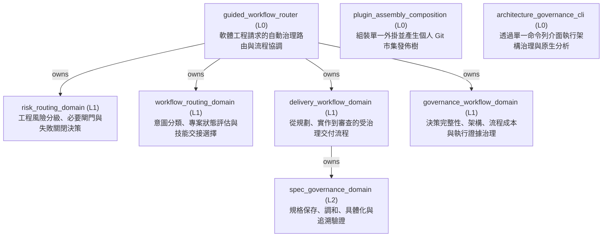
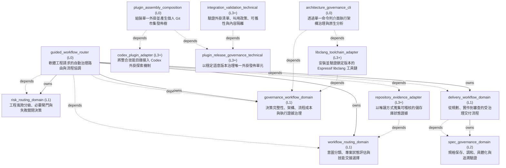

<!-- GENERATED BY govern-modular-event-architecture; DO NOT EDIT -->

# Governed Engineering Skills Architecture Guide

- Standard: `2.2.0`
- Schema: `2.2.0`

## System Purpose and Entrypoints

- `guided_workflow_router` — Automatically route every software-engineering intent by coordinating workflow selection, repository state, risk, delivery, and governance domains.
  - Entrypoints: [`ask-matt`](../skills/engineering/ask-matt/SKILL.md) (skill) [`main`](../skills/engineering/engineering-risk-routing/scripts/guided_workflow_router.py) (cli)
- `plugin_assembly_composition` — Assemble one complete Plugin artifact from the tracked Plugin shell and the two authoritative promoted Skill buckets, normalize host-specific invocation metadata, then emit a deterministic personal Git Marketplace publication tree and identity record.
  - Entrypoints: [`main`](../scripts/assemble_plugin.py) (cli)
- `architecture_governance_cli` — Compose the governance engine and pinned native provider behind the single public architecture CLI.
  - Entrypoints: [`main`](../skills/engineering/govern-modular-event-architecture/scripts/architecture_cli.py) (function)

## Main Function Tree

## Function Guide

### `guided_workflow_router`

- **Purpose:** Automatically route every software-engineering intent by coordinating workflow selection, repository state, risk, delivery, and governance domains.
- **Children:** `risk_routing_domain`, `workflow_routing_domain`, `delivery_workflow_domain`, `governance_workflow_domain`
- **Related Flows:** [`governed-engineering-route`](generated/guided_workflow_router.md#governed-engineering-route)
- **Protection Rationale:** Users never need to know or invoke ask-matt for software-engineering work.; Every design or specification decision offers two or three meaningful options, preferring structured choices and falling back to equivalent numbered text.; Every repository-modifying change set completes grilling before mutation.; Discoverable facts are explored before any unresolved decision is asked.; Every user turn is reassessed, and an active skill reroutes through this module with unresolved-decision evidence before asking a repository-modifying design or specification question.; Unresolved-decision evidence is true exactly while a non-discoverable user choice that shapes the change set remains open; it survives short answers through reconciliation and clears only when no open decisions remain.; A newly discovered discretionary decision stops execution and returns to grilling.; A confirmed specification resumes only when the caller supplies explicit resume evidence or the fresh task is exactly `開始執行` with an optional canonical Spec path; discovery alone proves only durable context.; Never route standalone learning-note or HackMD work.

### `risk_routing_domain`

- **Purpose:** Own engineering risk classes, gate selection, fail-closed behavior, and resume targets.
- **Children:** None
- **Related Flows:** [`governed-engineering-route`](generated/guided_workflow_router.md#governed-engineering-route)
- **Protection Rationale:** Higher hard-trigger risk always takes precedence.; Missing required capabilities or evidence cannot be downgraded.

### `workflow_routing_domain`

- **Purpose:** Own deterministic engineering-intent classification, three-state project assessment, capability fallback, and final skill handoff selection.
- **Children:** None
- **Related Flows:** [`governed-engineering-route`](generated/guided_workflow_router.md#governed-engineering-route)
- **Protection Rationale:** Explicit skills outrank inferred intent.; Intent selects the primary flow before project state and risk gates are applied.; A uniquely resolved confirmed specification does not bypass ProjectState interview precedence without explicit resume evidence.; Pending unresolved-decision evidence means a non-discoverable user choice affects implementation behavior, an interface, a persistent parameter, failure policy, specification scope, or an acceptance threshold.; Pending unresolved-decision evidence overrides lexical ambiguity in a short follow-up, selects grilling before the question is presented, and resumes at spec-governance for reconciliation.; Exact fresh-task `開始執行` derives resume evidence; quoted, negated, or conversational uses do not.; Resume evidence fails closed unless it identifies one valid confirmed specification; ambiguous candidates require one explicit selection.; A reopened working canonical specification blocks execution even when completed stages contain evidence from its prior confirmed revision.; Indeterminate intent or project state is never silently guessed.; Risk classification adds gates but never replaces the primary user intent.

### `delivery_workflow_domain`

- **Purpose:** Move an engineering idea or defect through planning, implementation, and review without bypassing required gates.
- **Children:** `spec_governance_domain`
- **Related Flows:** [`governed-change-set-lifecycle`](generated/delivery_workflow_domain.md#governed-change-set-lifecycle)
- **Protection Rationale:** Product mutation and commits require task and repository authorization; specification lifecycle writes do not grant that authority.; Every repository-modifying change set has one canonical specification before implementation.; A confirmed specification is verified rather than re-interviewed only with explicit resume evidence and no new decision or conflict.

### `spec_governance_domain`

- **Purpose:** Persist and reconcile engineering discussion into one canonical change-set specification, materialize it when decision-complete, and verify traceability before implementation.
- **Children:** None
- **Related Flows:** [`governed-change-set-lifecycle`](generated/delivery_workflow_domain.md#governed-change-set-lifecycle)
- **Protection Rationale:** Every answered decision is persisted before the next decision question.; Specification lifecycle writes never authorize product, Git, or external mutations.; Confirmed specifications have unique stable IDs, resolved relations, no open decisions, and at least one acceptance criterion per requirement.; Confirmed unimplemented specifications reopen in place before a possible contract change; implemented specifications never reopen.; Implemented specifications record PASS evidence for every acceptance criterion and a passing Spec review.; Conflicts, open decisions, invalid references, or missing requirement-to-acceptance traceability remain. → Preserve the last confirmed specification and return to grilling with exactly one conclusion-changing question.; The caller's expected revision or snapshot hash does not match the persisted working specification. → Preserve the persisted snapshot, reload it, and reconcile the answer again without allocating replacement IDs.

### `governance_workflow_domain`

- **Purpose:** Enforce decision completeness, evidence-calibrated Flow cost review, architecture ownership, evidence-backed explanation, and bounded runtime validation.
- **Children:** None
- **Related Flows:** [`governed-change-set-lifecycle`](generated/delivery_workflow_domain.md#governed-change-set-lifecycle)
- **Protection Rationale:** Codex never approves its own ADR or Algorithm Design Record.; A material Flow recommendation evaluates functional admission, execution and real-time feasibility, maintainability and extensibility, and model assurance before Module, Port, Event, or execution decisions are finalized.; Estimated models cannot establish a platform performance winner or real-time PASS; load-bearing evidence gaps remain BLOCKED.; C/C++ AST governance resolves native libclang only through its demand-owned pinned provider contract.

### `plugin_assembly_composition`

- **Purpose:** Assemble one complete Plugin artifact from the tracked Plugin shell and the two authoritative promoted Skill buckets, normalize host-specific invocation metadata, then emit a deterministic personal Git Marketplace publication tree and identity record.
- **Children:** None
- **Related Flows:** None
- **Protection Rationale:** Root engineering and productivity buckets are the only editable Skill source.; The tracked Plugin shell never contains a skills directory.; Every artifact records one complete file inventory and SHA-256 content fingerprint.; Assembled release-state mutation is delegated to Plugin release governance before inventory creation.; Local maintainer testing and `marketplace-release` publication consume the same artifact identity.; ChatGPT Work web and Codex Desktop install independently from one Git-backed release.; `marketplace-release` is generated and never becomes an editable Skill source.; Source metadata, artifact inventory, publication identity, tree fingerprint, cross-surface evidence, or output ownership is invalid. → Fail closed, preserve unrelated files, and report the mismatched identity or validation boundary.

### `architecture_governance_cli`

- **Purpose:** Compose the governance engine and pinned native provider behind the single public architecture CLI.
- **Children:** None
- **Related Flows:** None
- **Protection Rationale:** Gate execution never downloads or replaces a native provider cache.

## Parent Views

- [`guided_workflow_router`](generated/guided_workflow_router.md) — Automatically route every software-engineering intent by coordinating workflow selection, repository state, risk, delivery, and governance domains.
- [`risk_routing_domain`](generated/risk_routing_domain.md) — Own engineering risk classes, gate selection, fail-closed behavior, and resume targets.
- [`workflow_routing_domain`](generated/workflow_routing_domain.md) — Own deterministic engineering-intent classification, three-state project assessment, capability fallback, and final skill handoff selection.
- [`delivery_workflow_domain`](generated/delivery_workflow_domain.md) — Move an engineering idea or defect through planning, implementation, and review without bypassing required gates.
- [`governance_workflow_domain`](generated/governance_workflow_domain.md) — Enforce decision completeness, evidence-calibrated Flow cost review, architecture ownership, evidence-backed explanation, and bounded runtime validation.
- [`plugin_assembly_composition`](generated/plugin_assembly_composition.md) — Assemble one complete Plugin artifact from the tracked Plugin shell and the two authoritative promoted Skill buckets, normalize host-specific invocation metadata, then emit a deterministic personal Git Marketplace publication tree and identity record.
- [`architecture_governance_cli`](generated/architecture_governance_cli.md) — Compose the governance engine and pinned native provider behind the single public architecture CLI.

## End-to-End Flows

- [`governed-engineering-route`](generated/guided_workflow_router.md#governed-engineering-route) — Automatically classify every software-engineering request and turn-boundary decision handoff, inspect project state, preserve risk gates, and select an immediate safe skill.
- [`governed-change-set-lifecycle`](generated/delivery_workflow_domain.md#governed-change-set-lifecycle) — Persist and reconcile one modifying change set into a canonical specification, materialize it when decision-complete, wait for product execution authorization, verify traceability, implement it, and close it only after Spec review and commit disposition pass.

## Complete Technical Reference

## System Overview

## Type Catalog

- `plugin-distribution-error` — `plugin_assembly_composition` / `domain-value` / `cross-module`
- `personal-marketplace-publication-record` — `plugin_assembly_composition` / `domain-value` / `cross-module`
- `personal-marketplace-release-evidence` — `plugin_assembly_composition` / `domain-value` / `cross-module`
- `repository-artifact` — `workflow_routing_domain` / `domain-value` / `cross-module`
- `repository-evidence` — `workflow_routing_domain` / `domain-value` / `cross-module`
- `project-state-assessment` — `workflow_routing_domain` / `query` / `cross-module`
- `intent-assessment` — `workflow_routing_domain` / `query` / `cross-module`
- `workflow-selection-options` — `workflow_routing_domain` / `domain-value` / `cross-module`
- `guided-route-decision` — `workflow_routing_domain` / `query` / `cross-module`
- `spec-context-assessment` — `workflow_routing_domain` / `query` / `cross-module`
- `working-spec-reference` — `spec_governance_domain` / `domain-value` / `module-public`
- `discussion-context-record` — `spec_governance_domain` / `domain-value` / `module-public`
- `spec-consistency-assessment` — `spec_governance_domain` / `query` / `module-public`
- `canonical-spec-reference` — `spec_governance_domain` / `domain-value` / `module-public`
- `delivery-spec-context` — `delivery_workflow_domain` / `domain-value` / `cross-module`
- `spec-traceability-assessment` — `spec_governance_domain` / `query` / `module-public`
- `repository-evidence-port` — `workflow_routing_domain` / `port` / `module-public`
- `git-filesystem-repository-evidence-adapter` — `repository_evidence_adapter` / `adapter-binding` / `module-public`
- `routing-decision` — `risk_routing_domain` / `query` / `cross-module`
- `gate-result` — `risk_routing_domain` / `domain-value` / `cross-module`
- `governance-diagnostic` — `governance_workflow_domain` / `private-helper` / `private`
- `governance-manifest-error` — `governance_workflow_domain` / `private-helper` / `private`
- `governance-ast-evidence` — `governance_workflow_domain` / `private-helper` / `private`
- `libclang-toolchain-port` — `governance_workflow_domain` / `port` / `cross-module`
- `libclang-toolchain-evidence` — `governance_workflow_domain` / `domain-value` / `cross-module`
- `toolchain-provider-error` — `governance_workflow_domain` / `domain-value` / `cross-module`
- `espressif-libclang-toolchain-adapter` — `libclang_toolchain_adapter` / `adapter-binding` / `module-public`
- `collection-input-port` — `governance_workflow_domain` / `port` / `module-public`
- `collection-output-port` — `governance_workflow_domain` / `port` / `module-public`
- `transport-port` — `governance_workflow_domain` / `port` / `module-public`
- `guided-session-input-port` — `governance_workflow_domain` / `port` / `module-public`
- `guided-session-output-port` — `governance_workflow_domain` / `port` / `module-public`
- `runtime-verdict` — `governance_workflow_domain` / `domain-value` / `module-public`
- `criterion-result` — `governance_workflow_domain` / `domain-value` / `module-public`
- `verdict-input-port` — `governance_workflow_domain` / `port` / `module-public`
- `verdict-output-port` — `governance_workflow_domain` / `port` / `module-public`
- `validation-profile-error` — `governance_workflow_domain` / `private-helper` / `private`
- `platform-transport-adapter` — `governance_workflow_domain` / `adapter-binding` / `private`

## State Ownership

## Cross-module Mapping

- `routing-assessments-to-guided-handoff` / `guided_workflow_router` / `risk_routing_domain` to `workflow_routing_domain`
- `canonical-spec-to-delivery-context` / `delivery_workflow_domain` / `spec_governance_domain` to `delivery_workflow_domain`
- `delivery-spec-to-routing-context` / `guided_workflow_router` / `delivery_workflow_domain` to `workflow_routing_domain`

## Adoption Readiness

- [Human-readable readiness](generated/adoption-readiness.md)
- [Machine-readable readiness](generated/adoption-readiness.json)

## Execution Profiles

## Real-time Scheduling Studies
