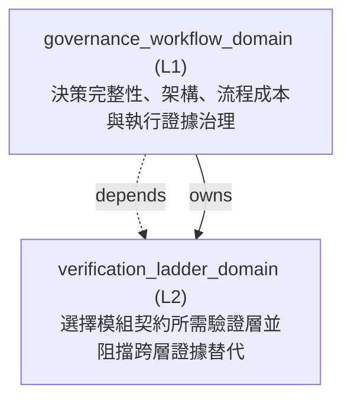
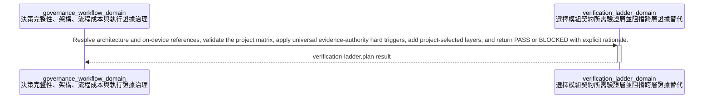

<!-- GENERATED BY govern-modular-event-architecture; DO NOT EDIT -->

# `governance_workflow_domain`

## Structure

## Modules

| ID | Level | Role | Parent | Implementation Status | Purpose |
|---|---|---|---|---|---|
| `governance_workflow_domain` | L1 | domain | `guided_workflow_router` | implemented | Enforce decision completeness, evidence-calibrated Flow cost review, architecture ownership, evidence-backed explanation, and bounded runtime validation. |
| `verification_ladder_domain` | L2 | component | `governance_workflow_domain` | implemented | Select the lowest sufficient additive verification layers for affected module contracts and evidence claims, validate project bindings, and reject cross-layer evidence substitution. |

### `governance_workflow_domain`

- **Purpose:** Enforce decision completeness, evidence-calibrated Flow cost review, architecture ownership, evidence-backed explanation, and bounded runtime validation.
- **Parent:** `guided_workflow_router`
- **Implementation Status:** `implemented`
- **Input Ports:** None
- **Output Ports:** None
- **Emitted Events:** None
- **Owned State:** None
- **Side Effects:** None
- **Errors:** None
- **Invariants:** Codex never approves its own ADR or Algorithm Design Record.; A material Flow recommendation evaluates functional admission, execution and real-time feasibility, maintainability and extensibility, and model assurance before Module, Port, Event, or execution decisions are finalized.; Estimated models cannot establish a platform performance winner or real-time PASS; load-bearing evidence gaps remain BLOCKED.; C/C++ AST governance resolves native libclang only through its demand-owned pinned provider contract.
- **Entrypoints:** [`govern-modular-event-architecture`](../../skills/engineering/govern-modular-event-architecture/SKILL.md) (skill)
- **Public Symbols:** [`govern-modular-event-architecture`](../../skills/engineering/govern-modular-event-architecture/SKILL.md) (skill) [`LibclangToolchainPort`](../../skills/engineering/govern-modular-event-architecture/scripts/libclang_toolchain_contract.py) (class)

### `verification_ladder_domain`

- **Purpose:** Select the lowest sufficient additive verification layers for affected module contracts and evidence claims, validate project bindings, and reject cross-layer evidence substitution.
- **Parent:** `governance_workflow_domain`
- **Implementation Status:** `implemented`
- **Input Ports:** `verification-ladder.plan`
- **Output Ports:** None
- **Emitted Events:** None
- **Owned State:** None
- **Side Effects:** None
- **Errors:** None
- **Invariants:** Host evidence remains valid for host-observable semantics but never satisfies target timing, scheduler, physical-hardware, or long-duration stability claims.; Device-dependent PIL, HIL, and System/Soak execution is delegated to validate-on-device after Validation Enablement.; Missing or stale architecture, scenario, profile, trigger, or evidence bindings return BLOCKED instead of silently omitting a layer.
- **Entrypoints:** [`verification-ladder`](../../skills/engineering/verification-ladder/SKILL.md) (skill) [`main`](../../skills/engineering/verification-ladder/scripts/verification_ladder.py) (function)
- **Public Symbols:** [`verification-ladder`](../../skills/engineering/verification-ladder/SKILL.md) (skill) [`main`](../../skills/engineering/verification-ladder/scripts/verification_ladder.py) (function)

## Port Contracts

| ID | Owner | Direction | Kind | Timing | Description | Symbols |
|---|---|---|---|---|---|---|
| `verification-ladder.plan` | `verification_ladder_domain` | input | query | sync | Validate one project verification matrix and derive the additive layers required by affected architecture references, contract dimensions, execution changes, and evidence claims.: Project matrix, governed architecture manifest, optional on-device profile, affected trigger categories, and observed evidence layers. | `main` |
| `libclang_toolchain.resolve` | `governance_workflow_domain` | output | query | sync | Resolve, bind, and verify one lock-pinned target-capable libclang provider.: Toolchain lock and operation mode produce immutable provider evidence or fail-closed CAST diagnostics. | `LibclangToolchainPort` |

## Event Contracts

| ID | Owner | Delivery | Emitted when | Purpose | Consumers |
|---|---|---|---|---|---|

## Type Catalog

| ID | Owner | Declaration | Visibility | Semantic kind | Consumers | References |
|---|---|---|---|---|---|---|
| `governance-diagnostic` | `governance_workflow_domain` | `Diagnostic` (class, `skills/engineering/govern-modular-event-architecture/scripts/check_architecture.py`) | private | private-helper | `governance_workflow_domain` | None |
| `governance-manifest-error` | `governance_workflow_domain` | `ManifestError` (class, `skills/engineering/govern-modular-event-architecture/scripts/check_architecture.py`) | private | private-helper | `governance_workflow_domain` | None |
| `governance-ast-evidence` | `governance_workflow_domain` | `AstEvidence` (class, `skills/engineering/govern-modular-event-architecture/scripts/ast_analyzer.py`) | private | private-helper | `governance_workflow_domain` | None |
| `libclang-toolchain-port` | `governance_workflow_domain` | `LibclangToolchainPort` (class, `skills/engineering/govern-modular-event-architecture/scripts/libclang_toolchain_contract.py`) | cross-module | port | `governance_workflow_domain`, `libclang_toolchain_adapter` | `libclang-toolchain-evidence` |
| `libclang-toolchain-evidence` | `governance_workflow_domain` | `LibclangToolchainEvidence` (class, `skills/engineering/govern-modular-event-architecture/scripts/libclang_toolchain_contract.py`) | cross-module | domain-value | `governance_workflow_domain`, `libclang_toolchain_adapter` | None |
| `toolchain-provider-error` | `governance_workflow_domain` | `ToolchainProviderError` (class, `skills/engineering/govern-modular-event-architecture/scripts/libclang_toolchain_contract.py`) | cross-module | domain-value | `architecture_governance_cli`, `governance_workflow_domain`, `libclang_toolchain_adapter` | None |
| `collection-input-port` | `governance_workflow_domain` | `CollectionInputPort` (class, `skills/engineering/validate-on-device/scripts/vod/execution.py`) | module-public | port | `governance_workflow_domain` | None |
| `collection-output-port` | `governance_workflow_domain` | `CollectionOutputPort` (class, `skills/engineering/validate-on-device/scripts/vod/execution.py`) | module-public | port | `governance_workflow_domain` | None |
| `transport-port` | `governance_workflow_domain` | `TransportPort` (class, `skills/engineering/validate-on-device/scripts/vod/execution.py`) | module-public | port | `governance_workflow_domain` | None |
| `guided-session-input-port` | `governance_workflow_domain` | `GuidedSessionInputPort` (class, `skills/engineering/validate-on-device/scripts/vod/guided.py`) | module-public | port | `governance_workflow_domain` | None |
| `guided-session-output-port` | `governance_workflow_domain` | `GuidedSessionOutputPort` (class, `skills/engineering/validate-on-device/scripts/vod/guided.py`) | module-public | port | `governance_workflow_domain` | None |
| `runtime-verdict` | `governance_workflow_domain` | `Verdict` (class, `skills/engineering/validate-on-device/scripts/vod/model.py`) | module-public | domain-value | `governance_workflow_domain` | None |
| `criterion-result` | `governance_workflow_domain` | `CriterionResult` (class, `skills/engineering/validate-on-device/scripts/vod/model.py`) | module-public | domain-value | `governance_workflow_domain` | `runtime-verdict` |
| `verdict-input-port` | `governance_workflow_domain` | `VerdictInputPort` (class, `skills/engineering/validate-on-device/scripts/vod/model.py`) | module-public | port | `governance_workflow_domain` | None |
| `verdict-output-port` | `governance_workflow_domain` | `VerdictOutputPort` (class, `skills/engineering/validate-on-device/scripts/vod/model.py`) | module-public | port | `governance_workflow_domain` | None |
| `validation-profile-error` | `governance_workflow_domain` | `ProfileError` (class, `skills/engineering/validate-on-device/scripts/vod/profile.py`) | private | private-helper | `governance_workflow_domain` | None |
| `platform-transport-adapter` | `governance_workflow_domain` | `PlatformTransportAdapter` (class, `skills/engineering/validate-on-device/scripts/vod/providers.py`) | private | adapter-binding | `governance_workflow_domain` | `transport-port` |

## State Ownership

| ID | Owner | Declaration | Type | Visibility | Mutability | Read authority | Write authority |
|---|---|---|---|---|---|---|---|

## Cross-module Mapping

| Interaction | Producer | Consumer | Parent | Producer contract | Consumer contract | Mapping owner | State accessed | Allowed edges | Forbidden edges |
|---|---|---|---|---|---|---|---|---|---|

## End-to-End Flows

### `verification-ladder-planning`

Validate project-owned verification bindings, combine universal hard triggers with project rules, and produce the lowest sufficient additive ladder without accepting evidence from a lower-authority environment.

#### Flow Diagram

#### Ordered Steps

| # | Module | Action | Receives | Emits | State changes | Side effects |
|---|---|---|---|---|---|---|
| 1 | `verification_ladder_domain` | Resolve architecture and on-device references, validate the project matrix, apply universal evidence-authority hard triggers, add project-selected layers, and return PASS or BLOCKED with explicit rationale. | `verification-ladder.plan` | None | None | None |

- **Success:** Every requested trigger is mapped to explicit criteria and the returned ordered layers are sufficient for each evidence claim.

#### Execution efficiency

- Workload `verification-ladder-planning-workload`: `best-effort`; steps `verification-ladder-planning.evaluate`; profiles None.
