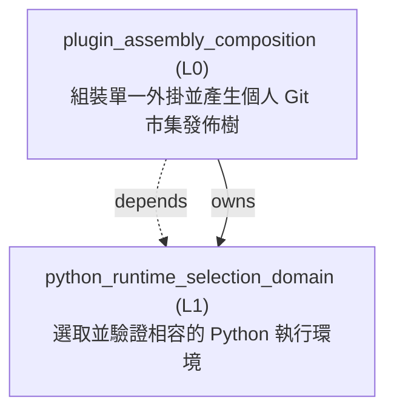

<!-- GENERATED BY govern-modular-event-architecture; DO NOT EDIT -->

# `plugin_assembly_composition`

## Structure



## Modules

| ID | Level | Role | Parent | Implementation Status | Purpose |
|---|---|---|---|---|---|
| `plugin_assembly_composition` | L0 | composition | `-` | implemented | Assemble one complete Plugin artifact from the tracked Plugin shell and the two authoritative promoted Skill buckets, normalize host-specific invocation metadata, select and validate one Python 3.11+ interpreter before assembly, safely recover access to only the exact ignored Windows artifact, coordinate the supported local Codex installation, and optionally emit a deterministic Codex Git Marketplace publication tree. |
| `python_runtime_selection_domain` | L1 | domain | `plugin_assembly_composition` | implemented | Own the deterministic admission policy that accepts an explicit compatible runtime, otherwise prefers a compatible PATH observation and requests Windows Launcher fallback only after that observation is rejected. |

### `plugin_assembly_composition`

- **Purpose:** Assemble one complete Plugin artifact from the tracked Plugin shell and the two authoritative promoted Skill buckets, normalize host-specific invocation metadata, select and validate one Python 3.11+ interpreter before assembly, safely recover access to only the exact ignored Windows artifact, coordinate the supported local Codex installation, and optionally emit a deterministic Codex Git Marketplace publication tree.
- **Parent:** `-`
- **Implementation Status:** `implemented`
- **Input Ports:** `plugin-release.synchronize-artifact`, `plugin-install.local`, `plugin-artifact-access.repair`, `local-install.register`
- **Output Ports:** `plugin-distribution.result`
- **Emitted Events:** `plugin-distribution.blocked`
- **Owned State:** None
- **Side Effects:** Replace only selected ignored output directories with a deterministic Plugin artifact and Marketplace publication tree. (`-`); Apply a local-only cache identity to the ignored validated artifact without changing formal release metadata. (`-`); Invoke the local installation adapter only after the assembled Plugin inventory and fingerprint validate. (`-`); Request the Windows artifact-access adapter to repair inherited access only for the exact ignored dist/governed-engineering-skills artifact, with elevation available only after a bounded non-elevated attempt fails. (`-`)
- **Errors:** `plugin_distribution_invalid`: Source metadata, artifact inventory, publication identity, tree fingerprint, Codex installation evidence, or output ownership is invalid. → `plugin-distribution.blocked` → Fail closed, preserve unrelated files, and report the mismatched identity or validation boundary.; `python_runtime_incompatible`: An explicitly injected Python command is incompatible, or neither PATH Python nor the Windows Python Launcher resolves Python 3.11 or newer. → `plugin-distribution.blocked` → Stop before assembly, report every observed candidate and version, and explain how to install or explicitly select Python 3.11 or newer.; `plugin_artifact_access_blocked`: The existing ignored artifact is inaccessible and its exact canonical path, repository containment, reparse-point safety, non-elevated repair, or explicitly approved elevated repair cannot be validated. → `plugin-distribution.blocked` → Refuse paths outside the exact governed artifact, stop before assembly and Codex registration, preserve unrelated files, and report whether elevation was declined or the bounded ACL repair failed.
- **Invariants:** Root engineering and productivity buckets are the only editable Skill source.; The tracked Plugin shell never contains a skills directory.; Every artifact records one complete file inventory and SHA-256 content fingerprint.; Assembly stages the complete replacement before removing a previous validated artifact.; Assembled release-state mutation is delegated to Plugin release governance before inventory creation.; The supported local installer consumes the same validated assembled artifact as optional Marketplace publication.; Codex Desktop and Codex CLI are the only supported installation surfaces.; Python selection completes before artifact mutation and the selected absolute interpreter performs every assembly, validation, and localization command.; Windows ACL recovery accepts only the canonical repository-owned dist/governed-engineering-skills directory and never a repository root, ancestor, sibling, outside path, symbolic link, junction, or other reparse point.; `marketplace-release` is generated and never becomes an editable Skill source.
- **Entrypoints:** [`main`](../../scripts/assemble_plugin.py) (cli)<br>[`install-local`](../../scripts/install-local.ps1) (script)
- **Public Symbols:** [`install-local`](../../scripts/install-local.ps1) (script)<br>[`install-local`](../../plugins/governed-engineering-skills/scripts/install-local.ps1) (script)<br>[`assemble`](../../scripts/assemble_plugin.py) (function)<br>[`validate_artifact`](../../scripts/assemble_plugin.py) (function)<br>[`localize_artifact`](../../scripts/assemble_plugin.py) (function)<br>[`write_marketplace_publication`](../../scripts/assemble_plugin.py) (function)<br>[`validate`](../../scripts/validate_distribution.py) (function)

### `python_runtime_selection_domain`

- **Purpose:** Own the deterministic admission policy that accepts an explicit compatible runtime, otherwise prefers a compatible PATH observation and requests Windows Launcher fallback only after that observation is rejected.
- **Parent:** `plugin_assembly_composition`
- **Implementation Status:** `implemented`
- **Input Ports:** `python-runtime.select`
- **Output Ports:** None
- **Emitted Events:** None
- **Owned State:** None
- **Side Effects:** None
- **Errors:** None
- **Invariants:** Explicit candidate admission is authoritative and never silently replaced.; A compatible PATH observation is accepted before requesting launcher fallback.; A launcher observation is accepted only after its resolved runtime is revalidated.
- **Entrypoints:** [`Select-CompatiblePythonCandidate`](../../scripts/python-runtime-selection-policy.ps1) (function)
- **Public Symbols:** [`Select-CompatiblePythonCandidate`](../../scripts/python-runtime-selection-policy.ps1) (function)

## Port Contracts

| ID | Owner | Direction | Kind | Timing | Description | Symbols |
|---|---|---|---|---|---|---|
| `python-runtime.select` | `python_runtime_selection_domain` | input | query | sync | Select one installed Python 3.11-or-newer interpreter before Plugin assembly.: Optional explicit command plus PATH and Windows Python Launcher candidates. | `Select-CompatiblePythonCandidate` |
| `plugin-artifact-access.repair` | `plugin_assembly_composition` | input | query | sync | Admit and restore replace access to only the exact governed Windows artifact.: Canonical repository root, exact artifact path, and bounded recovery result. | `install-local` |
| `plugin-install.local` | `plugin_assembly_composition` | input | command | sync | Assemble, validate, and begin installation of the governed Plugin for local Codex.: Repository-relative source, output, and Marketplace identities. | `install-local` |
| `local-install.register` | `plugin_assembly_composition` | input | command | sync | Register the validated local Marketplace and open the governed Plugin page.: Validated assembled Plugin path, Marketplace manifest path, and Plugin identifier. | `install-local` |
| `plugin-release.synchronize-artifact` | `plugin_assembly_composition` | input | command | sync | Ask Plugin release governance to bind an assembled Plugin release-state to that artifact's current production fingerprint.: Assembled Plugin root path whose release-state fingerprint must match its logical production files. | `assemble` |
| `plugin-distribution.result` | `plugin_assembly_composition` | output | event | sync | Publish a fail-closed Plugin assembly or Marketplace validation result.: Artifact identity, publication identity, and bounded validation diagnostics. | `validate_artifact` |

## Event Contracts

| ID | Owner | Delivery | Emitted when | Purpose | Consumers |
|---|---|---|---|---|---|
| `plugin-distribution.blocked` | `plugin_assembly_composition` | at-most-once | Python runtime, exact-target ACL recovery, artifact, publication, evidence, or output-ownership validation fails. | Report that Python admission, bounded artifact-access recovery, Plugin assembly, or personal Marketplace publication cannot continue safely. | `plugin_release_governance_technical` |

## Type Catalog

| ID | Owner | Declaration | Visibility | Semantic kind | Consumers | References |
|---|---|---|---|---|---|---|
| `plugin-distribution-error` | `plugin_assembly_composition` | `DistributionError` (class, `scripts/assemble_plugin.py`) | cross-module | domain-value | `plugin_assembly_composition` | None |
| `personal-marketplace-publication-record` | `plugin_assembly_composition` | `PersonalMarketplacePublicationRecord` (interface, `distribution/personal-marketplace-publication.schema.json`) | cross-module | domain-value | `plugin_assembly_composition` | None |

## State Ownership

| ID | Owner | Declaration | Type | Visibility | Mutability | Read authority | Write authority |
|---|---|---|---|---|---|---|---|

## Cross-module Mapping

| Interaction | Producer | Consumer | Parent | Producer contract | Consumer contract | Mapping owner | State accessed | Allowed edges | Forbidden edges |
|---|---|---|---|---|---|---|---|---|---|

## End-to-End Flows

### `local-plugin-installation`

Select one compatible Python interpreter, recover safe access to only the exact ignored Windows artifact when necessary, assemble and validate the root-owned Plugin, apply a local-only cache identity, then register and install it before opening the Codex Desktop detail page.

#### Flow Diagram

```mermaid
sequenceDiagram
    participant n_plugin_assembly_composition as plugin_assembly_composition<br/>組裝單一外掛並產生個人 Git 市集發佈樹
    participant n_python_runtime_discovery_adapter as python_runtime_discovery_adapter<br/>探測 Windows Python 候選並套用相容性政策
    participant n_windows_artifact_access_adapter as windows_artifact_access_adapter<br/>修復唯一受治理產物的 Windows 存取權限
    participant n_local_install_adapter as local_install_adapter<br/>註冊本機 Marketplace、安裝外掛並開啟 Codex 詳情頁
    n_plugin_assembly_composition->>+n_python_runtime_discovery_adapter: Validate an explicit Python command when supplied; otherwise accept a compatible PATH Python or resolve the Windows Python Launcher's highest Python 3 runtime to one validated absolute interpreter path.
    n_python_runtime_discovery_adapter-->>-n_plugin_assembly_composition: python-runtime.select result
    n_plugin_assembly_composition->>+n_windows_artifact_access_adapter: Confirm that the exact dist/governed-engineering-skills output is safely replaceable; when an existing Windows artifact is inaccessible, try a bounded inherited-ACL repair without elevation and request UAC only if that attempt fails.
    n_windows_artifact_access_adapter-->>-n_plugin_assembly_composition: plugin-artifact-access.repair result
    n_plugin_assembly_composition->>n_plugin_assembly_composition: Build the complete Plugin from the tracked shell and promoted root Skills, then reject missing, stale, or fingerprint-mismatched output.
    n_plugin_assembly_composition->>n_plugin_assembly_composition: Apply a local-only cache identity to the validated artifact and regenerate its inventory without changing formal release metadata.
    n_plugin_assembly_composition->>+n_local_install_adapter: Select an executable Codex CLI using verified PATH-first resolution with Desktop-runtime fallback, register the repository-local Marketplace, install the Plugin, and open its detail page.
    n_local_install_adapter-->>-n_plugin_assembly_composition: step 5
```

#### Ordered Steps

| # | Module | Action | Receives | Emits | State changes | Side effects |
|---|---|---|---|---|---|---|
| 1 | `python_runtime_discovery_adapter` | Validate an explicit Python command when supplied; otherwise accept a compatible PATH Python or resolve the Windows Python Launcher's highest Python 3 runtime to one validated absolute interpreter path. | `python-runtime.select` | None | None | None |
| 2 | `windows_artifact_access_adapter` | Confirm that the exact dist/governed-engineering-skills output is safely replaceable; when an existing Windows artifact is inaccessible, try a bounded inherited-ACL repair without elevation and request UAC only if that attempt fails. | `plugin-artifact-access.repair` | None | None | Repair inherited ACLs only on the exact ignored dist/governed-engineering-skills artifact after rejecting unsafe paths and reparse points. |
| 3 | `plugin_assembly_composition` | Build the complete Plugin from the tracked shell and promoted root Skills, then reject missing, stale, or fingerprint-mismatched output. | `plugin-install.local` | None | None | Replace only the ignored dist/governed-engineering-skills candidate. |
| 4 | `plugin_assembly_composition` | Apply a local-only cache identity to the validated artifact and regenerate its inventory without changing formal release metadata. | None | None | None | Mutate only the ignored dist/governed-engineering-skills candidate. |
| 5 | `local_install_adapter` | Select an executable Codex CLI using verified PATH-first resolution with Desktop-runtime fallback, register the repository-local Marketplace, install the Plugin, and open its detail page. | `local-install.register` | None | None | Update the current user's Codex Marketplace configuration.; Install the Plugin into the current user's Codex cache.; Open the Codex Desktop Plugin detail page. |

- **Success:** Codex recognizes the local Marketplace entry and reports successful installation from the validated, locally cache-busted artifact.
- **Errors:** The explicit, PATH, and Windows Python Launcher candidates do not yield a validated Python 3.11-or-newer absolute interpreter. → `plugin-distribution.blocked` → Stop before artifact mutation, report observed candidates and versions, and provide Python installation or explicit-selection recovery guidance.
- **Errors:** Assembly or artifact validation fails. → `plugin-distribution.blocked` → Stop before invoking Codex or changing user configuration and report the failed validation boundary.
- **Errors:** The existing ignored artifact is inaccessible and exact-target safety, reparse-point rejection, non-elevated repair, UAC approval, or post-repair access validation fails. → `plugin-distribution.blocked` → Stop before assembly and Codex registration, leave unrelated paths untouched, return a stable non-zero status, and identify the rejected safety boundary or UAC recovery action.
- **Errors:** Codex resolution, Marketplace registration, Plugin installation, or Plugin-page launch fails. → `local-install.blocked` → Preserve the validated artifact, issue no removal command against a prior Plugin install, return a stable non-zero exit code, and provide the log and retry action. A Marketplace registered before installation failure remains registered for that retry.

#### Execution efficiency

- Workload `local-plugin-installation-workload`: `best-effort`; steps `local-plugin-installation.recover-artifact-access`, `local-plugin-installation.assemble`, `local-plugin-installation.register`; profiles None.
