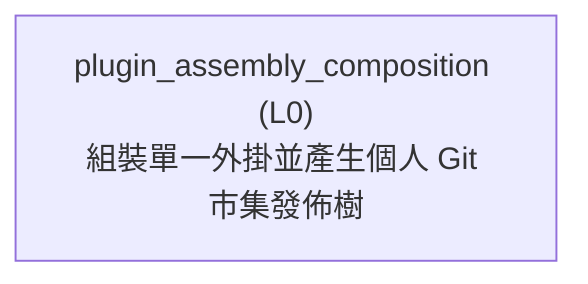

<!-- GENERATED BY govern-modular-event-architecture; DO NOT EDIT -->

# `plugin_assembly_composition`

## Structure

## Modules

| ID | Level | Role | Parent | Implementation Status | Purpose |
|---|---|---|---|---|---|
| `plugin_assembly_composition` | L0 | composition | `-` | implemented | Assemble one complete Plugin artifact from the tracked Plugin shell and the two authoritative promoted Skill buckets, normalize host-specific invocation metadata, then emit a deterministic personal Git Marketplace publication tree and identity record. |

### `plugin_assembly_composition`

- **Purpose:** Assemble one complete Plugin artifact from the tracked Plugin shell and the two authoritative promoted Skill buckets, normalize host-specific invocation metadata, then emit a deterministic personal Git Marketplace publication tree and identity record.
- **Parent:** `-`
- **Implementation Status:** `implemented`
- **Input Ports:** `plugin-release.synchronize-artifact`
- **Output Ports:** `plugin-distribution.result`
- **Emitted Events:** `plugin-distribution.blocked`
- **Owned State:** None
- **Side Effects:** Replace only selected ignored output directories with a deterministic Plugin artifact and Marketplace publication tree. (`-`)
- **Errors:** `plugin_distribution_invalid`: Source metadata, artifact inventory, publication identity, tree fingerprint, cross-surface evidence, or output ownership is invalid. → `plugin-distribution.blocked` → Fail closed, preserve unrelated files, and report the mismatched identity or validation boundary.
- **Invariants:** Root engineering and productivity buckets are the only editable Skill source.; The tracked Plugin shell never contains a skills directory.; Every artifact records one complete file inventory and SHA-256 content fingerprint.; Assembled release-state mutation is delegated to Plugin release governance before inventory creation.; Local maintainer testing and `marketplace-release` publication consume the same artifact identity.; ChatGPT Work web and Codex Desktop install independently from one Git-backed release.; `marketplace-release` is generated and never becomes an editable Skill source.
- **Entrypoints:** [`main`](../../scripts/assemble_plugin.py) (cli)
- **Public Symbols:** [`assemble`](../../scripts/assemble_plugin.py) (function) [`validate_artifact`](../../scripts/assemble_plugin.py) (function) [`write_marketplace_publication`](../../scripts/assemble_plugin.py) (function) [`validate`](../../scripts/validate_distribution.py) (function) [`validate`](../../scripts/validate_personal_marketplace_release.py) (function)

## Port Contracts

| ID | Owner | Direction | Kind | Timing | Description | Symbols |
|---|---|---|---|---|---|---|
| `plugin-release.synchronize-artifact` | `plugin_assembly_composition` | input | command | sync | Ask Plugin release governance to bind an assembled Plugin release-state to that artifact's current production fingerprint.: Assembled Plugin root path whose release-state fingerprint must match its logical production files. | `assemble` |
| `plugin-distribution.result` | `plugin_assembly_composition` | output | event | sync | Publish a fail-closed Plugin assembly or Marketplace validation result.: Artifact identity, publication identity, and bounded validation diagnostics. | `validate_artifact` |

## Event Contracts

| ID | Owner | Delivery | Emitted when | Purpose | Consumers |
|---|---|---|---|---|---|
| `plugin-distribution.blocked` | `plugin_assembly_composition` | at-most-once | Artifact, publication, evidence, or output-ownership validation fails. | Report that Plugin assembly or personal Marketplace publication cannot continue safely. | `plugin_release_governance_technical` |

## Type Catalog

| ID | Owner | Declaration | Visibility | Semantic kind | Consumers | References |
|---|---|---|---|---|---|---|
| `plugin-distribution-error` | `plugin_assembly_composition` | `DistributionError` (class, `scripts/assemble_plugin.py`) | cross-module | domain-value | `plugin_assembly_composition` | None |
| `personal-marketplace-publication-record` | `plugin_assembly_composition` | `PersonalMarketplacePublicationRecord` (interface, `distribution/personal-marketplace-publication.schema.json`) | cross-module | domain-value | `plugin_assembly_composition` | None |
| `personal-marketplace-release-evidence` | `plugin_assembly_composition` | `PersonalMarketplaceReleaseEvidence` (interface, `distribution/personal-marketplace-release-evidence.schema.json`) | cross-module | domain-value | `plugin_assembly_composition` | None |

## State Ownership

| ID | Owner | Declaration | Type | Visibility | Mutability | Read authority | Write authority |
|---|---|---|---|---|---|---|---|

## Cross-module Mapping

| Interaction | Producer | Consumer | Parent | Producer contract | Consumer contract | Mapping owner | State accessed | Allowed edges | Forbidden edges |
|---|---|---|---|---|---|---|---|---|---|

## End-to-End Flows
