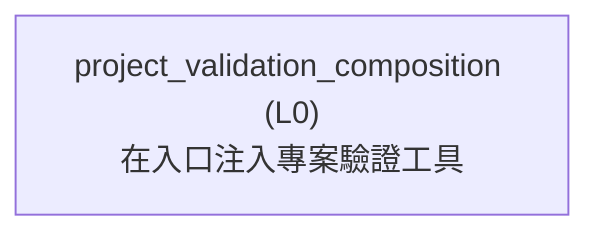

<!-- GENERATED BY govern-modular-event-architecture; DO NOT EDIT -->

# `project_validation_composition`

## Structure

## Modules

| ID | Level | Role | Parent | Implementation Status | Purpose |
|---|---|---|---|---|---|
| `project_validation_composition` | L0 | composition | `-` | implemented | Inject the project validation adapter into existing specification and delivery public CLIs. |

### `project_validation_composition`

- **Purpose:** Inject the project validation adapter into existing specification and delivery public CLIs.
- **Parent:** `-`
- **Implementation Status:** `implemented`
- **Input Ports:** None
- **Output Ports:** None
- **Emitted Events:** None
- **Owned State:** None
- **Side Effects:** None
- **Errors:** None
- **Invariants:** Functional consumers receive the demand-owned validation callable; they never construct the technical adapter.
- **Entrypoints:** [`main`](../../skills/engineering/implement/scripts/project_validation_workflow.py) (cli)
- **Public Symbols:** [`main`](../../skills/engineering/implement/scripts/project_validation_workflow.py) (function)

## Port Contracts

| ID | Owner | Direction | Kind | Timing | Description | Symbols |
|---|---|---|---|---|---|---|

## Event Contracts

| ID | Owner | Delivery | Emitted when | Purpose | Consumers |
|---|---|---|---|---|---|

## Type Catalog

| ID | Owner | Declaration | Visibility | Semantic kind | Consumers | References |
|---|---|---|---|---|---|---|

## State Ownership

| ID | Owner | Declaration | Type | Visibility | Mutability | Read authority | Write authority |
|---|---|---|---|---|---|---|---|

## Cross-module Mapping

| Interaction | Producer | Consumer | Parent | Producer contract | Consumer contract | Mapping owner | State accessed | Allowed edges | Forbidden edges |
|---|---|---|---|---|---|---|---|---|---|

## End-to-End Flows
