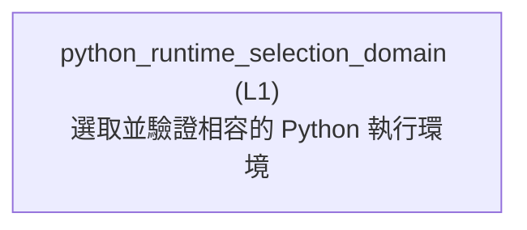

<!-- GENERATED BY govern-modular-event-architecture; DO NOT EDIT -->

# `python_runtime_selection_domain`

## Structure

## Modules

| ID | Level | Role | Parent | Implementation Status | Purpose |
|---|---|---|---|---|---|
| `python_runtime_selection_domain` | L1 | domain | `plugin_assembly_composition` | implemented | Own the deterministic admission policy that accepts an explicit compatible runtime, otherwise prefers a compatible PATH observation and requests Windows Launcher fallback only after that observation is rejected. |

### `python_runtime_selection_domain`

- **Purpose:** Own the deterministic admission policy that accepts an explicit compatible runtime, otherwise prefers a compatible PATH observation and requests Windows Launcher fallback only after that observation is rejected.
- **Parent:** `plugin_assembly_composition`
- **Implementation Status:** `implemented`
- **Input Ports:** `python-runtime.select`
- **Output Ports:** None
- **Emitted Events:** None
- **Owned State:** None
- **Side Effects:** None
- **Errors:** None
- **Invariants:** Explicit candidate admission is authoritative and never silently replaced.; A compatible PATH observation is accepted before requesting launcher fallback.; A launcher observation is accepted only after its resolved runtime is revalidated.
- **Entrypoints:** [`Select-CompatiblePythonCandidate`](../../scripts/python-runtime-selection-policy.ps1) (function)
- **Public Symbols:** [`Select-CompatiblePythonCandidate`](../../scripts/python-runtime-selection-policy.ps1) (function)

## Port Contracts

| ID | Owner | Direction | Kind | Timing | Description | Symbols |
|---|---|---|---|---|---|---|
| `python-runtime.select` | `python_runtime_selection_domain` | input | query | sync | Select one installed Python 3.11-or-newer interpreter before Plugin assembly.: Optional explicit command plus PATH and Windows Python Launcher candidates. | `Select-CompatiblePythonCandidate` |

## Event Contracts

| ID | Owner | Delivery | Emitted when | Purpose | Consumers |
|---|---|---|---|---|---|

## Type Catalog

| ID | Owner | Declaration | Visibility | Semantic kind | Consumers | References |
|---|---|---|---|---|---|---|

## State Ownership

| ID | Owner | Declaration | Type | Visibility | Mutability | Read authority | Write authority |
|---|---|---|---|---|---|---|---|

## Cross-module Mapping

| Interaction | Producer | Consumer | Parent | Producer contract | Consumer contract | Mapping owner | State accessed | Allowed edges | Forbidden edges |
|---|---|---|---|---|---|---|---|---|---|

## End-to-End Flows
