<!-- GENERATED BY govern-modular-event-architecture; DO NOT EDIT -->

# System Overview

```mermaid
flowchart TD
    n_guided_workflow_router["guided_workflow_router (L0)<br/>軟體工程請求的自動治理路由與流程協調"]
    n_risk_routing_domain["risk_routing_domain (L1)<br/>工程風險分級、必要閘門與失敗關閉決策"]
    n_workflow_routing_domain["workflow_routing_domain (L1)<br/>意圖分類、專案狀態評估與技能交接選擇"]
    n_delivery_workflow_domain["delivery_workflow_domain (L1)<br/>從規劃、實作到審查的受治理交付流程"]
    n_spec_governance_domain["spec_governance_domain (L2)<br/>規格保存、調和、具體化與追溯驗證"]
    n_formatter_governance_domain["formatter_governance_domain (L2)<br/>在產品程式碼修改前選擇並執行單一格式化政策"]
    n_governance_workflow_domain["governance_workflow_domain (L1)<br/>決策完整性、架構、流程成本與執行證據治理"]
    n_verification_ladder_domain["verification_ladder_domain (L2)<br/>選擇模組契約所需驗證層並阻擋跨層證據替代"]
    n_codex_plugin_adapter["codex_plugin_adapter (L3+)<br/>將整合技能目錄接入 Codex 外掛探索機制"]
    n_repository_evidence_adapter["repository_evidence_adapter (L3+)<br/>以唯讀方式蒐集可稽核的儲存庫狀態證據"]
    n_plugin_assembly_composition["plugin_assembly_composition (L0)<br/>組裝單一外掛並產生個人 Git 市集發佈樹"]
    n_python_runtime_selection_domain["python_runtime_selection_domain (L1)<br/>選取並驗證相容的 Python 執行環境"]
    n_python_runtime_discovery_adapter["python_runtime_discovery_adapter (L3+)<br/>探測 Windows Python 候選並套用相容性政策"]
    n_windows_artifact_access_adapter["windows_artifact_access_adapter (L3+)<br/>修復唯一受治理產物的 Windows 存取權限"]
    n_local_install_adapter["local_install_adapter (L3+)<br/>註冊本機 Marketplace、安裝外掛並開啟 Codex 詳情頁"]
    n_integration_validation_technical["integration_validation_technical (L3+)<br/>驗證外掛清單、叫用政策、可攜性與內容隔離"]
    n_plugin_release_governance_technical["plugin_release_governance_technical (L3+)<br/>以穩定語意版本治理唯一外掛發佈單元"]
    n_architecture_governance_cli["architecture_governance_cli (L0)<br/>透過單一命令列介面執行架構治理與原生分析"]
    n_libclang_toolchain_adapter["libclang_toolchain_adapter (L3+)<br/>安裝並驗證鎖定版本的 Espressif libclang 工具鏈"]
    n_guided_workflow_router -.->|depends| n_workflow_routing_domain
    n_guided_workflow_router -.->|depends| n_risk_routing_domain
    n_guided_workflow_router -.->|depends| n_delivery_workflow_domain
    n_guided_workflow_router -.->|depends| n_governance_workflow_domain
    n_guided_workflow_router -.->|depends| n_repository_evidence_adapter
    n_guided_workflow_router -->|owns| n_risk_routing_domain
    n_guided_workflow_router -->|owns| n_workflow_routing_domain
    n_guided_workflow_router -->|owns| n_delivery_workflow_domain
    n_delivery_workflow_domain -.->|depends| n_spec_governance_domain
    n_delivery_workflow_domain -.->|depends| n_formatter_governance_domain
    n_delivery_workflow_domain -->|owns| n_spec_governance_domain
    n_delivery_workflow_domain -->|owns| n_formatter_governance_domain
    n_guided_workflow_router -->|owns| n_governance_workflow_domain
    n_governance_workflow_domain -.->|depends| n_verification_ladder_domain
    n_governance_workflow_domain -->|owns| n_verification_ladder_domain
    n_repository_evidence_adapter -.->|depends| n_workflow_routing_domain
    n_plugin_assembly_composition -.->|depends| n_codex_plugin_adapter
    n_plugin_assembly_composition -.->|depends| n_local_install_adapter
    n_plugin_assembly_composition -.->|depends| n_python_runtime_selection_domain
    n_plugin_assembly_composition -.->|depends| n_python_runtime_discovery_adapter
    n_plugin_assembly_composition -.->|depends| n_windows_artifact_access_adapter
    n_plugin_assembly_composition -.->|depends| n_plugin_release_governance_technical
    n_plugin_assembly_composition -->|owns| n_python_runtime_selection_domain
    n_python_runtime_discovery_adapter -.->|depends| n_python_runtime_selection_domain
    n_integration_validation_technical -.->|depends| n_plugin_release_governance_technical
    n_architecture_governance_cli -.->|depends| n_governance_workflow_domain
    n_architecture_governance_cli -.->|depends| n_libclang_toolchain_adapter
    n_libclang_toolchain_adapter -.->|depends| n_governance_workflow_domain
```

## Modules

| ID | Level | Role | Parent | Implementation Status | Purpose |
|---|---|---|---|---|---|
| `guided_workflow_router` | L0 | composition | `-` | implemented | Automatically route every software-engineering intent by coordinating workflow selection, repository state, risk, delivery, and governance domains. |
| `risk_routing_domain` | L1 | domain | `guided_workflow_router` | implemented | Own engineering risk classes, gate selection, fail-closed behavior, and resume targets. |
| `workflow_routing_domain` | L1 | domain | `guided_workflow_router` | implemented | Own deterministic engineering-intent classification, three-state project assessment, capability fallback, and final skill handoff selection. |
| `delivery_workflow_domain` | L1 | domain | `guided_workflow_router` | implemented | Move an engineering idea or defect through planning, implementation, and review without bypassing required gates. |
| `spec_governance_domain` | L2 | component | `delivery_workflow_domain` | implemented | Persist and reconcile engineering discussion into one canonical change-set specification, materialize it when decision-complete, and verify traceability before implementation. |
| `formatter_governance_domain` | L2 | component | `delivery_workflow_domain` | implemented | Select and enforce one formatter policy before product-code mutation, preserving repository CLI style, applying governed fallbacks, and governing confirmed full-program formatting writes. |
| `governance_workflow_domain` | L1 | domain | `guided_workflow_router` | implemented | Enforce decision completeness, evidence-calibrated Flow cost review, architecture ownership, evidence-backed explanation, and bounded runtime validation. |
| `verification_ladder_domain` | L2 | component | `governance_workflow_domain` | implemented | Select the lowest sufficient additive verification layers for affected module contracts and evidence claims, validate project bindings, and reject cross-layer evidence substitution. |
| `codex_plugin_adapter` | L3+ | adapter | `-` | implemented | Bind the integrated skill directory to Codex plugin discovery. |
| `repository_evidence_adapter` | L3+ | adapter | `-` | implemented | Enumerate tracked and non-ignored untracked repository evidence without mutating Git, the index, or the worktree. |
| `plugin_assembly_composition` | L0 | composition | `-` | implemented | Assemble one complete Plugin artifact from the tracked Plugin shell and the two authoritative promoted Skill buckets, normalize host-specific invocation metadata, select and validate one Python 3.11+ interpreter before assembly, safely recover access to only the exact ignored Windows artifact, coordinate the supported local Codex installation, and optionally emit a deterministic Codex Git Marketplace publication tree. |
| `python_runtime_selection_domain` | L1 | domain | `plugin_assembly_composition` | implemented | Own the deterministic admission policy that accepts an explicit compatible runtime, otherwise prefers a compatible PATH observation and requests Windows Launcher fallback only after that observation is rejected. |
| `python_runtime_discovery_adapter` | L3+ | adapter | `-` | implemented | Discover and execute explicit, PATH, and Windows Python Launcher candidates, convert process output into validated observations, and apply the functional runtime-selection policy for the one-click installer. |
| `windows_artifact_access_adapter` | L3+ | adapter | `-` | implemented | Bind the exact governed artifact-access request to Windows filesystem inspection, inherited ACL reset, and narrowly scoped UAC process execution. |
| `local_install_adapter` | L3+ | adapter | `-` | implemented | Install the governed Plugin through a verified Codex Marketplace CLI. Support both the maintainer-only local artifact adapter and native Windows and Linux user installers that provision bounded dependencies and consume the generated governed Marketplace branch. |
| `integration_validation_technical` | L3+ | technical | `-` | implemented | Validate plugin inventory, skill metadata, path portability, and learning-note isolation. |
| `plugin_release_governance_technical` | L3+ | technical | `-` | implemented | Validate and release the repository's only release unit through continuous stable-only SemVer. |
| `architecture_governance_cli` | L0 | composition | `-` | implemented | Compose the governance engine and pinned native provider behind the single public architecture CLI. |
| `libclang_toolchain_adapter` | L3+ | adapter | `-` | implemented | Provision and verify the official lock-pinned Espressif libclang distribution for target-capable C/C++ governance. |

### `guided_workflow_router`

- **Purpose:** Automatically route every software-engineering intent by coordinating workflow selection, repository state, risk, delivery, and governance domains.
- **Parent:** `-`
- **Implementation Status:** `implemented`
- **Input Ports:** `guided-routing.route`
- **Output Ports:** None
- **Emitted Events:** None
- **Owned State:** None
- **Side Effects:** None
- **Errors:** None
- **Invariants:** Users never need to know or invoke ask-matt for software-engineering work.; Every design or specification decision offers two or three meaningful options, preferring structured choices and falling back to equivalent numbered text.; Every repository-modifying change set completes grilling before mutation.; Discoverable facts are explored before any unresolved decision is asked.; Every user turn is reassessed, and an active skill reroutes through this module with unresolved-decision evidence before asking a repository-modifying design or specification question.; Unresolved-decision evidence is true exactly while a non-discoverable user choice that shapes the change set remains open; it survives short answers through reconciliation and clears only when no open decisions remain.; A newly discovered discretionary decision stops execution and returns to grilling.; A confirmed specification resumes only when the caller supplies explicit resume evidence or the fresh task is exactly `開始執行` with an optional canonical Spec path; discovery alone proves only durable context.; Never route standalone learning-note or HackMD work.
- **Entrypoints:** [`ask-matt`](../../skills/engineering/ask-matt/SKILL.md) (skill) [`main`](../../skills/engineering/engineering-risk-routing/scripts/guided_workflow_router.py) (cli)
- **Public Symbols:** [`ask-matt`](../../skills/engineering/ask-matt/SKILL.md) (skill) [`route`](../../skills/engineering/engineering-risk-routing/scripts/guided_workflow_router.py) (function)

### `risk_routing_domain`

- **Purpose:** Own engineering risk classes, gate selection, fail-closed behavior, and resume targets.
- **Parent:** `guided_workflow_router`
- **Implementation Status:** `implemented`
- **Input Ports:** `risk-routing.classify`
- **Output Ports:** None
- **Emitted Events:** None
- **Owned State:** None
- **Side Effects:** None
- **Errors:** None
- **Invariants:** Higher hard-trigger risk always takes precedence.; Missing required capabilities or evidence cannot be downgraded.
- **Entrypoints:** [`main`](../../skills/engineering/engineering-risk-routing/scripts/classify_risk.py) (cli)
- **Public Symbols:** [`classify`](../../skills/engineering/engineering-risk-routing/scripts/classify_risk.py) (function)

### `workflow_routing_domain`

- **Purpose:** Own deterministic engineering-intent classification, three-state project assessment, capability fallback, and final skill handoff selection.
- **Parent:** `guided_workflow_router`
- **Implementation Status:** `implemented`
- **Input Ports:** `workflow-routing.assess-project`, `workflow-routing.select`
- **Output Ports:** `repository-evidence.collect`
- **Emitted Events:** None
- **Owned State:** None
- **Side Effects:** None
- **Errors:** None
- **Invariants:** Explicit skills outrank inferred intent.; Intent selects the primary flow before project state and risk gates are applied.; A uniquely resolved confirmed specification does not bypass ProjectState interview precedence without explicit resume evidence.; Pending unresolved-decision evidence means a non-discoverable user choice affects implementation behavior, an interface, a persistent parameter, failure policy, specification scope, or an acceptance threshold.; Pending unresolved-decision evidence overrides lexical ambiguity in a short follow-up, selects grilling before the question is presented, and resumes at spec-governance for reconciliation.; Exact fresh-task `開始執行` derives resume evidence; quoted, negated, or conversational uses do not.; Resume evidence fails closed unless it identifies one valid confirmed specification; ambiguous candidates require one explicit selection.; A reopened working canonical specification blocks execution even when completed stages contain evidence from its prior confirmed revision.; Indeterminate intent or project state is never silently guessed.; Risk classification adds gates but never replaces the primary user intent.
- **Entrypoints:** [`assess_project_state`](../../skills/engineering/engineering-risk-routing/scripts/project_state.py) (function) [`select_workflow`](../../skills/engineering/engineering-risk-routing/scripts/workflow_selection.py) (function)
- **Public Symbols:** [`RepositoryEvidencePort`](../../skills/engineering/engineering-risk-routing/scripts/project_state.py) (class) [`assess_project_state`](../../skills/engineering/engineering-risk-routing/scripts/project_state.py) (function) [`classify_intent`](../../skills/engineering/engineering-risk-routing/scripts/workflow_selection.py) (function) [`select_workflow`](../../skills/engineering/engineering-risk-routing/scripts/workflow_selection.py) (function)

### `delivery_workflow_domain`

- **Purpose:** Move an engineering idea or defect through planning, implementation, and review without bypassing required gates.
- **Parent:** `guided_workflow_router`
- **Implementation Status:** `implemented`
- **Input Ports:** None
- **Output Ports:** `delivery-workflow.result`
- **Emitted Events:** `delivery.tracker-publication-pending`
- **Owned State:** None
- **Side Effects:** None
- **Errors:** None
- **Invariants:** Product mutation and commits require task and repository authorization; specification lifecycle writes do not grant that authority.; Every repository-modifying change set has one canonical specification before implementation.; Governed delivery reloads the current canonical hash, working identity and explicit human execution instruction.; A confirmed specification is verified rather than re-interviewed only with explicit resume evidence and no new decision or conflict.
- **Entrypoints:** [`implement`](../../skills/engineering/implement/SKILL.md) (skill) [`assess_delivery_spec_context`](../../skills/engineering/implement/scripts/spec_delivery.py) (function) [`assess_delivery_turn_context`](../../skills/engineering/implement/scripts/spec_delivery.py) (function) [`verify_delivery_admission`](../../skills/engineering/implement/scripts/spec_delivery.py) (function) [`main`](../../skills/engineering/implement/scripts/spec_delivery.py) (function)
- **Public Symbols:** [`implement`](../../skills/engineering/implement/SKILL.md) (skill) [`assess_delivery_spec_context`](../../skills/engineering/implement/scripts/spec_delivery.py) (function) [`assess_delivery_turn_context`](../../skills/engineering/implement/scripts/spec_delivery.py) (function) [`verify_delivery_admission`](../../skills/engineering/implement/scripts/spec_delivery.py) (function) [`main`](../../skills/engineering/implement/scripts/spec_delivery.py) (function)

### `spec_governance_domain`

- **Purpose:** Persist and reconcile engineering discussion into one canonical change-set specification, materialize it when decision-complete, and verify traceability before implementation.
- **Parent:** `delivery_workflow_domain`
- **Implementation Status:** `implemented`
- **Input Ports:** `spec-governance.start`, `spec-governance.reconcile`, `spec-governance.materialize`, `spec-governance.reopen`, `spec-governance.prepare-commit`, `spec-governance.verify`
- **Output Ports:** `spec-governance.result`
- **Emitted Events:** `spec-governance.blocked`
- **Owned State:** None
- **Side Effects:** Atomically persist one local project-root WORKING-SPEC Markdown snapshot with structured, visibly redacted Discussion Context and append its normalized journal without transcript or hidden-reasoning prose. (`-`); Materialize one decision-complete canonical specification under specs/. (`-`)
- **Errors:** `specification_unresolved`: Conflicts, open decisions, invalid references, or missing requirement-to-acceptance traceability remain. → `spec-governance.blocked` → Preserve the last confirmed specification and return to grilling with exactly one conclusion-changing question.; `stale_working_spec`: The caller's expected revision or snapshot hash does not match the persisted working specification. → `spec-governance.blocked` → Preserve the persisted snapshot, reload it, and reconcile the answer again without allocating replacement IDs.
- **Invariants:** Every answered decision is persisted before the next decision question.; Versioned pending questions survive timeout and mode changes without a deadline.; Only an explicit matching answer with a new DISC record clears a pending question.; Specification lifecycle writes never authorize product, Git, or external mutations.; Confirmed specifications have unique stable IDs, resolved relations, no open decisions, and at least one acceptance criterion per requirement.; Confirmed unimplemented specifications reopen in place before a possible contract change; implemented specifications never reopen.; Implemented specifications record PASS evidence for every acceptance criterion and a passing Spec review.
- **Entrypoints:** [`spec-governance`](../../skills/engineering/spec-governance/SKILL.md) (skill) [`main`](../../skills/engineering/spec-governance/scripts/spec_contract.py) (cli) [`assess_turn_context`](../../skills/engineering/spec-governance/scripts/spec_contract.py) (function) [`record_question`](../../skills/engineering/spec-governance/scripts/spec_contract.py) (function) [`pending_decision`](../../skills/engineering/spec-governance/scripts/spec_contract.py) (function)
- **Public Symbols:** [`spec-governance`](../../skills/engineering/spec-governance/SKILL.md) (skill) [`main`](../../skills/engineering/spec-governance/scripts/spec_contract.py) (function) [`assess_turn_context`](../../skills/engineering/spec-governance/scripts/spec_contract.py) (function) [`record_question`](../../skills/engineering/spec-governance/scripts/spec_contract.py) (function) [`pending_decision`](../../skills/engineering/spec-governance/scripts/spec_contract.py) (function)

### `formatter_governance_domain`

- **Purpose:** Select and enforce one formatter policy before product-code mutation, preserving repository CLI style, applying governed fallbacks, and governing confirmed full-program formatting writes.
- **Parent:** `delivery_workflow_domain`
- **Implementation Status:** `implemented`
- **Input Ports:** `formatter-governance.evaluate`
- **Output Ports:** `formatter-governance.result`
- **Emitted Events:** `formatter-governance.blocked`
- **Owned State:** None
- **Side Effects:** Permit only collision-free minimal scaffold and formatter configuration writes before product behavior exists. (`-`); Invoke the selected formatter only after its availability and exact target root are verified. (`-`); Format the confirmed clean product-source and test scope only after affirmative authorization, then run the same CLI's non-mutating check. (`-`)
- **Errors:** `formatter_policy_unresolved`: ProjectState, repository formatter identity, command policy, or prerequisite evidence is missing or indeterminate. → `formatter-governance.blocked` → Preserve the repository and stop before scaffold or product-code mutation.; `formatter_target_unsafe`: The exact target root is invalid, a scaffold path escapes or repeats the root, or any target or ancestor path already exists. → `formatter-governance.blocked` → Report structured collision evidence and preserve every existing byte.; `formatter_check_failed`: Tool authorization, availability, non-mutating check, or observed check semantics do not pass. → `formatter-governance.blocked` → Stop product-code mutation and report the failed prerequisite.; `formatter_full_write_blocked`: Canonical SPEC confirmation is absent or ambiguous, a targeted program file is dirty, CLI evidence is missing, or installation fails. → `formatter-governance.blocked` → Preserve all target bytes and stop before the full-format write.
- **Invariants:** Greenfield selection uses one governed language mapping; existing projects preserve their repository formatter and style or use the governed fallback only when no repository CLI formatter is discoverable.; Indeterminate project state, target-root ambiguity, path collisions, missing authorization, unavailable tooling, or a failing non-mutating check blocks product-code mutation.; Minimal scaffold never overwrites an existing path and never creates an accidental nested project.; Canonical SPEC presence triggers one confirmation but never proves AI authorship or authorizes a formatting write.; Full-program formatting includes clean product source and tests while excluding documentation, configuration, generated, vendor, and build paths.
- **Entrypoints:** [`formatter-governance`](../../skills/engineering/formatter-governance/SKILL.md) (skill) [`main`](../../skills/engineering/formatter-governance/scripts/formatter_policy.py) (cli)
- **Public Symbols:** [`formatter-governance`](../../skills/engineering/formatter-governance/SKILL.md) (skill) [`main`](../../skills/engineering/formatter-governance/scripts/formatter_policy.py) (function)

### `governance_workflow_domain`

- **Purpose:** Enforce decision completeness, evidence-calibrated Flow cost review, architecture ownership, evidence-backed explanation, and bounded runtime validation.
- **Parent:** `guided_workflow_router`
- **Implementation Status:** `implemented`
- **Input Ports:** None
- **Output Ports:** None
- **Emitted Events:** None
- **Owned State:** None
- **Side Effects:** None
- **Errors:** None
- **Invariants:** Codex never approves its own ADR or Algorithm Design Record.; A material Flow recommendation evaluates functional admission, execution and real-time feasibility, maintainability and extensibility, and model assurance before Module, Port, Event, or execution decisions are finalized.; Estimated models cannot establish a platform performance winner or real-time PASS; load-bearing evidence gaps remain BLOCKED.; C/C++ AST governance resolves native libclang only through its demand-owned pinned provider contract.
- **Entrypoints:** [`govern-modular-event-architecture`](../../skills/engineering/govern-modular-event-architecture/SKILL.md) (skill)
- **Public Symbols:** [`govern-modular-event-architecture`](../../skills/engineering/govern-modular-event-architecture/SKILL.md) (skill) [`LibclangToolchainPort`](../../skills/engineering/govern-modular-event-architecture/scripts/libclang_toolchain_contract.py) (class)

### `verification_ladder_domain`

- **Purpose:** Select the lowest sufficient additive verification layers for affected module contracts and evidence claims, validate project bindings, and reject cross-layer evidence substitution.
- **Parent:** `governance_workflow_domain`
- **Implementation Status:** `implemented`
- **Input Ports:** `verification-ladder.plan`
- **Output Ports:** None
- **Emitted Events:** None
- **Owned State:** None
- **Side Effects:** None
- **Errors:** None
- **Invariants:** Host evidence remains valid for host-observable semantics but never satisfies target timing, scheduler, physical-hardware, or long-duration stability claims.; Device-dependent PIL, HIL, and System/Soak execution is delegated to validate-on-device after Validation Enablement.; Missing or stale architecture, scenario, profile, trigger, or evidence bindings return BLOCKED instead of silently omitting a layer.
- **Entrypoints:** [`verification-ladder`](../../skills/engineering/verification-ladder/SKILL.md) (skill) [`main`](../../skills/engineering/verification-ladder/scripts/verification_ladder.py) (function)
- **Public Symbols:** [`verification-ladder`](../../skills/engineering/verification-ladder/SKILL.md) (skill) [`main`](../../skills/engineering/verification-ladder/scripts/verification_ladder.py) (function)

### `codex_plugin_adapter`

- **Purpose:** Bind the integrated skill directory to Codex plugin discovery.
- **Parent:** `-`
- **Implementation Status:** `implemented`
- **Input Ports:** None
- **Output Ports:** None
- **Emitted Events:** None
- **Owned State:** None
- **Side Effects:** None
- **Errors:** None
- **Invariants:** The manifest discovers exactly one flat skills root.
- **Entrypoints:** [`governed-engineering-skills`](../../plugins/governed-engineering-skills/.codex-plugin/plugin.json) (manifest)
- **Public Symbols:** [`governed-engineering-skills`](../../plugins/governed-engineering-skills/.codex-plugin/plugin.json) (manifest)

### `repository_evidence_adapter`

- **Purpose:** Enumerate tracked and non-ignored untracked repository evidence without mutating Git, the index, or the worktree.
- **Parent:** `-`
- **Implementation Status:** `implemented`
- **Input Ports:** None
- **Output Ports:** None
- **Emitted Events:** None
- **Owned State:** None
- **Side Effects:** None
- **Errors:** None
- **Invariants:** Never write repository files, Git metadata, or ignore configuration.; Exclude ignored dependencies, caches, build outputs, generated artifacts, and Git metadata from project-state evidence.; Never follow symbolic links or read their target metadata.; Preserve safely enumerable excluded paths with deterministic exclusion reasons.
- **Entrypoints:** [`GitFilesystemRepositoryEvidenceAdapter`](../../skills/engineering/engineering-risk-routing/scripts/repository_evidence.py) (class)
- **Public Symbols:** [`GitFilesystemRepositoryEvidenceAdapter`](../../skills/engineering/engineering-risk-routing/scripts/repository_evidence.py) (class)

### `plugin_assembly_composition`

- **Purpose:** Assemble one complete Plugin artifact from the tracked Plugin shell and the two authoritative promoted Skill buckets, normalize host-specific invocation metadata, select and validate one Python 3.11+ interpreter before assembly, safely recover access to only the exact ignored Windows artifact, coordinate the supported local Codex installation, and optionally emit a deterministic Codex Git Marketplace publication tree.
- **Parent:** `-`
- **Implementation Status:** `implemented`
- **Input Ports:** `plugin-release.inventory`, `plugin-release.synchronize-artifact`, `plugin-install.local`, `plugin-artifact-access.repair`, `local-install.register`
- **Output Ports:** `plugin-distribution.result`
- **Emitted Events:** `plugin-distribution.blocked`
- **Owned State:** None
- **Side Effects:** Replace only selected ignored output directories with a deterministic Plugin artifact and Marketplace publication tree. (`-`); Rehearse release validation in a temporary checkout populated exclusively from the current tracked working-tree files. (`-`); Apply a local-only cache identity to the ignored validated artifact without changing formal release metadata. (`-`); Invoke the local installation adapter only after the assembled Plugin inventory and fingerprint validate. (`-`); Request the Windows artifact-access adapter to repair inherited access only for the exact ignored dist/governed-engineering-skills artifact, with elevation available only after a bounded non-elevated attempt fails. (`-`)
- **Errors:** `plugin_distribution_invalid`: Source metadata, artifact inventory, publication identity, tree fingerprint, Codex installation evidence, or output ownership is invalid. → `plugin-distribution.blocked` → Fail closed, preserve unrelated files, and report the mismatched identity or validation boundary.; `python_runtime_incompatible`: An explicitly injected Python command is incompatible, or neither PATH Python nor the Windows Python Launcher resolves Python 3.11 or newer. → `plugin-distribution.blocked` → Stop before assembly, report every observed candidate and version, and explain how to install or explicitly select Python 3.11 or newer.; `plugin_artifact_access_blocked`: The existing ignored artifact is inaccessible and its exact canonical path, repository containment, reparse-point safety, non-elevated repair, or explicitly approved elevated repair cannot be validated. → `plugin-distribution.blocked` → Refuse paths outside the exact governed artifact, stop before assembly and Codex registration, preserve unrelated files, and report whether elevation was declined or the bounded ACL repair failed.
- **Invariants:** Root engineering and productivity buckets are the only editable Skill source.; The tracked Plugin shell never contains a skills directory.; Plugin assembly and production fingerprinting consume the same deterministic source-to-artifact inventory and reject duplicate logical artifact paths.; Every artifact records one complete file inventory and SHA-256 content fingerprint.; Assembly stages the complete replacement before removing a previous validated artifact.; Assembled release-state mutation is delegated to Plugin release governance before inventory creation.; The supported local installer consumes the same validated assembled artifact as optional Marketplace publication.; Codex Desktop and Codex CLI are the only supported installation surfaces.; Python selection completes before artifact mutation and the selected absolute interpreter performs every assembly, validation, and localization command.; Windows ACL recovery accepts only the canonical repository-owned dist/governed-engineering-skills directory and never a repository root, ancestor, sibling, outside path, symbolic link, junction, or other reparse point.; `marketplace-release` is generated and never becomes an editable Skill source.; Release readiness is reported only after a tracked-file-only rehearsal passes assembly, distribution, artifact, version, Marketplace-candidate, and tag eligibility validation.
- **Entrypoints:** [`main`](../../scripts/assemble_plugin.py) (cli) [`install-local`](../../scripts/install-local.ps1) (script)
- **Public Symbols:** [`install-local`](../../scripts/install-local.ps1) (script) [`install-local`](../../plugins/governed-engineering-skills/scripts/install-local.ps1) (script) [`assemble`](../../scripts/assemble_plugin.py) (function) [`validate_artifact`](../../scripts/assemble_plugin.py) (function) [`localize_artifact`](../../scripts/assemble_plugin.py) (function) [`write_marketplace_publication`](../../scripts/assemble_plugin.py) (function) [`rehearse_release`](../../scripts/assemble_plugin.py) (function) [`validate`](../../scripts/validate_distribution.py) (function)

### `python_runtime_selection_domain`

- **Purpose:** Own the deterministic admission policy that accepts an explicit compatible runtime, otherwise prefers a compatible PATH observation and requests Windows Launcher fallback only after that observation is rejected.
- **Parent:** `plugin_assembly_composition`
- **Implementation Status:** `implemented`
- **Input Ports:** `python-runtime.select`
- **Output Ports:** None
- **Emitted Events:** None
- **Owned State:** None
- **Side Effects:** None
- **Errors:** None
- **Invariants:** Explicit candidate admission is authoritative and never silently replaced.; A compatible PATH observation is accepted before requesting launcher fallback.; A launcher observation is accepted only after its resolved runtime is revalidated.
- **Entrypoints:** [`Select-CompatiblePythonCandidate`](../../scripts/python-runtime-selection-policy.ps1) (function)
- **Public Symbols:** [`Select-CompatiblePythonCandidate`](../../scripts/python-runtime-selection-policy.ps1) (function)

### `python_runtime_discovery_adapter`

- **Purpose:** Discover and execute explicit, PATH, and Windows Python Launcher candidates, convert process output into validated observations, and apply the functional runtime-selection policy for the one-click installer.
- **Parent:** `-`
- **Implementation Status:** `implemented`
- **Input Ports:** None
- **Output Ports:** None
- **Emitted Events:** None
- **Owned State:** None
- **Side Effects:** Execute bounded side-effect-free Python capability probes through PATH applications or the Windows Python Launcher. (`-`)
- **Errors:** `python_runtime_probe_failed`: A candidate cannot execute, returns malformed output, reports an old version, or resolves a missing executable path. → `plugin-distribution.blocked` → Preserve the observation as a diagnostic and follow the domain-owned admission or fallback action without entering Plugin assembly.
- **Invariants:** Every accepted executable is normalized to an absolute path and revalidated.; Python 2 and Python 3.10 are observable candidates but never execution runtimes.
- **Entrypoints:** [`Resolve-CompatiblePython`](../../scripts/python-runtime-selection.ps1) (function)
- **Public Symbols:** [`Resolve-CompatiblePython`](../../scripts/python-runtime-selection.ps1) (function)

### `windows_artifact_access_adapter`

- **Purpose:** Bind the exact governed artifact-access request to Windows filesystem inspection, inherited ACL reset, and narrowly scoped UAC process execution.
- **Parent:** `-`
- **Implementation Status:** `implemented`
- **Input Ports:** None
- **Output Ports:** None
- **Emitted Events:** None
- **Owned State:** None
- **Side Effects:** Inspect every artifact descendant and create/delete bounded probes to prove recursive read and replacement access. (`-`); Reset inherited ACLs only for the exact admitted artifact, using an elevated PowerShell helper only after ordinary repair fails. (`-`)
- **Errors:** `windows_artifact_access_refused`: The path is outside the exact artifact boundary, is a reparse point, remains partially inaccessible, elevation is declined, or ACL reset fails. → `plugin-distribution.blocked` → Return a fail-closed result to composition without invoking assembly or Codex registration and identify the rejected safety boundary.
- **Invariants:** Repository roots, dist roots, ancestors, siblings, outside paths, and any root or nested reparse point are never ACL repair targets.; Elevated execution derives the only target from the admitted repository root.
- **Entrypoints:** [`Ensure-GovernedArtifactAccess`](../../scripts/windows-artifact-access.ps1) (function)
- **Public Symbols:** [`Ensure-GovernedArtifactAccess`](../../scripts/windows-artifact-access.ps1) (function)

### `local_install_adapter`

- **Purpose:** Install the governed Plugin through a verified Codex Marketplace CLI. Support both the maintainer-only local artifact adapter and native Windows and Linux user installers that provision bounded dependencies and consume the generated governed Marketplace branch.
- **Parent:** `-`
- **Implementation Status:** `implemented`
- **Input Ports:** None
- **Output Ports:** `local-install.result`
- **Emitted Events:** `local-install.blocked`
- **Owned State:** None
- **Side Effects:** Register the repository-local Marketplace in the current user's Codex configuration. (`-`); Install the governed Plugin into the current user's Codex cache after Marketplace registration succeeds. (`-`); Open the governed Plugin detail page after installation succeeds. (`-`); Install missing Git, Node.js, npm, or Codex dependencies through the platform provider declared in distribution/installer-providers.json. (`-`)
- **Errors:** `local_installation_failed`: The assembled artifact is incomplete, no PATH or Codex Desktop runtime candidate can execute, Marketplace registration or Plugin installation fails, or the Desktop Plugin page cannot open. → `local-install.blocked` → Return a stable non-zero exit code and write an actionable bounded log. If installation fails after registration, leave the local Marketplace registered for retry and do not request removal of a prior Plugin install.
- **Invariants:** Accept only the validated assembled Plugin under dist/governed-engineering-skills.; Resolve repository paths relative to the user-launched installer.; Accept only a local cache identity already produced by Plugin assembly.; Probe automatic Codex candidates with a side-effect-free version command before Marketplace registration; use an executable PATH candidate before any bundled Desktop runtime candidate.; Treat an explicitly injected Codex command as authoritative for maintainers and isolated contract tests.; Never report installation complete before Codex Plugin installation exits successfully.; Never require a remote Marketplace branch for local Codex installation.; Remote user installation never removes the previously installed Plugin before the governed Marketplace and replacement Plugin validate successfully.; Preserve Codex versions newer than the tracked minimum and fail closed when the installed command remains older after a provisioning attempt.
- **Entrypoints:** [`install-local`](../../plugins/governed-engineering-skills/scripts/install-local.ps1) (script) [`install-marketplace`](../../scripts/install-marketplace.ps1) (script) [`install-marketplace`](../../scripts/install-marketplace.sh) (script)
- **Public Symbols:** [`install-local`](../../plugins/governed-engineering-skills/scripts/install-local.ps1) (script)

### `integration_validation_technical`

- **Purpose:** Validate plugin inventory, skill metadata, path portability, and learning-note isolation.
- **Parent:** `-`
- **Implementation Status:** `implemented`
- **Input Ports:** None
- **Output Ports:** `plugin-integration.result`
- **Emitted Events:** `plugin-integration.blocked`
- **Owned State:** None
- **Side Effects:** None
- **Errors:** `plugin_integration_invalid`: Inventory, metadata, portability, or learning-note isolation violates the assembled Plugin contract. → `plugin-integration.blocked` → Emit bounded diagnostics and return a non-zero validation result without mutating the Plugin or user configuration.
- **Invariants:** Validation must not mutate the plugin or user configuration.
- **Entrypoints:** [`main`](../../plugins/governed-engineering-skills/scripts/validate_integration.py) (cli)
- **Public Symbols:** [`main`](../../plugins/governed-engineering-skills/scripts/validate_integration.py) (function)

### `plugin_release_governance_technical`

- **Purpose:** Validate and release the repository's only release unit through continuous stable-only SemVer.
- **Parent:** `-`
- **Implementation Status:** `implemented`
- **Input Ports:** None
- **Output Ports:** `plugin-release.result`
- **Emitted Events:** `plugin-release.blocked`
- **Owned State:** None
- **Side Effects:** An authorized release intent atomically updates plugin version metadata, the production fingerprint, applied changesets, and the changelog. (`-`); Artifact synchronization updates only the assembled Plugin release-state fingerprint before its immutable inventory is generated. (`-`)
- **Errors:** `plugin_release_identity_invalid`: Version, changelog, changeset, tag, or release intent is inconsistent. → `plugin-release.blocked` → Stop before tagging or Marketplace publication and report the stale release identity.
- **Invariants:** Plugin package and Codex manifest versions remain identical.; Plugin release metadata is the repository's sole active version authority.; Local Codex cachebusters never become formal release versions.; Formal plugin versions contain no prerelease or general build metadata.; Every release intent names the complete pending changeset set, and the highest declared bump determines the next stable version.; Invalid transitions or inconsistent metadata are rejected before any release file is modified.; Production fingerprint synchronization rejects the tracked incomplete Plugin shell and accepts only a populated assembled Skill tree.; Production fingerprints hash only entries selected by the deterministic assembly inventory, independent of ignored or untracked workspace artifacts.
- **Entrypoints:** [`main`](../../plugins/governed-engineering-skills/scripts/version_governance.py) (cli)
- **Public Symbols:** [`assembly_source_inventory`](../../plugins/governed-engineering-skills/scripts/version_governance.py) (function) [`validate_repository`](../../plugins/governed-engineering-skills/scripts/version_governance.py) (function) [`synchronize_production_fingerprint`](../../plugins/governed-engineering-skills/scripts/version_governance.py) (function)

### `architecture_governance_cli`

- **Purpose:** Compose the governance engine and pinned native provider behind the single public architecture CLI.
- **Parent:** `-`
- **Implementation Status:** `implemented`
- **Input Ports:** None
- **Output Ports:** None
- **Emitted Events:** None
- **Owned State:** None
- **Side Effects:** Dispatch one bounded governance or toolchain operation. (`-`)
- **Errors:** None
- **Invariants:** Gate execution never downloads or replaces a native provider cache.
- **Entrypoints:** [`main`](../../skills/engineering/govern-modular-event-architecture/scripts/architecture_cli.py) (function)
- **Public Symbols:** [`main`](../../skills/engineering/govern-modular-event-architecture/scripts/architecture_cli.py) (function)

### `libclang_toolchain_adapter`

- **Purpose:** Provision and verify the official lock-pinned Espressif libclang distribution for target-capable C/C++ governance.
- **Parent:** `-`
- **Implementation Status:** `implemented`
- **Input Ports:** None
- **Output Ports:** None
- **Emitted Events:** None
- **Owned State:** None
- **Side Effects:** Explicit install creates an immutable per-user version cache. (`-`)
- **Errors:** None
- **Invariants:** Gate execution never downloads or overwrites a cache.; Library loading is explicit and hash-verified.
- **Entrypoints:** [`EspressifLibclangToolchainAdapter`](../../skills/engineering/govern-modular-event-architecture/scripts/libclang_toolchain_adapter.py) (class)
- **Public Symbols:** [`EspressifLibclangToolchainAdapter`](../../skills/engineering/govern-modular-event-architecture/scripts/libclang_toolchain_adapter.py) (class)

## Port Contracts

| ID | Owner | Direction | Kind | Timing | Description | Symbols |
|---|---|---|---|---|---|---|
| `verification-ladder.plan` | `verification_ladder_domain` | input | query | sync | Validate one project verification matrix and derive the additive layers required by affected architecture references, contract dimensions, execution changes, and evidence claims.: Project matrix, governed architecture manifest, optional on-device profile, affected trigger categories, and observed evidence layers. | `main` |
| `python-runtime.select` | `python_runtime_selection_domain` | input | query | sync | Select one installed Python 3.11-or-newer interpreter before Plugin assembly.: Optional explicit command plus PATH and Windows Python Launcher candidates. | `Select-CompatiblePythonCandidate` |
| `plugin-artifact-access.repair` | `plugin_assembly_composition` | input | query | sync | Admit and restore replace access to only the exact governed Windows artifact.: Canonical repository root, exact artifact path, and bounded recovery result. | `install-local` |
| `plugin-install.local` | `plugin_assembly_composition` | input | command | sync | Assemble, validate, and begin installation of the governed Plugin for local Codex.: Repository-relative source, output, and Marketplace identities. | `install-local` |
| `local-install.register` | `plugin_assembly_composition` | input | command | sync | Register the validated local Marketplace and open the governed Plugin page.: Validated assembled Plugin path, Marketplace manifest path, and Plugin identifier. | `install-local` |
| `local-install.result` | `local_install_adapter` | output | event | sync | Publish a bounded local Codex installation result.: Stable exit status, installation phase, and actionable diagnostic. | `install-local` |
| `plugin-release.synchronize-artifact` | `plugin_assembly_composition` | input | command | sync | Ask Plugin release governance to bind an assembled Plugin release-state to that artifact's current production fingerprint.: Assembled Plugin root path whose release-state fingerprint must match its logical production files. | `assemble` |
| `plugin-release.inventory` | `plugin_assembly_composition` | input | query | sync | Enumerate the deterministic source-to-artifact files shared by Plugin assembly and production fingerprinting.: Repository root mapped to unique normalized Plugin artifact paths and their source files. | `assemble` |
| `plugin-distribution.result` | `plugin_assembly_composition` | output | event | sync | Publish a fail-closed Plugin assembly or Marketplace validation result.: Artifact identity, publication identity, and bounded validation diagnostics. | `validate_artifact` |
| `plugin-integration.result` | `integration_validation_technical` | output | event | sync | Publish the assembled Plugin integration-validation result.: Inventory, metadata, portability, and isolation diagnostics. | `main` |
| `plugin-release.result` | `plugin_release_governance_technical` | output | event | sync | Publish the stable Plugin release-identity validation result.: Version, changeset, tag, and release-intent diagnostics. | `validate_repository` |
| `guided-routing.route` | `guided_workflow_router` | input | query | sync | Route one software-engineering request to its safe primary skill.: Task text, project root, explicit skill, available capabilities, risk decision, wayfinder complexity evidence, and caller-supplied unresolved-decision evidence. | `ask-matt` |
| `risk-routing.classify` | `risk_routing_domain` | input | query | sync | Classify one engineering task and select required gates.: Task text, optional entry skill, available capabilities, and passed gate evidence. | `classify` |
| `workflow-routing.assess-project` | `workflow_routing_domain` | input | query | sync | Convert repository evidence into a three-state implementation and documentation assessment.: Read-only tracked and non-ignored untracked path evidence. | `assess_project_state` |
| `workflow-routing.select` | `workflow_routing_domain` | input | query | sync | Select the authoritative skill handoff after intent, project state, risk, capability, and complexity checks.: IntentAssessment, ProjectStateAssessment, RoutingDecision, capabilities, wayfinder threshold evidence, exact fresh-task confirmed-Spec resume intent, and caller-supplied unresolved-decision lifecycle evidence for a non-discoverable choice that shapes the change set. | `select_workflow` |
| `repository-evidence.collect` | `workflow_routing_domain` | output | query | sync | Read repository paths and Git tracking status for project-state assessment.: One project root produces normalized RepositoryEvidence rows. | `RepositoryEvidencePort` |
| `spec-governance.start` | `spec_governance_domain` | input | command | sync | Create, migrate, or resolve one flat project-root working specification pair.: Project root, change-set slug and optional working, task, or branch evidence produce one immutable WorkingSpecReference. | `spec-governance` |
| `formatter-governance.evaluate` | `formatter_governance_domain` | input | query | sync | Evaluate formatter selection, exact-root scaffold safety, full-program confirmation and scope, and the pre-product mutation gate through one stable CLI contract.: ProjectState, language or repository formatter identity and argv, exact root and scaffold paths, prior evidence statuses, tool availability, check status, canonical SPEC, confirmation, clean-target evidence, CLI write and check outcomes, and native permission outcome. | `main` |
| `formatter-governance.result` | `formatter_governance_domain` | output | event | sync | Publish the formatter policy PASS or BLOCKED decision with bounded evidence.: Project kind and root, formatter identity, check and write argv, program and dirty file scopes, confirmation, installation and execution outcomes, mutation allowances, and diagnostic reason. | `main` |
| `spec-governance.reconcile` | `spec_governance_domain` | input | command | sync | Reconcile and persist one newly confirmed discussion statement before another decision question.: Expected working revision and hash, existing durable context, and one confirmed statement produce a new snapshot, normalized journal event, and consistency verdict. | `spec-governance` |
| `spec-governance.materialize` | `spec_governance_domain` | input | command | sync | Persist one decision-complete working specification as the canonical repository artifact.: A PASS SpecConsistencyAssessment produces one versioned Markdown specification without granting product execution authority. | `spec-governance` |
| `spec-governance.reopen` | `spec_governance_domain` | input | command | sync | Reopen a confirmed unimplemented specification in place before clarifying a possible contract change.: Expected canonical revision, reason, and specification path produce a working canonical revision plus a local flat WORKING-SPEC pair. | `spec-governance` |
| `spec-governance.prepare-commit` | `spec_governance_domain` | input | query | sync | Detect staged local WORKING-SPEC pairs and require an explicit retention disposition.: Project Git state and known working pairs produce delete, keep-local, or archive choices without performing Git actions. | `spec-governance` |
| `spec-governance.verify` | `spec_governance_domain` | input | query | sync | Verify a canonical specification and its requirement-to-validation traceability.: A resolved canonical specification and current request produce a PASS or BLOCKED assessment. | `spec-governance` |
| `spec-governance.result` | `spec_governance_domain` | output | event | sync | Publish one specification lifecycle result to the delivery parent.: Consistency or traceability verdict with canonical specification identity. | `spec-governance` |
| `delivery-workflow.result` | `delivery_workflow_domain` | output | event | sync | Publish delivery failures that preserve a valid canonical specification.: Canonical specification identity and the pending external delivery action. | `implement` |
| `libclang_toolchain.resolve` | `governance_workflow_domain` | output | query | sync | Resolve, bind, and verify one lock-pinned target-capable libclang provider.: Toolchain lock and operation mode produce immutable provider evidence or fail-closed CAST diagnostics. | `LibclangToolchainPort` |

## Event Contracts

| ID | Owner | Delivery | Emitted when | Purpose | Consumers |
|---|---|---|---|---|---|
| `formatter-governance.blocked` | `formatter_governance_domain` | at-most-once | Any formatter-governance prerequisite fails closed. | Report that formatter selection, scaffold safety, permission, or the non-mutating check prevents delivery from continuing. | `delivery_workflow_domain` |
| `local-install.blocked` | `local_install_adapter` | at-most-once | Artifact validation, Codex resolution, Marketplace registration, Plugin installation, or page launch fails. | Report that local Codex installation cannot continue safely. | `plugin_assembly_composition` |
| `plugin-distribution.blocked` | `plugin_assembly_composition` | at-most-once | Python runtime, exact-target ACL recovery, artifact, publication, evidence, or output-ownership validation fails. | Report that Python admission, bounded artifact-access recovery, Plugin assembly, or personal Marketplace publication cannot continue safely. | `plugin_release_governance_technical` |
| `plugin-integration.blocked` | `integration_validation_technical` | at-most-once | Inventory, metadata, portability, or isolation validation fails. | Report that the assembled Plugin violates an integration contract. | `plugin_release_governance_technical` |
| `plugin-release.blocked` | `plugin_release_governance_technical` | at-most-once | Version, changeset, tag, or release-intent validation fails. | Report that the stable release identity is inconsistent. | `plugin_assembly_composition` |
| `spec-governance.blocked` | `spec_governance_domain` | at-most-once | A reconciliation or verification has unresolved blocking evidence. | Tell delivery orchestration that specification work cannot continue safely. | `delivery_workflow_domain` |
| `delivery.tracker-publication-pending` | `delivery_workflow_domain` | at-most-once | Canonical materialization succeeds and tracker publication fails. | Preserve durable context while reporting that its tracker snapshot remains pending. | `guided_workflow_router` |

## Type Catalog

| ID | Owner | Declaration | Visibility | Semantic kind | Consumers | References |
|---|---|---|---|---|---|---|
| `plugin-distribution-error` | `plugin_assembly_composition` | `DistributionError` (class, `scripts/assemble_plugin.py`) | cross-module | domain-value | `plugin_assembly_composition` | None |
| `personal-marketplace-publication-record` | `plugin_assembly_composition` | `PersonalMarketplacePublicationRecord` (interface, `distribution/personal-marketplace-publication.schema.json`) | cross-module | domain-value | `plugin_assembly_composition` | None |
| `repository-artifact` | `workflow_routing_domain` | `RepositoryArtifact` (interface, `skills/engineering/engineering-risk-routing/references/guided-routing-contract.schema.json`) | cross-module | domain-value | `workflow_routing_domain`, `repository_evidence_adapter` | None |
| `repository-evidence` | `workflow_routing_domain` | `RepositoryEvidence` (interface, `skills/engineering/engineering-risk-routing/references/guided-routing-contract.schema.json`) | cross-module | domain-value | `guided_workflow_router`, `workflow_routing_domain` | None |
| `project-state-assessment` | `workflow_routing_domain` | `ProjectStateAssessment` (interface, `skills/engineering/engineering-risk-routing/references/guided-routing-contract.schema.json`) | cross-module | query | `guided_workflow_router` | `repository-artifact`, `repository-evidence` |
| `intent-assessment` | `workflow_routing_domain` | `IntentAssessment` (interface, `skills/engineering/engineering-risk-routing/references/guided-routing-contract.schema.json`) | cross-module | query | `guided_workflow_router` | None |
| `workflow-selection-options` | `workflow_routing_domain` | `WorkflowSelectionOptions` (interface, `skills/engineering/engineering-risk-routing/references/guided-routing-contract.schema.json`) | cross-module | domain-value | `guided_workflow_router`, `workflow_routing_domain` | None |
| `guided-route-decision` | `workflow_routing_domain` | `GuidedRouteDecision` (interface, `skills/engineering/engineering-risk-routing/references/guided-routing-contract.schema.json`) | cross-module | query | `guided_workflow_router` | `project-state-assessment`, `intent-assessment`, `spec-context-assessment` |
| `spec-context-assessment` | `workflow_routing_domain` | `SpecContextAssessment` (interface, `skills/engineering/engineering-risk-routing/references/guided-routing-contract.schema.json`) | cross-module | query | `guided_workflow_router`, `workflow_routing_domain` | None |
| `working-spec-reference` | `spec_governance_domain` | `WorkingSpecReference` (interface, `skills/engineering/spec-governance/references/spec-contract.schema.json`) | module-public | domain-value | `delivery_workflow_domain` | None |
| `discussion-context-record` | `spec_governance_domain` | `DiscussionContextRecord` (interface, `skills/engineering/spec-governance/references/spec-contract.schema.json`) | module-public | domain-value | `delivery_workflow_domain` | None |
| `spec-consistency-assessment` | `spec_governance_domain` | `SpecConsistencyAssessment` (interface, `skills/engineering/spec-governance/references/spec-contract.schema.json`) | module-public | query | `delivery_workflow_domain` | None |
| `canonical-spec-reference` | `spec_governance_domain` | `CanonicalSpecReference` (interface, `skills/engineering/spec-governance/references/spec-contract.schema.json`) | module-public | domain-value | `delivery_workflow_domain` | None |
| `delivery-spec-context` | `delivery_workflow_domain` | `CanonicalSpecReferenceProjection` (interface, `skills/engineering/implement/SKILL.md`) | cross-module | domain-value | `guided_workflow_router` | `canonical-spec-reference` |
| `spec-traceability-assessment` | `spec_governance_domain` | `SpecTraceabilityAssessment` (interface, `skills/engineering/spec-governance/references/spec-contract.schema.json`) | module-public | query | `delivery_workflow_domain` | `canonical-spec-reference` |
| `repository-evidence-port` | `workflow_routing_domain` | `RepositoryEvidencePort` (class, `skills/engineering/engineering-risk-routing/scripts/project_state.py`) | module-public | port | `workflow_routing_domain`, `repository_evidence_adapter` | `repository-artifact` |
| `git-filesystem-repository-evidence-adapter` | `repository_evidence_adapter` | `GitFilesystemRepositoryEvidenceAdapter` (class, `skills/engineering/engineering-risk-routing/scripts/repository_evidence.py`) | module-public | adapter-binding | `guided_workflow_router` | `repository-evidence-port`, `repository-artifact` |
| `routing-decision` | `risk_routing_domain` | `RoutingDecision` (interface, `skills/engineering/engineering-risk-routing/references/routing-contract.schema.json`) | cross-module | query | `guided_workflow_router` | None |
| `gate-result` | `risk_routing_domain` | `GateResult` (interface, `skills/engineering/engineering-risk-routing/references/routing-contract.schema.json`) | cross-module | domain-value | `guided_workflow_router` | None |
| `governance-diagnostic` | `governance_workflow_domain` | `Diagnostic` (class, `skills/engineering/govern-modular-event-architecture/scripts/check_architecture.py`) | private | private-helper | `governance_workflow_domain` | None |
| `governance-manifest-error` | `governance_workflow_domain` | `ManifestError` (class, `skills/engineering/govern-modular-event-architecture/scripts/check_architecture.py`) | private | private-helper | `governance_workflow_domain` | None |
| `governance-ast-evidence` | `governance_workflow_domain` | `AstEvidence` (class, `skills/engineering/govern-modular-event-architecture/scripts/ast_analyzer.py`) | private | private-helper | `governance_workflow_domain` | None |
| `libclang-toolchain-port` | `governance_workflow_domain` | `LibclangToolchainPort` (class, `skills/engineering/govern-modular-event-architecture/scripts/libclang_toolchain_contract.py`) | cross-module | port | `governance_workflow_domain`, `libclang_toolchain_adapter` | `libclang-toolchain-evidence` |
| `libclang-toolchain-evidence` | `governance_workflow_domain` | `LibclangToolchainEvidence` (class, `skills/engineering/govern-modular-event-architecture/scripts/libclang_toolchain_contract.py`) | cross-module | domain-value | `governance_workflow_domain`, `libclang_toolchain_adapter` | None |
| `toolchain-provider-error` | `governance_workflow_domain` | `ToolchainProviderError` (class, `skills/engineering/govern-modular-event-architecture/scripts/libclang_toolchain_contract.py`) | cross-module | domain-value | `architecture_governance_cli`, `governance_workflow_domain`, `libclang_toolchain_adapter` | None |
| `espressif-libclang-toolchain-adapter` | `libclang_toolchain_adapter` | `EspressifLibclangToolchainAdapter` (class, `skills/engineering/govern-modular-event-architecture/scripts/libclang_toolchain_adapter.py`) | module-public | adapter-binding | `architecture_governance_cli` | `libclang-toolchain-port`, `libclang-toolchain-evidence` |
| `collection-input-port` | `governance_workflow_domain` | `CollectionInputPort` (class, `skills/engineering/validate-on-device/scripts/vod/execution.py`) | module-public | port | `governance_workflow_domain` | None |
| `collection-output-port` | `governance_workflow_domain` | `CollectionOutputPort` (class, `skills/engineering/validate-on-device/scripts/vod/execution.py`) | module-public | port | `governance_workflow_domain` | None |
| `transport-port` | `governance_workflow_domain` | `TransportPort` (class, `skills/engineering/validate-on-device/scripts/vod/execution.py`) | module-public | port | `governance_workflow_domain` | None |
| `guided-session-input-port` | `governance_workflow_domain` | `GuidedSessionInputPort` (class, `skills/engineering/validate-on-device/scripts/vod/guided.py`) | module-public | port | `governance_workflow_domain` | None |
| `guided-session-output-port` | `governance_workflow_domain` | `GuidedSessionOutputPort` (class, `skills/engineering/validate-on-device/scripts/vod/guided.py`) | module-public | port | `governance_workflow_domain` | None |
| `runtime-verdict` | `governance_workflow_domain` | `Verdict` (class, `skills/engineering/validate-on-device/scripts/vod/model.py`) | module-public | domain-value | `governance_workflow_domain` | None |
| `criterion-result` | `governance_workflow_domain` | `CriterionResult` (class, `skills/engineering/validate-on-device/scripts/vod/model.py`) | module-public | domain-value | `governance_workflow_domain` | `runtime-verdict` |
| `verdict-input-port` | `governance_workflow_domain` | `VerdictInputPort` (class, `skills/engineering/validate-on-device/scripts/vod/model.py`) | module-public | port | `governance_workflow_domain` | None |
| `verdict-output-port` | `governance_workflow_domain` | `VerdictOutputPort` (class, `skills/engineering/validate-on-device/scripts/vod/model.py`) | module-public | port | `governance_workflow_domain` | None |
| `validation-profile-error` | `governance_workflow_domain` | `ProfileError` (class, `skills/engineering/validate-on-device/scripts/vod/profile.py`) | private | private-helper | `governance_workflow_domain` | None |
| `platform-transport-adapter` | `governance_workflow_domain` | `PlatformTransportAdapter` (class, `skills/engineering/validate-on-device/scripts/vod/providers.py`) | private | adapter-binding | `governance_workflow_domain` | `transport-port` |

## State Ownership

| ID | Owner | Declaration | Type | Visibility | Mutability | Read authority | Write authority |
|---|---|---|---|---|---|---|---|

## Cross-module Mapping

| Interaction | Producer | Consumer | Parent | Producer contract | Consumer contract | Mapping owner | State accessed | Allowed edges | Forbidden edges |
|---|---|---|---|---|---|---|---|---|---|
| `routing-assessments-to-guided-handoff`: Combine workflow-owned intent and project state with risk-owned gate evidence without letting either sibling depend directly on the other. | `risk_routing_domain` | `workflow_routing_domain` | `guided_workflow_router` | `routing-decision` | `guided-route-decision` | `guided_workflow_router` | None | `guided_workflow_router->risk_routing_domain`, `guided_workflow_router->workflow_routing_domain` | `risk_routing_domain->workflow_routing_domain`, `workflow_routing_domain->risk_routing_domain` |
| `canonical-spec-to-delivery-context`: Project the child-owned canonical specification result into its parent delivery workflow without leaking the child contract to a sibling. | `spec_governance_domain` | `delivery_workflow_domain` | `delivery_workflow_domain` | `canonical-spec-reference` | `delivery-spec-context` | `delivery_workflow_domain` | None | `delivery_workflow_domain->spec_governance_domain` | `spec_governance_domain->delivery_workflow_domain` |
| `delivery-spec-to-routing-context`: Convert delivery-owned canonical specification evidence into the routing domain's request-to-spec context without creating a sibling dependency. | `delivery_workflow_domain` | `workflow_routing_domain` | `guided_workflow_router` | `delivery-spec-context` | `spec-context-assessment` | `guided_workflow_router` | None | `guided_workflow_router->delivery_workflow_domain`, `delivery_workflow_domain->spec_governance_domain`, `guided_workflow_router->workflow_routing_domain` | `spec_governance_domain->workflow_routing_domain`, `workflow_routing_domain->delivery_workflow_domain` |
