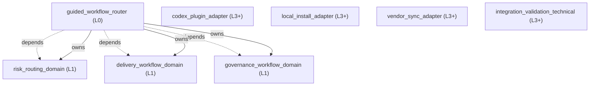

<!-- GENERATED BY govern-modular-event-architecture; DO NOT EDIT -->

# Governed Engineering Skills Architecture Guide

- Standard: `2.0.2`
- Schema: `2.0.2`

## System Overview

## Parent Views

- [`guided_workflow_router`](generated/guided_workflow_router.md) — Present the user-invoked engineering map and coordinate risk, delivery, and governance domains.
- [`risk_routing_domain`](generated/risk_routing_domain.md) — Own engineering risk classes, gate selection, fail-closed behavior, and resume targets.
- [`delivery_workflow_domain`](generated/delivery_workflow_domain.md) — Move an engineering idea or defect through planning, implementation, and review without bypassing required gates.
- [`governance_workflow_domain`](generated/governance_workflow_domain.md) — Enforce decision completeness, architecture ownership, evidence-backed explanation, and bounded runtime validation.

## End-to-End Flows

- [`governed-engineering-route`](generated/guided_workflow_router.md#governed-engineering-route) — Classify an engineering request before selecting its first workflow step.

## Type Catalog

- `routing-decision` ??`risk_routing_domain` / `query` / `cross-module`
- `gate-result` ??`risk_routing_domain` / `domain-value` / `cross-module`

## State Ownership

## Cross-module Mapping

## Execution Profiles
