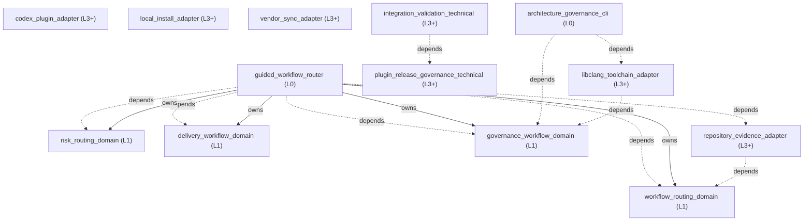

<!-- GENERATED BY govern-modular-event-architecture; DO NOT EDIT -->

# Governed Engineering Skills Architecture Guide

- Standard: `2.1.0`
- Schema: `2.1.0`

## System Overview

## Parent Views

- [`guided_workflow_router`](generated/guided_workflow_router.md) — Automatically route every software-engineering intent by coordinating workflow selection, repository state, risk, delivery, and governance domains.
- [`risk_routing_domain`](generated/risk_routing_domain.md) — Own engineering risk classes, gate selection, fail-closed behavior, and resume targets.
- [`workflow_routing_domain`](generated/workflow_routing_domain.md) — Own deterministic engineering-intent classification, three-state project assessment, capability fallback, and final skill handoff selection.
- [`delivery_workflow_domain`](generated/delivery_workflow_domain.md) — Move an engineering idea or defect through planning, implementation, and review without bypassing required gates.
- [`governance_workflow_domain`](generated/governance_workflow_domain.md) — Enforce decision completeness, architecture ownership, evidence-backed explanation, and bounded runtime validation.
- [`architecture_governance_cli`](generated/architecture_governance_cli.md) — Compose the governance engine and pinned native provider behind the single public architecture CLI.

## End-to-End Flows

- [`governed-engineering-route`](generated/guided_workflow_router.md#governed-engineering-route) — Automatically classify every software-engineering request, inspect its project state, preserve risk gates, and select an immediate safe handoff.

## Type Catalog

- `repository-artifact` — `workflow_routing_domain` / `domain-value` / `cross-module`
- `repository-evidence` — `workflow_routing_domain` / `domain-value` / `cross-module`
- `project-state-assessment` — `workflow_routing_domain` / `query` / `cross-module`
- `intent-assessment` — `workflow_routing_domain` / `query` / `cross-module`
- `guided-route-decision` — `workflow_routing_domain` / `query` / `cross-module`
- `repository-evidence-port` — `workflow_routing_domain` / `port` / `module-public`
- `git-filesystem-repository-evidence-adapter` — `repository_evidence_adapter` / `adapter-binding` / `module-public`
- `routing-decision` — `risk_routing_domain` / `query` / `cross-module`
- `gate-result` — `risk_routing_domain` / `domain-value` / `cross-module`
- `governance-diagnostic` — `governance_workflow_domain` / `private-helper` / `private`
- `governance-manifest-error` — `governance_workflow_domain` / `private-helper` / `private`
- `governance-ast-evidence` — `governance_workflow_domain` / `private-helper` / `private`
- `libclang-toolchain-port` — `governance_workflow_domain` / `port` / `cross-module`
- `libclang-toolchain-evidence` — `governance_workflow_domain` / `domain-value` / `cross-module`
- `toolchain-provider-error` — `governance_workflow_domain` / `domain-value` / `cross-module`
- `espressif-libclang-toolchain-adapter` — `libclang_toolchain_adapter` / `adapter-binding` / `module-public`
- `collection-input-port` — `governance_workflow_domain` / `port` / `module-public`
- `collection-output-port` — `governance_workflow_domain` / `port` / `module-public`
- `transport-port` — `governance_workflow_domain` / `port` / `module-public`
- `guided-session-input-port` — `governance_workflow_domain` / `port` / `module-public`
- `guided-session-output-port` — `governance_workflow_domain` / `port` / `module-public`
- `runtime-verdict` — `governance_workflow_domain` / `domain-value` / `module-public`
- `criterion-result` — `governance_workflow_domain` / `domain-value` / `module-public`
- `verdict-input-port` — `governance_workflow_domain` / `port` / `module-public`
- `verdict-output-port` — `governance_workflow_domain` / `port` / `module-public`
- `validation-profile-error` — `governance_workflow_domain` / `private-helper` / `private`
- `platform-transport-adapter` — `governance_workflow_domain` / `adapter-binding` / `private`

## State Ownership

## Cross-module Mapping

- `routing-assessments-to-guided-handoff` / `guided_workflow_router` / `risk_routing_domain` to `workflow_routing_domain`

## Adoption Readiness

- [Human-readable readiness](generated/adoption-readiness.md)
- [Machine-readable readiness](generated/adoption-readiness.json)

## Execution Profiles

## Real-time Scheduling Studies
