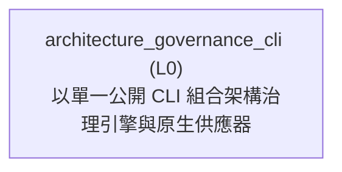

<!-- GENERATED BY govern-modular-event-architecture; DO NOT EDIT -->

# `architecture_governance_cli`

## Structure

## Modules

| ID | Level | Role | Parent | Implementation Status | Purpose |
|---|---|---|---|---|---|
| `architecture_governance_cli` | L0 | composition | `-` | implemented | Compose the governance engine and pinned native provider behind the single public architecture CLI. |

### `architecture_governance_cli`

- **Purpose:** Compose the governance engine and pinned native provider behind the single public architecture CLI.
- **Parent:** `-`
- **Implementation Status:** `implemented`
- **Input Ports:** None
- **Output Ports:** None
- **Emitted Events:** None
- **Owned State:** None
- **Side Effects:** Dispatch one bounded governance or toolchain operation. (`-`)
- **Errors:** None
- **Invariants:** Gate execution never downloads or replaces a native provider cache.
- **Entrypoints:** [`main`](../../skills/govern-modular-event-architecture/scripts/architecture_cli.py) (function)
- **Public Symbols:** [`main`](../../skills/govern-modular-event-architecture/scripts/architecture_cli.py) (function)

## Port Contracts

| ID | Owner | Direction | Kind | Timing | Description | Symbols |
|---|---|---|---|---|---|---|

## Event Contracts

| ID | Owner | Delivery | Emitted when | Purpose | Consumers |
|---|---|---|---|---|---|

## Type Catalog

| ID | Owner | Declaration | Visibility | Semantic kind | Consumers | References |
|---|---|---|---|---|---|---|

## State Ownership

| ID | Owner | Declaration | Type | Visibility | Mutability | Read authority | Write authority |
|---|---|---|---|---|---|---|---|

## Cross-module Mapping

| Interaction | Producer | Consumer | Parent | Producer contract | Consumer contract | Mapping owner | State accessed | Allowed edges | Forbidden edges |
|---|---|---|---|---|---|---|---|---|---|

## End-to-End Flows
