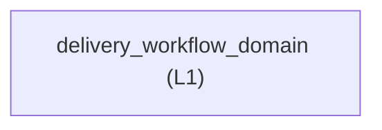

<!-- GENERATED BY govern-modular-event-architecture; DO NOT EDIT -->

# `delivery_workflow_domain`

## Structure

## Modules

| ID | Level | Role | Parent | Implementation Status | Purpose |
|---|---|---|---|---|---|
| `delivery_workflow_domain` | L1 | domain | `guided_workflow_router` | implemented | Move an engineering idea or defect through planning, implementation, and review without bypassing required gates. |

### `delivery_workflow_domain`

- **Purpose:** Move an engineering idea or defect through planning, implementation, and review without bypassing required gates.
- **Parent:** `guided_workflow_router`
- **Implementation Status:** `implemented`
- **Input Ports:** None
- **Output Ports:** None
- **Emitted Events:** None
- **Owned State:** None
- **Side Effects:** None
- **Errors:** None
- **Invariants:** Mutation and commits require task and repository authorization.
- **Entrypoints:** [`implement`](../../skills/implement/SKILL.md) (skill)
- **Public Symbols:** [`implement`](../../skills/implement/SKILL.md) (skill)

## Port Contracts

| ID | Owner | Direction | Kind | Timing | Description | Symbols |
|---|---|---|---|---|---|---|

## Event Contracts

| ID | Owner | Delivery | Emitted when | Purpose | Consumers |
|---|---|---|---|---|---|

## Type Catalog

| ID | Owner | Declaration | Visibility | Semantic kind | Consumers | References |
|---|---|---|---|---|---|---|

## State Ownership

| ID | Owner | Declaration | Type | Visibility | Mutability | Read authority | Write authority |
|---|---|---|---|---|---|---|---|

## Cross-module Mapping

| Interaction | Producer | Consumer | Parent | Producer contract | Consumer contract | Mapping owner | State accessed | Allowed edges | Forbidden edges |
|---|---|---|---|---|---|---|---|---|---|

## End-to-End Flows
