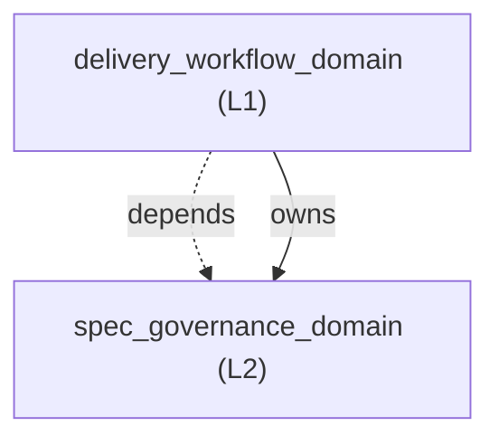
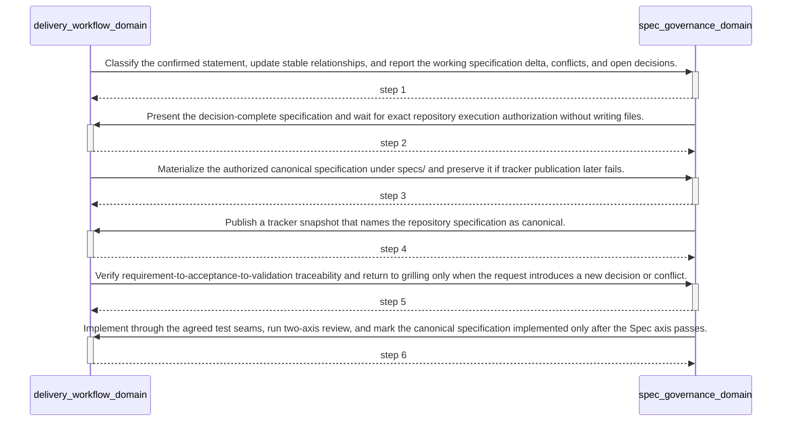

<!-- GENERATED BY govern-modular-event-architecture; DO NOT EDIT -->

# `delivery_workflow_domain`

## Structure

## Modules

| ID | Level | Role | Parent | Implementation Status | Purpose |
|---|---|---|---|---|---|
| `delivery_workflow_domain` | L1 | domain | `guided_workflow_router` | implemented | Move an engineering idea or defect through planning, implementation, and review without bypassing required gates. |
| `spec_governance_domain` | L2 | component | `delivery_workflow_domain` | implemented | Reconcile engineering discussion into one canonical change-set specification, materialize it only after authorization, and verify traceability before implementation. |

### `delivery_workflow_domain`

- **Purpose:** Move an engineering idea or defect through planning, implementation, and review without bypassing required gates.
- **Parent:** `guided_workflow_router`
- **Implementation Status:** `implemented`
- **Input Ports:** None
- **Output Ports:** `delivery-workflow.result`
- **Emitted Events:** `delivery.tracker-publication-pending`
- **Owned State:** None
- **Side Effects:** None
- **Errors:** None
- **Invariants:** Mutation and commits require task and repository authorization.; Every repository-modifying change set has one canonical specification before implementation.; A confirmed specification is verified rather than re-interviewed only with explicit resume evidence and no new decision or conflict.
- **Entrypoints:** [`implement`](../../skills/implement/SKILL.md) (skill) [`assess_delivery_spec_context`](../../skills/implement/scripts/spec_delivery.py) (function)
- **Public Symbols:** [`implement`](../../skills/implement/SKILL.md) (skill) [`assess_delivery_spec_context`](../../skills/implement/scripts/spec_delivery.py) (function)

### `spec_governance_domain`

- **Purpose:** Reconcile engineering discussion into one canonical change-set specification, materialize it only after authorization, and verify traceability before implementation.
- **Parent:** `delivery_workflow_domain`
- **Implementation Status:** `implemented`
- **Input Ports:** `spec-governance.reconcile`, `spec-governance.materialize`, `spec-governance.verify`
- **Output Ports:** `spec-governance.result`
- **Emitted Events:** `spec-governance.blocked`
- **Owned State:** None
- **Side Effects:** Materialize one authorized canonical specification under specs/. (`-`)
- **Errors:** `specification_unresolved`: Conflicts, open decisions, invalid references, or missing requirement-to-acceptance traceability remain. → `spec-governance.blocked` → Preserve the last confirmed specification and return to grilling with exactly one conclusion-changing question.
- **Invariants:** Discussion updates remain an in-conversation working specification until explicit authorization.; Confirmed specifications have unique stable IDs, resolved relations, no open decisions, and at least one acceptance criterion per requirement.; Implemented specifications record PASS evidence for every acceptance criterion and a passing Spec review.
- **Entrypoints:** [`spec-governance`](../../skills/spec-governance/SKILL.md) (skill) [`main`](../../skills/spec-governance/scripts/spec_contract.py) (cli)
- **Public Symbols:** [`spec-governance`](../../skills/spec-governance/SKILL.md) (skill) [`main`](../../skills/spec-governance/scripts/spec_contract.py) (function)

## Port Contracts

| ID | Owner | Direction | Kind | Timing | Description | Symbols |
|---|---|---|---|---|---|---|
| `spec-governance.reconcile` | `spec_governance_domain` | input | query | sync | Reconcile one newly confirmed discussion statement into the working specification.: Existing durable context, the working specification, and one confirmed statement produce a classified delta and consistency verdict. | `spec-governance` |
| `spec-governance.materialize` | `spec_governance_domain` | input | command | sync | Persist one decision-complete working specification as the canonical repository artifact.: An authorized PASS SpecConsistencyAssessment produces one versioned Markdown specification. | `spec-governance` |
| `spec-governance.verify` | `spec_governance_domain` | input | query | sync | Verify a canonical specification and its requirement-to-validation traceability.: A resolved canonical specification and current request produce a PASS or BLOCKED assessment. | `spec-governance` |
| `spec-governance.result` | `spec_governance_domain` | output | event | sync | Publish one specification lifecycle result to the delivery parent.: Consistency or traceability verdict with canonical specification identity. | `spec-governance` |
| `delivery-workflow.result` | `delivery_workflow_domain` | output | event | sync | Publish delivery failures that preserve a valid canonical specification.: Canonical specification identity and the pending external delivery action. | `implement` |

## Event Contracts

| ID | Owner | Delivery | Emitted when | Purpose | Consumers |
|---|---|---|---|---|---|
| `spec-governance.blocked` | `spec_governance_domain` | at-most-once | A reconciliation or verification has unresolved blocking evidence. | Tell delivery orchestration that specification work cannot continue safely. | `delivery_workflow_domain` |
| `delivery.tracker-publication-pending` | `delivery_workflow_domain` | at-most-once | Canonical materialization succeeds and tracker publication fails. | Preserve durable context while reporting that its tracker snapshot remains pending. | `guided_workflow_router` |

## Type Catalog

| ID | Owner | Declaration | Visibility | Semantic kind | Consumers | References |
|---|---|---|---|---|---|---|
| `spec-consistency-assessment` | `spec_governance_domain` | `SpecConsistencyAssessment` (interface, `skills/spec-governance/references/spec-contract.schema.json`) | module-public | query | `delivery_workflow_domain` | None |
| `canonical-spec-reference` | `spec_governance_domain` | `CanonicalSpecReference` (interface, `skills/spec-governance/references/spec-contract.schema.json`) | module-public | domain-value | `delivery_workflow_domain` | None |
| `delivery-spec-context` | `delivery_workflow_domain` | `CanonicalSpecReferenceProjection` (interface, `skills/implement/SKILL.md`) | cross-module | domain-value | `guided_workflow_router` | `canonical-spec-reference` |
| `spec-traceability-assessment` | `spec_governance_domain` | `SpecTraceabilityAssessment` (interface, `skills/spec-governance/references/spec-contract.schema.json`) | module-public | query | `delivery_workflow_domain` | `canonical-spec-reference` |

## State Ownership

| ID | Owner | Declaration | Type | Visibility | Mutability | Read authority | Write authority |
|---|---|---|---|---|---|---|---|

## Cross-module Mapping

| Interaction | Producer | Consumer | Parent | Producer contract | Consumer contract | Mapping owner | State accessed | Allowed edges | Forbidden edges |
|---|---|---|---|---|---|---|---|---|---|
| `canonical-spec-to-delivery-context`: Project the child-owned canonical specification result into its parent delivery workflow without leaking the child contract to a sibling. | `spec_governance_domain` | `delivery_workflow_domain` | `delivery_workflow_domain` | `canonical-spec-reference` | `delivery-spec-context` | `delivery_workflow_domain` | None | `delivery_workflow_domain->spec_governance_domain` | `spec_governance_domain->delivery_workflow_domain` |

## End-to-End Flows

### `governed-change-set-lifecycle`

Reconcile one modifying change set into a canonical specification, materialize it after authorization, verify traceability, implement it, and close it only after Spec review passes.

#### Flow Diagram

#### Ordered Steps

| # | Module | Action | Receives | Emits | State changes | Side effects |
|---|---|---|---|---|---|---|
| 1 | `spec_governance_domain` | Classify the confirmed statement, update stable relationships, and report the working specification delta, conflicts, and open decisions. | `spec-governance.reconcile` | None | None | None |
| 2 | `delivery_workflow_domain` | Present the decision-complete specification and wait for exact repository execution authorization without writing files. | None | None | None | None |
| 3 | `spec_governance_domain` | Materialize the authorized canonical specification under specs/ and preserve it if tracker publication later fails. | `spec-governance.materialize` | None | None | Write one canonical specification revision. |
| 4 | `delivery_workflow_domain` | Publish a tracker snapshot that names the repository specification as canonical. | None | None | None | Create or update one tracker Issue when configured. |
| 5 | `spec_governance_domain` | Verify requirement-to-acceptance-to-validation traceability and return to grilling only when the request introduces a new decision or conflict. | `spec-governance.verify` | None | None | None |
| 6 | `delivery_workflow_domain` | Implement through the agreed test seams, run two-axis review, and mark the canonical specification implemented only after the Spec axis passes. | None | None | None | Update the canonical specification with PASS evidence and implemented status. |

- **Success:** The implemented behavior is traceable to one canonical specification whose requirements and acceptance criteria have verified PASS evidence.
- **Errors:** Reconciliation finds an unresolved conflict or conclusion-changing decision. → `spec-governance.blocked` → Remain in grilling and ask exactly one conclusion-changing question.
- **Errors:** Canonical materialization succeeds but tracker publication fails. → `delivery.tracker-publication-pending` → Preserve the canonical specification and report BLOCKED with a retry target.

#### Execution efficiency

- Workload `governed-change-set-workload`: `best-effort`; steps `governed-change-set-lifecycle.reconcile`, `governed-change-set-lifecycle.authorize`, `governed-change-set-lifecycle.materialize`, `governed-change-set-lifecycle.publish`, `governed-change-set-lifecycle.verify`, `governed-change-set-lifecycle.implement-review`; profiles None.
