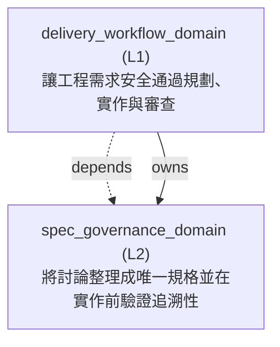

<!-- GENERATED BY govern-modular-event-architecture; DO NOT EDIT -->

# `delivery_workflow_domain`

## Structure



## Modules

| ID | Level | Role | Parent | Implementation Status | Purpose |
|---|---|---|---|---|---|
| `delivery_workflow_domain` | L1 | domain | `guided_workflow_router` | implemented | Move an engineering idea or defect through planning, implementation, and review without bypassing required gates. |
| `spec_governance_domain` | L2 | component | `delivery_workflow_domain` | implemented | Persist and reconcile engineering discussion into one canonical change-set specification, materialize it when decision-complete, and verify traceability before implementation. |

### `delivery_workflow_domain`

- **Purpose:** Move an engineering idea or defect through planning, implementation, and review without bypassing required gates.
- **Parent:** `guided_workflow_router`
- **Implementation Status:** `implemented`
- **Input Ports:** None
- **Output Ports:** `delivery-workflow.result`
- **Emitted Events:** `delivery.tracker-publication-pending`
- **Owned State:** None
- **Side Effects:** None
- **Errors:** None
- **Invariants:** Product mutation and commits require task and repository authorization; specification lifecycle writes do not grant that authority.; Every repository-modifying change set has one canonical specification before implementation.; A confirmed specification is verified rather than re-interviewed only with explicit resume evidence and no new decision or conflict.
- **Entrypoints:** [`implement`](../../skills/implement/SKILL.md) (skill)<br>[`assess_delivery_spec_context`](../../skills/implement/scripts/spec_delivery.py) (function)
- **Public Symbols:** [`implement`](../../skills/implement/SKILL.md) (skill)<br>[`assess_delivery_spec_context`](../../skills/implement/scripts/spec_delivery.py) (function)

### `spec_governance_domain`

- **Purpose:** Persist and reconcile engineering discussion into one canonical change-set specification, materialize it when decision-complete, and verify traceability before implementation.
- **Parent:** `delivery_workflow_domain`
- **Implementation Status:** `implemented`
- **Input Ports:** `spec-governance.start`, `spec-governance.reconcile`, `spec-governance.materialize`, `spec-governance.reopen`, `spec-governance.prepare-commit`, `spec-governance.verify`
- **Output Ports:** `spec-governance.result`
- **Emitted Events:** `spec-governance.blocked`
- **Owned State:** None
- **Side Effects:** Atomically persist one owner-private working Markdown snapshot and append its normalized local journal. (`-`); Materialize one decision-complete canonical specification under specs/. (`-`)
- **Errors:** `specification_unresolved`: Conflicts, open decisions, invalid references, or missing requirement-to-acceptance traceability remain. → `spec-governance.blocked` → Preserve the last confirmed specification and return to grilling with exactly one conclusion-changing question.; `stale_working_spec`: The caller's expected revision or snapshot hash does not match the persisted working specification. → `spec-governance.blocked` → Preserve the persisted snapshot, reload it, and reconcile the answer again without allocating replacement IDs.
- **Invariants:** Every answered decision is persisted before the next decision question.; Specification lifecycle writes never authorize product, Git, or external mutations.; Confirmed specifications have unique stable IDs, resolved relations, no open decisions, and at least one acceptance criterion per requirement.; Confirmed unimplemented specifications reopen in place before a possible contract change; implemented specifications never reopen.; Implemented specifications record PASS evidence for every acceptance criterion and a passing Spec review.
- **Entrypoints:** [`spec-governance`](../../skills/spec-governance/SKILL.md) (skill)<br>[`main`](../../skills/spec-governance/scripts/spec_contract.py) (cli)
- **Public Symbols:** [`spec-governance`](../../skills/spec-governance/SKILL.md) (skill)<br>[`main`](../../skills/spec-governance/scripts/spec_contract.py) (function)

## Port Contracts

| ID | Owner | Direction | Kind | Timing | Description | Symbols |
|---|---|---|---|---|---|---|
| `spec-governance.start` | `spec_governance_domain` | input | command | sync | Create or resolve one project-local working specification bundle.: Project root, change-set slug and optional working, task, or branch evidence produce one immutable WorkingSpecReference. | `spec-governance` |
| `spec-governance.reconcile` | `spec_governance_domain` | input | command | sync | Reconcile and persist one newly confirmed discussion statement before another decision question.: Expected working revision and hash, existing durable context, and one confirmed statement produce a new snapshot, normalized journal event, and consistency verdict. | `spec-governance` |
| `spec-governance.materialize` | `spec_governance_domain` | input | command | sync | Persist one decision-complete working specification as the canonical repository artifact.: A PASS SpecConsistencyAssessment produces one versioned Markdown specification without granting product execution authority. | `spec-governance` |
| `spec-governance.reopen` | `spec_governance_domain` | input | command | sync | Reopen a confirmed unimplemented specification in place before clarifying a possible contract change.: Expected canonical revision, reason, and specification path produce a working canonical revision plus a local working bundle. | `spec-governance` |
| `spec-governance.prepare-commit` | `spec_governance_domain` | input | query | sync | Detect staged local working bundles and require an explicit retention disposition.: Project Git state and known working bundles produce delete, keep-local, or archive choices without performing Git actions. | `spec-governance` |
| `spec-governance.verify` | `spec_governance_domain` | input | query | sync | Verify a canonical specification and its requirement-to-validation traceability.: A resolved canonical specification and current request produce a PASS or BLOCKED assessment. | `spec-governance` |
| `spec-governance.result` | `spec_governance_domain` | output | event | sync | Publish one specification lifecycle result to the delivery parent.: Consistency or traceability verdict with canonical specification identity. | `spec-governance` |
| `delivery-workflow.result` | `delivery_workflow_domain` | output | event | sync | Publish delivery failures that preserve a valid canonical specification.: Canonical specification identity and the pending external delivery action. | `implement` |

## Event Contracts

| ID | Owner | Delivery | Emitted when | Purpose | Consumers |
|---|---|---|---|---|---|
| `spec-governance.blocked` | `spec_governance_domain` | at-most-once | A reconciliation or verification has unresolved blocking evidence. | Tell delivery orchestration that specification work cannot continue safely. | `delivery_workflow_domain` |
| `delivery.tracker-publication-pending` | `delivery_workflow_domain` | at-most-once | Canonical materialization succeeds and tracker publication fails. | Preserve durable context while reporting that its tracker snapshot remains pending. | `guided_workflow_router` |

## Type Catalog

| ID | Owner | Declaration | Visibility | Semantic kind | Consumers | References |
|---|---|---|---|---|---|---|
| `working-spec-reference` | `spec_governance_domain` | `WorkingSpecReference` (interface, `skills/spec-governance/references/spec-contract.schema.json`) | module-public | domain-value | `delivery_workflow_domain` | None |
| `spec-consistency-assessment` | `spec_governance_domain` | `SpecConsistencyAssessment` (interface, `skills/spec-governance/references/spec-contract.schema.json`) | module-public | query | `delivery_workflow_domain` | None |
| `canonical-spec-reference` | `spec_governance_domain` | `CanonicalSpecReference` (interface, `skills/spec-governance/references/spec-contract.schema.json`) | module-public | domain-value | `delivery_workflow_domain` | None |
| `delivery-spec-context` | `delivery_workflow_domain` | `CanonicalSpecReferenceProjection` (interface, `skills/implement/SKILL.md`) | cross-module | domain-value | `guided_workflow_router` | `canonical-spec-reference` |
| `spec-traceability-assessment` | `spec_governance_domain` | `SpecTraceabilityAssessment` (interface, `skills/spec-governance/references/spec-contract.schema.json`) | module-public | query | `delivery_workflow_domain` | `canonical-spec-reference` |

## State Ownership

| ID | Owner | Declaration | Type | Visibility | Mutability | Read authority | Write authority |
|---|---|---|---|---|---|---|---|

## Cross-module Mapping

| Interaction | Producer | Consumer | Parent | Producer contract | Consumer contract | Mapping owner | State accessed | Allowed edges | Forbidden edges |
|---|---|---|---|---|---|---|---|---|---|
| `canonical-spec-to-delivery-context`: Project the child-owned canonical specification result into its parent delivery workflow without leaking the child contract to a sibling. | `spec_governance_domain` | `delivery_workflow_domain` | `delivery_workflow_domain` | `canonical-spec-reference` | `delivery-spec-context` | `delivery_workflow_domain` | None | `delivery_workflow_domain->spec_governance_domain` | `spec_governance_domain->delivery_workflow_domain` |

## End-to-End Flows

### `governed-change-set-lifecycle`

Persist and reconcile one modifying change set into a canonical specification, materialize it when decision-complete, wait for product execution authorization, verify traceability, implement it, and close it only after Spec review and commit disposition pass.

#### Flow Diagram

```mermaid
sequenceDiagram
    participant n_delivery_workflow_domain as delivery_workflow_domain<br/>讓工程需求安全通過規劃、實作與審查
    participant n_spec_governance_domain as spec_governance_domain<br/>將討論整理成唯一規格並在實作前驗證追溯性
    participant n_governance_workflow_domain as governance_workflow_domain<br/>管理決策完整性、架構所有權與證據驗證
    n_delivery_workflow_domain->>+n_spec_governance_domain: Create or resolve one project-local working bundle before the first decision question.
    n_spec_governance_domain-->>-n_delivery_workflow_domain: step 1
    n_spec_governance_domain->>+n_spec_governance_domain: Classify the confirmed statement, update stable relationships, and report and persist the working specification delta, conflicts, and open decisions before another decision question.
    n_spec_governance_domain-->>-n_spec_governance_domain: step 2
    n_spec_governance_domain->>+n_governance_workflow_domain: Review every material as-is and target Flow through functional admission, execution and real-time feasibility, maintainability and extensibility change scenarios, and model assurance; keep unresolved load-bearing evidence BLOCKED.
    n_governance_workflow_domain-->>-n_spec_governance_domain: step 3
    n_governance_workflow_domain->>+n_spec_governance_domain: Materialize the decision-complete canonical specification under specs/ without granting product execution authorization.
    n_spec_governance_domain-->>-n_governance_workflow_domain: step 4
    n_spec_governance_domain->>+n_delivery_workflow_domain: Present the confirmed specification and wait for exact product execution authorization; reopen it before clarification when a possible contract change appears.
    n_delivery_workflow_domain-->>-n_spec_governance_domain: step 5
    n_delivery_workflow_domain->>+n_delivery_workflow_domain: Publish a tracker snapshot that names the repository specification as canonical.
    n_delivery_workflow_domain-->>-n_delivery_workflow_domain: step 6
    n_delivery_workflow_domain->>+n_spec_governance_domain: Verify requirement-to-acceptance-to-validation traceability and return to grilling only when the request introduces a new decision or conflict.
    n_spec_governance_domain-->>-n_delivery_workflow_domain: step 7
    n_spec_governance_domain->>+n_delivery_workflow_domain: Implement through the agreed test seams, run two-axis review, and mark the canonical specification implemented only after the Spec axis passes.
    n_delivery_workflow_domain-->>-n_spec_governance_domain: step 8
    n_delivery_workflow_domain->>+n_spec_governance_domain: Reject staged local working state and require delete, keep-local, or archive disposition before the delivery workflow commits.
    n_spec_governance_domain-->>-n_delivery_workflow_domain: step 9
```

#### Ordered Steps

| # | Module | Action | Receives | Emits | State changes | Side effects |
|---|---|---|---|---|---|---|
| 1 | `spec_governance_domain` | Create or resolve one project-local working bundle before the first decision question. | `spec-governance.start` | None | None | Write one local authoritative working Markdown snapshot and journal epoch. |
| 2 | `spec_governance_domain` | Classify the confirmed statement, update stable relationships, and report and persist the working specification delta, conflicts, and open decisions before another decision question. | `spec-governance.reconcile` | None | None | Atomically replace the working snapshot and append one normalized journal event. |
| 3 | `governance_workflow_domain` | Review every material as-is and target Flow through functional admission, execution and real-time feasibility, maintainability and extensibility change scenarios, and model assurance; keep unresolved load-bearing evidence BLOCKED. | None | None | None | None |
| 4 | `spec_governance_domain` | Materialize the decision-complete canonical specification under specs/ without granting product execution authorization. | `spec-governance.materialize` | None | None | Write one canonical specification revision. |
| 5 | `delivery_workflow_domain` | Present the confirmed specification and wait for exact product execution authorization; reopen it before clarification when a possible contract change appears. | `spec-governance.reopen` | None | None | Reopen one confirmed unimplemented specification in place when required. |
| 6 | `delivery_workflow_domain` | Publish a tracker snapshot that names the repository specification as canonical. | None | None | None | Create or update one tracker Issue when configured. |
| 7 | `spec_governance_domain` | Verify requirement-to-acceptance-to-validation traceability and return to grilling only when the request introduces a new decision or conflict. | `spec-governance.verify` | None | None | None |
| 8 | `delivery_workflow_domain` | Implement through the agreed test seams, run two-axis review, and mark the canonical specification implemented only after the Spec axis passes. | None | None | None | Update the canonical specification with PASS evidence and implemented status. |
| 9 | `spec_governance_domain` | Reject staged local working state and require delete, keep-local, or archive disposition before the delivery workflow commits. | `spec-governance.prepare-commit` | None | None | None |

- **Success:** The implemented behavior is traceable to one canonical specification whose requirements and acceptance criteria have verified PASS evidence.
- **Errors:** Reconciliation finds an unresolved conflict or conclusion-changing decision. → `spec-governance.blocked` → Remain in grilling and ask exactly one conclusion-changing question.
- **Errors:** A material Flow has unresolved platform units, cost paths, budgets, model error, reserve, interference, or scenario coverage. → `spec-governance.blocked` → Preserve directional analysis but keep the performance or real-time claim BLOCKED until the required evidence is calibrated.
- **Errors:** Canonical materialization succeeds but tracker publication fails. → `delivery.tracker-publication-pending` → Preserve the canonical specification and report BLOCKED with a retry target.
- **Errors:** Local working state is staged or its retention disposition is missing. → `spec-governance.blocked` → Preserve the bundle, block commit, and ask exactly one disposition question.

#### Execution efficiency

- Workload `governed-change-set-workload`: `best-effort`; steps `governed-change-set-lifecycle.start`, `governed-change-set-lifecycle.reconcile`, `governed-change-set-lifecycle.review-flow-cost`, `governed-change-set-lifecycle.materialize`, `governed-change-set-lifecycle.authorize`, `governed-change-set-lifecycle.publish`, `governed-change-set-lifecycle.verify`, `governed-change-set-lifecycle.implement-review`, `governed-change-set-lifecycle.prepare-commit`; profiles None.
