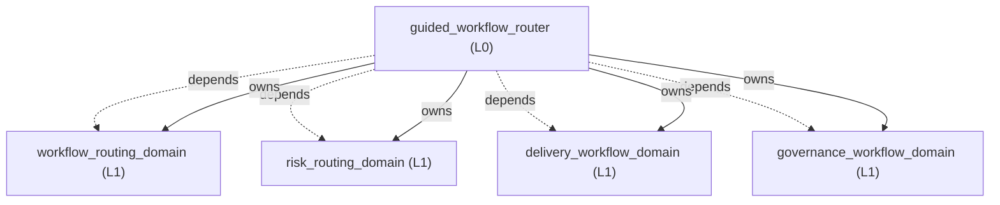
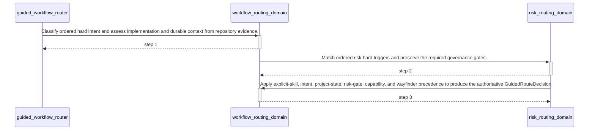

<!-- GENERATED BY govern-modular-event-architecture; DO NOT EDIT -->

# `guided_workflow_router`

## Structure

## Modules

| ID | Level | Role | Parent | Implementation Status | Purpose |
|---|---|---|---|---|---|
| `guided_workflow_router` | L0 | composition | `-` | implemented | Automatically route every software-engineering intent by coordinating workflow selection, repository state, risk, delivery, and governance domains. |
| `risk_routing_domain` | L1 | domain | `guided_workflow_router` | implemented | Own engineering risk classes, gate selection, fail-closed behavior, and resume targets. |
| `workflow_routing_domain` | L1 | domain | `guided_workflow_router` | implemented | Own deterministic engineering-intent classification, three-state project assessment, capability fallback, and final skill handoff selection. |
| `delivery_workflow_domain` | L1 | domain | `guided_workflow_router` | implemented | Move an engineering idea or defect through planning, implementation, and review without bypassing required gates. |
| `governance_workflow_domain` | L1 | domain | `guided_workflow_router` | implemented | Enforce decision completeness, architecture ownership, evidence-backed explanation, and bounded runtime validation. |

### `guided_workflow_router`

- **Purpose:** Automatically route every software-engineering intent by coordinating workflow selection, repository state, risk, delivery, and governance domains.
- **Parent:** `-`
- **Implementation Status:** `implemented`
- **Input Ports:** `guided-routing.route`
- **Output Ports:** None
- **Emitted Events:** None
- **Owned State:** None
- **Side Effects:** None
- **Errors:** None
- **Invariants:** Users never need to know or invoke ask-matt for software-engineering work.; Every repository-modifying change set completes grilling before mutation.; Discoverable facts are explored before any unresolved decision is asked.; A newly discovered discretionary decision stops execution and returns to grilling.; Never route standalone learning-note or HackMD work.
- **Entrypoints:** [`ask-matt`](../../skills/ask-matt/SKILL.md) (skill) [`main`](../../skills/engineering-risk-routing/scripts/guided_workflow_router.py) (cli)
- **Public Symbols:** [`ask-matt`](../../skills/ask-matt/SKILL.md) (skill) [`route`](../../skills/engineering-risk-routing/scripts/guided_workflow_router.py) (function)

### `risk_routing_domain`

- **Purpose:** Own engineering risk classes, gate selection, fail-closed behavior, and resume targets.
- **Parent:** `guided_workflow_router`
- **Implementation Status:** `implemented`
- **Input Ports:** `risk-routing.classify`
- **Output Ports:** None
- **Emitted Events:** None
- **Owned State:** None
- **Side Effects:** None
- **Errors:** None
- **Invariants:** Higher hard-trigger risk always takes precedence.; Missing required capabilities or evidence cannot be downgraded.
- **Entrypoints:** [`main`](../../skills/engineering-risk-routing/scripts/classify_risk.py) (cli)
- **Public Symbols:** [`classify`](../../skills/engineering-risk-routing/scripts/classify_risk.py) (function)

### `workflow_routing_domain`

- **Purpose:** Own deterministic engineering-intent classification, three-state project assessment, capability fallback, and final skill handoff selection.
- **Parent:** `guided_workflow_router`
- **Implementation Status:** `implemented`
- **Input Ports:** `workflow-routing.assess-project`, `workflow-routing.select`
- **Output Ports:** `repository-evidence.collect`
- **Emitted Events:** None
- **Owned State:** None
- **Side Effects:** None
- **Errors:** None
- **Invariants:** Explicit skills outrank inferred intent.; Intent selects the primary flow before project state and risk gates are applied.; Indeterminate intent or project state is never silently guessed.; Risk classification adds gates but never replaces the primary user intent.
- **Entrypoints:** [`assess_project_state`](../../skills/engineering-risk-routing/scripts/project_state.py) (function) [`select_workflow`](../../skills/engineering-risk-routing/scripts/workflow_selection.py) (function)
- **Public Symbols:** [`RepositoryEvidencePort`](../../skills/engineering-risk-routing/scripts/project_state.py) (class) [`assess_project_state`](../../skills/engineering-risk-routing/scripts/project_state.py) (function) [`classify_intent`](../../skills/engineering-risk-routing/scripts/workflow_selection.py) (function) [`select_workflow`](../../skills/engineering-risk-routing/scripts/workflow_selection.py) (function)

### `delivery_workflow_domain`

- **Purpose:** Move an engineering idea or defect through planning, implementation, and review without bypassing required gates.
- **Parent:** `guided_workflow_router`
- **Implementation Status:** `implemented`
- **Input Ports:** None
- **Output Ports:** None
- **Emitted Events:** None
- **Owned State:** None
- **Side Effects:** None
- **Errors:** None
- **Invariants:** Mutation and commits require task and repository authorization.
- **Entrypoints:** [`implement`](../../skills/implement/SKILL.md) (skill)
- **Public Symbols:** [`implement`](../../skills/implement/SKILL.md) (skill)

### `governance_workflow_domain`

- **Purpose:** Enforce decision completeness, architecture ownership, evidence-backed explanation, and bounded runtime validation.
- **Parent:** `guided_workflow_router`
- **Implementation Status:** `implemented`
- **Input Ports:** None
- **Output Ports:** None
- **Emitted Events:** None
- **Owned State:** None
- **Side Effects:** None
- **Errors:** None
- **Invariants:** Codex never approves its own ADR or Algorithm Design Record.; C/C++ AST governance resolves native libclang only through its demand-owned pinned provider contract.
- **Entrypoints:** [`govern-modular-event-architecture`](../../skills/govern-modular-event-architecture/SKILL.md) (skill)
- **Public Symbols:** [`govern-modular-event-architecture`](../../skills/govern-modular-event-architecture/SKILL.md) (skill) [`LibclangToolchainPort`](../../skills/govern-modular-event-architecture/scripts/libclang_toolchain_contract.py) (class)

## Port Contracts

| ID | Owner | Direction | Kind | Timing | Description | Symbols |
|---|---|---|---|---|---|---|
| `guided-routing.route` | `guided_workflow_router` | input | query | sync | Route one software-engineering request to its safe primary skill.: Task text, project root, explicit skill, available capabilities, risk decision, and wayfinder complexity evidence. | `ask-matt` |
| `risk-routing.classify` | `risk_routing_domain` | input | query | sync | Classify one engineering task and select required gates.: Task text, optional entry skill, available capabilities, and passed gate evidence. | `classify` |
| `workflow-routing.assess-project` | `workflow_routing_domain` | input | query | sync | Convert repository evidence into a three-state implementation and documentation assessment.: Read-only tracked and non-ignored untracked path evidence. | `assess_project_state` |
| `workflow-routing.select` | `workflow_routing_domain` | input | query | sync | Select the authoritative skill handoff after intent, project state, risk, capability, and complexity checks.: IntentAssessment, ProjectStateAssessment, RoutingDecision, capabilities, and wayfinder threshold evidence. | `select_workflow` |
| `repository-evidence.collect` | `workflow_routing_domain` | output | query | sync | Read repository paths and Git tracking status for project-state assessment.: One project root produces normalized RepositoryEvidence rows. | `RepositoryEvidencePort` |
| `libclang_toolchain.resolve` | `governance_workflow_domain` | output | query | sync | Resolve, bind, and verify one lock-pinned target-capable libclang provider.: Toolchain lock and operation mode produce immutable provider evidence or fail-closed CAST diagnostics. | `LibclangToolchainPort` |

## Event Contracts

| ID | Owner | Delivery | Emitted when | Purpose | Consumers |
|---|---|---|---|---|---|

## Type Catalog

| ID | Owner | Declaration | Visibility | Semantic kind | Consumers | References |
|---|---|---|---|---|---|---|
| `repository-artifact` | `workflow_routing_domain` | `RepositoryArtifact` (interface, `skills/engineering-risk-routing/references/guided-routing-contract.schema.json`) | cross-module | domain-value | `workflow_routing_domain`, `repository_evidence_adapter` | None |
| `repository-evidence` | `workflow_routing_domain` | `RepositoryEvidence` (interface, `skills/engineering-risk-routing/references/guided-routing-contract.schema.json`) | cross-module | domain-value | `guided_workflow_router`, `workflow_routing_domain` | None |
| `project-state-assessment` | `workflow_routing_domain` | `ProjectStateAssessment` (interface, `skills/engineering-risk-routing/references/guided-routing-contract.schema.json`) | cross-module | query | `guided_workflow_router` | `repository-artifact`, `repository-evidence` |
| `intent-assessment` | `workflow_routing_domain` | `IntentAssessment` (interface, `skills/engineering-risk-routing/references/guided-routing-contract.schema.json`) | cross-module | query | `guided_workflow_router` | None |
| `guided-route-decision` | `workflow_routing_domain` | `GuidedRouteDecision` (interface, `skills/engineering-risk-routing/references/guided-routing-contract.schema.json`) | cross-module | query | `guided_workflow_router` | `project-state-assessment`, `intent-assessment` |
| `repository-evidence-port` | `workflow_routing_domain` | `RepositoryEvidencePort` (class, `skills/engineering-risk-routing/scripts/project_state.py`) | module-public | port | `workflow_routing_domain`, `repository_evidence_adapter` | `repository-artifact` |
| `routing-decision` | `risk_routing_domain` | `RoutingDecision` (interface, `skills/engineering-risk-routing/references/routing-contract.schema.json`) | cross-module | query | `guided_workflow_router` | None |
| `gate-result` | `risk_routing_domain` | `GateResult` (interface, `skills/engineering-risk-routing/references/routing-contract.schema.json`) | cross-module | domain-value | `guided_workflow_router` | None |
| `governance-diagnostic` | `governance_workflow_domain` | `Diagnostic` (class, `skills/govern-modular-event-architecture/scripts/check_architecture.py`) | private | private-helper | `governance_workflow_domain` | None |
| `governance-manifest-error` | `governance_workflow_domain` | `ManifestError` (class, `skills/govern-modular-event-architecture/scripts/check_architecture.py`) | private | private-helper | `governance_workflow_domain` | None |
| `governance-ast-evidence` | `governance_workflow_domain` | `AstEvidence` (class, `skills/govern-modular-event-architecture/scripts/ast_analyzer.py`) | private | private-helper | `governance_workflow_domain` | None |
| `libclang-toolchain-port` | `governance_workflow_domain` | `LibclangToolchainPort` (class, `skills/govern-modular-event-architecture/scripts/libclang_toolchain_contract.py`) | cross-module | port | `governance_workflow_domain`, `libclang_toolchain_adapter` | `libclang-toolchain-evidence` |
| `libclang-toolchain-evidence` | `governance_workflow_domain` | `LibclangToolchainEvidence` (class, `skills/govern-modular-event-architecture/scripts/libclang_toolchain_contract.py`) | cross-module | domain-value | `governance_workflow_domain`, `libclang_toolchain_adapter` | None |
| `toolchain-provider-error` | `governance_workflow_domain` | `ToolchainProviderError` (class, `skills/govern-modular-event-architecture/scripts/libclang_toolchain_contract.py`) | cross-module | domain-value | `architecture_governance_cli`, `governance_workflow_domain`, `libclang_toolchain_adapter` | None |
| `collection-input-port` | `governance_workflow_domain` | `CollectionInputPort` (class, `skills/validate-on-device/scripts/vod/execution.py`) | module-public | port | `governance_workflow_domain` | None |
| `collection-output-port` | `governance_workflow_domain` | `CollectionOutputPort` (class, `skills/validate-on-device/scripts/vod/execution.py`) | module-public | port | `governance_workflow_domain` | None |
| `transport-port` | `governance_workflow_domain` | `TransportPort` (class, `skills/validate-on-device/scripts/vod/execution.py`) | module-public | port | `governance_workflow_domain` | None |
| `guided-session-input-port` | `governance_workflow_domain` | `GuidedSessionInputPort` (class, `skills/validate-on-device/scripts/vod/guided.py`) | module-public | port | `governance_workflow_domain` | None |
| `guided-session-output-port` | `governance_workflow_domain` | `GuidedSessionOutputPort` (class, `skills/validate-on-device/scripts/vod/guided.py`) | module-public | port | `governance_workflow_domain` | None |
| `runtime-verdict` | `governance_workflow_domain` | `Verdict` (class, `skills/validate-on-device/scripts/vod/model.py`) | module-public | domain-value | `governance_workflow_domain` | None |
| `criterion-result` | `governance_workflow_domain` | `CriterionResult` (class, `skills/validate-on-device/scripts/vod/model.py`) | module-public | domain-value | `governance_workflow_domain` | `runtime-verdict` |
| `verdict-input-port` | `governance_workflow_domain` | `VerdictInputPort` (class, `skills/validate-on-device/scripts/vod/model.py`) | module-public | port | `governance_workflow_domain` | None |
| `verdict-output-port` | `governance_workflow_domain` | `VerdictOutputPort` (class, `skills/validate-on-device/scripts/vod/model.py`) | module-public | port | `governance_workflow_domain` | None |
| `validation-profile-error` | `governance_workflow_domain` | `ProfileError` (class, `skills/validate-on-device/scripts/vod/profile.py`) | private | private-helper | `governance_workflow_domain` | None |
| `platform-transport-adapter` | `governance_workflow_domain` | `PlatformTransportAdapter` (class, `skills/validate-on-device/scripts/vod/providers.py`) | private | adapter-binding | `governance_workflow_domain` | `transport-port` |

## State Ownership

| ID | Owner | Declaration | Type | Visibility | Mutability | Read authority | Write authority |
|---|---|---|---|---|---|---|---|

## Cross-module Mapping

| Interaction | Producer | Consumer | Parent | Producer contract | Consumer contract | Mapping owner | State accessed | Allowed edges | Forbidden edges |
|---|---|---|---|---|---|---|---|---|---|
| `routing-assessments-to-guided-handoff`: Combine workflow-owned intent and project state with risk-owned gate evidence without letting either sibling depend directly on the other. | `risk_routing_domain` | `workflow_routing_domain` | `guided_workflow_router` | `routing-decision` | `guided-route-decision` | `guided_workflow_router` | None | `guided_workflow_router->risk_routing_domain`, `guided_workflow_router->workflow_routing_domain` | `risk_routing_domain->workflow_routing_domain`, `workflow_routing_domain->risk_routing_domain` |

## End-to-End Flows

### `governed-engineering-route`

Automatically classify every software-engineering request, inspect its project state, preserve risk gates, and select an immediate safe handoff.

#### Flow Diagram

#### Ordered Steps

| # | Module | Action | Receives | Emits | State changes | Side effects |
|---|---|---|---|---|---|---|
| 1 | `workflow_routing_domain` | Classify ordered hard intent and assess implementation and durable context from repository evidence. | `workflow-routing.assess-project`, `repository-evidence.collect` | None | None | None |
| 2 | `risk_routing_domain` | Match ordered risk hard triggers and preserve the required governance gates. | `risk-routing.classify` | None | None | None |
| 3 | `workflow_routing_domain` | Apply explicit-skill, intent, project-state, risk-gate, capability, and wayfinder precedence to produce the authoritative GuidedRouteDecision. | `workflow-routing.select` | None | None | None |

- **Success:** A PASS or DEGRADED decision selects an immediate safe handoff; unresolved evidence or missing non-substitutable capability returns BLOCKED.

#### Execution efficiency

- Workload `governed-routing-workload`: `best-effort`; steps `governed-engineering-route.assess`, `governed-engineering-route.classify-risk`, `governed-engineering-route.select`; profiles None.
