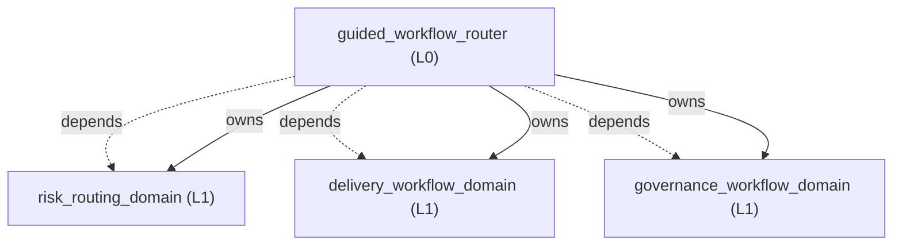
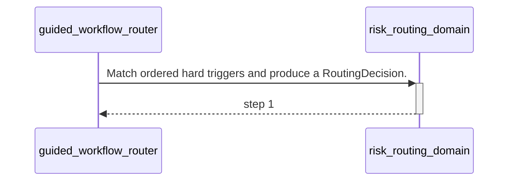

<!-- GENERATED BY govern-modular-event-architecture; DO NOT EDIT -->

# `guided_workflow_router`

## Structure

## Modules

| ID | Level | Role | Parent | Implementation Status | Purpose |
|---|---|---|---|---|---|
| `guided_workflow_router` | L0 | composition | `-` | implemented | Present the user-invoked engineering map and coordinate risk, delivery, and governance domains. |
| `risk_routing_domain` | L1 | domain | `guided_workflow_router` | implemented | Own engineering risk classes, gate selection, fail-closed behavior, and resume targets. |
| `delivery_workflow_domain` | L1 | domain | `guided_workflow_router` | implemented | Move an engineering idea or defect through planning, implementation, and review without bypassing required gates. |
| `governance_workflow_domain` | L1 | domain | `guided_workflow_router` | implemented | Enforce decision completeness, architecture ownership, evidence-backed explanation, and bounded runtime validation. |

### `guided_workflow_router`

- **Purpose:** Present the user-invoked engineering map and coordinate risk, delivery, and governance domains.
- **Parent:** `-`
- **Implementation Status:** `implemented`
- **Input Ports:** None
- **Output Ports:** None
- **Emitted Events:** None
- **Owned State:** None
- **Side Effects:** None
- **Errors:** None
- **Invariants:** Never execute human-only skills on the user's behalf.; Never route standalone learning-note or HackMD work.
- **Entrypoints:** [`ask-matt`](../../skills/ask-matt/SKILL.md) (skill)
- **Public Symbols:** [`ask-matt`](../../skills/ask-matt/SKILL.md) (skill)

### `risk_routing_domain`

- **Purpose:** Own engineering risk classes, gate selection, fail-closed behavior, and resume targets.
- **Parent:** `guided_workflow_router`
- **Implementation Status:** `implemented`
- **Input Ports:** `risk-routing.classify`
- **Output Ports:** None
- **Emitted Events:** None
- **Owned State:** None
- **Side Effects:** None
- **Errors:** None
- **Invariants:** Higher hard-trigger risk always takes precedence.; Missing required capabilities or evidence cannot be downgraded.
- **Entrypoints:** [`main`](../../skills/engineering-risk-routing/scripts/classify_risk.py) (cli)
- **Public Symbols:** [`classify`](../../skills/engineering-risk-routing/scripts/classify_risk.py) (function)

### `delivery_workflow_domain`

- **Purpose:** Move an engineering idea or defect through planning, implementation, and review without bypassing required gates.
- **Parent:** `guided_workflow_router`
- **Implementation Status:** `implemented`
- **Input Ports:** None
- **Output Ports:** None
- **Emitted Events:** None
- **Owned State:** None
- **Side Effects:** None
- **Errors:** None
- **Invariants:** Mutation and commits require task and repository authorization.
- **Entrypoints:** [`implement`](../../skills/implement/SKILL.md) (skill)
- **Public Symbols:** [`implement`](../../skills/implement/SKILL.md) (skill)

### `governance_workflow_domain`

- **Purpose:** Enforce decision completeness, architecture ownership, evidence-backed explanation, and bounded runtime validation.
- **Parent:** `guided_workflow_router`
- **Implementation Status:** `implemented`
- **Input Ports:** None
- **Output Ports:** None
- **Emitted Events:** None
- **Owned State:** None
- **Side Effects:** None
- **Errors:** None
- **Invariants:** Codex never approves its own ADR or Algorithm Design Record.
- **Entrypoints:** [`govern-modular-event-architecture`](../../skills/govern-modular-event-architecture/SKILL.md) (skill)
- **Public Symbols:** [`govern-modular-event-architecture`](../../skills/govern-modular-event-architecture/SKILL.md) (skill)

## Port Contracts

| ID | Owner | Direction | Kind | Timing | Description | Symbols |
|---|---|---|---|---|---|---|
| `risk-routing.classify` | `risk_routing_domain` | input | query | sync | Classify one engineering task and select required gates.: Task text, optional entry skill, available capabilities, and passed gate evidence. | `classify` |

## Event Contracts

| ID | Owner | Delivery | Emitted when | Purpose | Consumers |
|---|---|---|---|---|---|

## Type Catalog

| ID | Owner | Declaration | Visibility | Semantic kind | Consumers | References |
|---|---|---|---|---|---|---|
| `routing-decision` | `risk_routing_domain` | `RoutingDecision` (interface, `skills/engineering-risk-routing/references/routing-contract.schema.json`) | cross-module | query | `guided_workflow_router` | None |
| `gate-result` | `risk_routing_domain` | `GateResult` (interface, `skills/engineering-risk-routing/references/routing-contract.schema.json`) | cross-module | domain-value | `guided_workflow_router` | None |
| `governance-diagnostic` | `governance_workflow_domain` | `Diagnostic` (class, `skills/govern-modular-event-architecture/scripts/check_architecture.py`) | private | private-helper | `governance_workflow_domain` | None |
| `governance-manifest-error` | `governance_workflow_domain` | `ManifestError` (class, `skills/govern-modular-event-architecture/scripts/check_architecture.py`) | private | private-helper | `governance_workflow_domain` | None |
| `governance-ast-evidence` | `governance_workflow_domain` | `AstEvidence` (class, `skills/govern-modular-event-architecture/scripts/ast_analyzer.py`) | private | private-helper | `governance_workflow_domain` | None |
| `collection-input-port` | `governance_workflow_domain` | `CollectionInputPort` (class, `skills/validate-on-device/scripts/vod/execution.py`) | module-public | port | `governance_workflow_domain` | None |
| `collection-output-port` | `governance_workflow_domain` | `CollectionOutputPort` (class, `skills/validate-on-device/scripts/vod/execution.py`) | module-public | port | `governance_workflow_domain` | None |
| `transport-port` | `governance_workflow_domain` | `TransportPort` (class, `skills/validate-on-device/scripts/vod/execution.py`) | module-public | port | `governance_workflow_domain` | None |
| `guided-session-input-port` | `governance_workflow_domain` | `GuidedSessionInputPort` (class, `skills/validate-on-device/scripts/vod/guided.py`) | module-public | port | `governance_workflow_domain` | None |
| `guided-session-output-port` | `governance_workflow_domain` | `GuidedSessionOutputPort` (class, `skills/validate-on-device/scripts/vod/guided.py`) | module-public | port | `governance_workflow_domain` | None |
| `runtime-verdict` | `governance_workflow_domain` | `Verdict` (class, `skills/validate-on-device/scripts/vod/model.py`) | module-public | domain-value | `governance_workflow_domain` | None |
| `criterion-result` | `governance_workflow_domain` | `CriterionResult` (class, `skills/validate-on-device/scripts/vod/model.py`) | module-public | domain-value | `governance_workflow_domain` | `runtime-verdict` |
| `verdict-input-port` | `governance_workflow_domain` | `VerdictInputPort` (class, `skills/validate-on-device/scripts/vod/model.py`) | module-public | port | `governance_workflow_domain` | None |
| `verdict-output-port` | `governance_workflow_domain` | `VerdictOutputPort` (class, `skills/validate-on-device/scripts/vod/model.py`) | module-public | port | `governance_workflow_domain` | None |
| `validation-profile-error` | `governance_workflow_domain` | `ProfileError` (class, `skills/validate-on-device/scripts/vod/profile.py`) | private | private-helper | `governance_workflow_domain` | None |
| `platform-transport-adapter` | `governance_workflow_domain` | `PlatformTransportAdapter` (class, `skills/validate-on-device/scripts/vod/providers.py`) | private | adapter-binding | `governance_workflow_domain` | `transport-port` |

## State Ownership

| ID | Owner | Declaration | Type | Visibility | Mutability | Read authority | Write authority |
|---|---|---|---|---|---|---|---|

## Cross-module Mapping

| Interaction | Producer | Consumer | Parent | Producer contract | Consumer contract | Mapping owner | State accessed | Allowed edges | Forbidden edges |
|---|---|---|---|---|---|---|---|---|---|

## End-to-End Flows

### `governed-engineering-route`

Classify an engineering request before selecting its first workflow step.

#### Flow Diagram

#### Ordered Steps

| # | Module | Action | Receives | Emits | State changes | Side effects |
|---|---|---|---|---|---|---|
| 1 | `risk_routing_domain` | Match ordered hard triggers and produce a RoutingDecision. | `risk-routing.classify` | None | None | None |

- **Success:** A PASS decision selects the next skill or identifies an out-of-scope standalone request.

#### Execution efficiency

- Workload `governed-routing-workload`: `best-effort`; steps `governed-engineering-route.classify`; profiles None.
