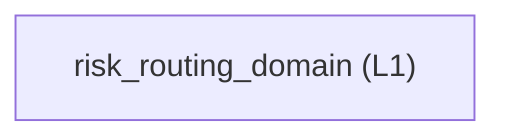

<!-- GENERATED BY govern-modular-event-architecture; DO NOT EDIT -->

# `risk_routing_domain`

## Structure

## Modules

| ID | Level | Role | Parent | Implementation Status | Purpose |
|---|---|---|---|---|---|
| `risk_routing_domain` | L1 | domain | `guided_workflow_router` | implemented | Own engineering risk classes, gate selection, fail-closed behavior, and resume targets. |

### `risk_routing_domain`

- **Purpose:** Own engineering risk classes, gate selection, fail-closed behavior, and resume targets.
- **Parent:** `guided_workflow_router`
- **Implementation Status:** `implemented`
- **Input Ports:** `risk-routing.classify`
- **Output Ports:** None
- **Emitted Events:** None
- **Owned State:** None
- **Side Effects:** None
- **Errors:** None
- **Invariants:** Higher hard-trigger risk always takes precedence.; Missing required capabilities or evidence cannot be downgraded.
- **Entrypoints:** [`main`](../../skills/engineering-risk-routing/scripts/classify_risk.py) (cli)
- **Public Symbols:** [`classify`](../../skills/engineering-risk-routing/scripts/classify_risk.py) (function)

## Port Contracts

| ID | Owner | Direction | Kind | Timing | Description | Symbols |
|---|---|---|---|---|---|---|
| `risk-routing.classify` | `risk_routing_domain` | input | query | sync | Classify one engineering task and select required gates.: Task text, optional entry skill, available capabilities, and passed gate evidence. | `classify` |

## Event Contracts

| ID | Owner | Delivery | Emitted when | Purpose | Consumers |
|---|---|---|---|---|---|

## Type Catalog

| ID | Owner | Declaration | Visibility | Semantic kind | Consumers | References |
|---|---|---|---|---|---|---|
| `routing-decision` | `risk_routing_domain` | `RoutingDecision` (interface, `skills/engineering-risk-routing/references/routing-contract.schema.json`) | cross-module | query | `guided_workflow_router` | None |
| `gate-result` | `risk_routing_domain` | `GateResult` (interface, `skills/engineering-risk-routing/references/routing-contract.schema.json`) | cross-module | domain-value | `guided_workflow_router` | None |

## State Ownership

| ID | Owner | Declaration | Type | Visibility | Mutability | Read authority | Write authority |
|---|---|---|---|---|---|---|---|

## Cross-module Mapping

| Interaction | Producer | Consumer | Parent | Producer contract | Consumer contract | Mapping owner | State accessed | Allowed edges | Forbidden edges |
|---|---|---|---|---|---|---|---|---|---|

## End-to-End Flows
