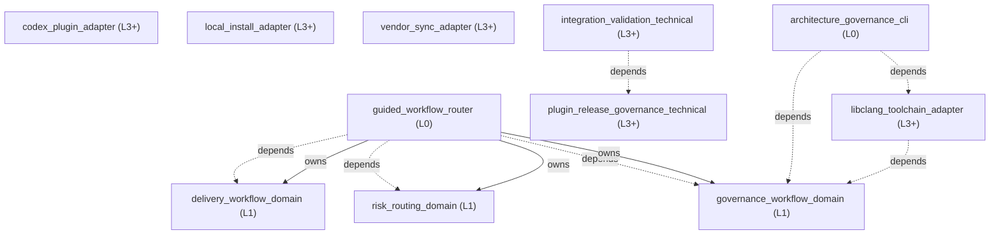

<!-- GENERATED BY govern-modular-event-architecture; DO NOT EDIT -->

# System Overview

## Modules

| ID | Level | Role | Parent | Implementation Status | Purpose |
|---|---|---|---|---|---|
| `guided_workflow_router` | L0 | composition | `-` | implemented | Present the user-invoked engineering map and coordinate risk, delivery, and governance domains. |
| `risk_routing_domain` | L1 | domain | `guided_workflow_router` | implemented | Own engineering risk classes, gate selection, fail-closed behavior, and resume targets. |
| `delivery_workflow_domain` | L1 | domain | `guided_workflow_router` | implemented | Move an engineering idea or defect through planning, implementation, and review without bypassing required gates. |
| `governance_workflow_domain` | L1 | domain | `guided_workflow_router` | implemented | Enforce decision completeness, architecture ownership, evidence-backed explanation, and bounded runtime validation. |
| `codex_plugin_adapter` | L3+ | adapter | `-` | implemented | Bind the integrated skill directory to Codex plugin discovery. |
| `local_install_adapter` | L3+ | adapter | `-` | implemented | Register the repo-local marketplace through the supported Codex CLI command and open the governed plugin's Codex Desktop installation page. |
| `vendor_sync_adapter` | L3+ | adapter | `-` | implemented | Hash vendored skills, refresh unmodified snapshots, and fail closed on overlay drift. |
| `integration_validation_technical` | L3+ | technical | `-` | implemented | Validate plugin inventory, skill metadata, path portability, and learning-note isolation. |
| `plugin_release_governance_technical` | L3+ | technical | `-` | implemented | Validate and promote the plugin through isolated SemVer prerelease stages without changing the root package release state. |
| `architecture_governance_cli` | L0 | composition | `-` | implemented | Compose the governance engine and pinned native provider behind the single public architecture CLI. |
| `libclang_toolchain_adapter` | L3+ | adapter | `-` | implemented | Provision and verify the official lock-pinned Espressif libclang distribution for target-capable C/C++ governance. |

### `guided_workflow_router`

- **Purpose:** Present the user-invoked engineering map and coordinate risk, delivery, and governance domains.
- **Parent:** `-`
- **Implementation Status:** `implemented`
- **Input Ports:** None
- **Output Ports:** None
- **Emitted Events:** None
- **Owned State:** None
- **Side Effects:** None
- **Errors:** None
- **Invariants:** Never execute human-only skills on the user's behalf.; Never route standalone learning-note or HackMD work.
- **Entrypoints:** [`ask-matt`](../../skills/ask-matt/SKILL.md) (skill)
- **Public Symbols:** [`ask-matt`](../../skills/ask-matt/SKILL.md) (skill)

### `risk_routing_domain`

- **Purpose:** Own engineering risk classes, gate selection, fail-closed behavior, and resume targets.
- **Parent:** `guided_workflow_router`
- **Implementation Status:** `implemented`
- **Input Ports:** `risk-routing.classify`
- **Output Ports:** None
- **Emitted Events:** None
- **Owned State:** None
- **Side Effects:** None
- **Errors:** None
- **Invariants:** Higher hard-trigger risk always takes precedence.; Missing required capabilities or evidence cannot be downgraded.
- **Entrypoints:** [`main`](../../skills/engineering-risk-routing/scripts/classify_risk.py) (cli)
- **Public Symbols:** [`classify`](../../skills/engineering-risk-routing/scripts/classify_risk.py) (function)

### `delivery_workflow_domain`

- **Purpose:** Move an engineering idea or defect through planning, implementation, and review without bypassing required gates.
- **Parent:** `guided_workflow_router`
- **Implementation Status:** `implemented`
- **Input Ports:** None
- **Output Ports:** None
- **Emitted Events:** None
- **Owned State:** None
- **Side Effects:** None
- **Errors:** None
- **Invariants:** Mutation and commits require task and repository authorization.
- **Entrypoints:** [`implement`](../../skills/implement/SKILL.md) (skill)
- **Public Symbols:** [`implement`](../../skills/implement/SKILL.md) (skill)

### `governance_workflow_domain`

- **Purpose:** Enforce decision completeness, architecture ownership, evidence-backed explanation, and bounded runtime validation.
- **Parent:** `guided_workflow_router`
- **Implementation Status:** `implemented`
- **Input Ports:** None
- **Output Ports:** None
- **Emitted Events:** None
- **Owned State:** None
- **Side Effects:** None
- **Errors:** None
- **Invariants:** Codex never approves its own ADR or Algorithm Design Record.; C/C++ AST governance resolves native libclang only through its demand-owned pinned provider contract.
- **Entrypoints:** [`govern-modular-event-architecture`](../../skills/govern-modular-event-architecture/SKILL.md) (skill)
- **Public Symbols:** [`govern-modular-event-architecture`](../../skills/govern-modular-event-architecture/SKILL.md) (skill) [`LibclangToolchainPort`](../../skills/govern-modular-event-architecture/scripts/libclang_toolchain_contract.py) (class)

### `codex_plugin_adapter`

- **Purpose:** Bind the integrated skill directory to Codex plugin discovery.
- **Parent:** `-`
- **Implementation Status:** `implemented`
- **Input Ports:** None
- **Output Ports:** None
- **Emitted Events:** None
- **Owned State:** None
- **Side Effects:** None
- **Errors:** None
- **Invariants:** The manifest discovers exactly one flat skills root.
- **Entrypoints:** [`governed-engineering-skills`](../../.codex-plugin/plugin.json) (manifest)
- **Public Symbols:** [`governed-engineering-skills`](../../.codex-plugin/plugin.json) (manifest)

### `local_install_adapter`

- **Purpose:** Register the repo-local marketplace through the supported Codex CLI command and open the governed plugin's Codex Desktop installation page.
- **Parent:** `-`
- **Implementation Status:** `implemented`
- **Input Ports:** None
- **Output Ports:** None
- **Emitted Events:** None
- **Owned State:** None
- **Side Effects:** Register the repo-local marketplace in the current user's Codex configuration. (`-`); Open the governed plugin detail page in Codex Desktop for the user-confirmed Install action. (`-`)
- **Errors:** None
- **Invariants:** Resolve repository and plugin paths relative to the installer location.; Resolve Codex from PATH or the stable per-user Codex Desktop runtime directory.; Never prompt for paths, parameters, or confirmations.; Never assume that the Codex CLI supports plugin add or plugin list commands.; Never report that the plugin is installed before the user confirms Install in Codex Desktop.; Stop when marketplace registration or the Desktop install-page launch fails.
- **Entrypoints:** [`install-local`](../../scripts/install-local.ps1) (script)
- **Public Symbols:** [`install-local`](../../scripts/install-local.ps1) (script)

### `vendor_sync_adapter`

- **Purpose:** Hash vendored skills, refresh unmodified snapshots, and fail closed on overlay drift.
- **Parent:** `-`
- **Implementation Status:** `implemented`
- **Input Ports:** None
- **Output Ports:** None
- **Emitted Events:** None
- **Owned State:** None
- **Side Effects:** Refresh vendored files only when the caller explicitly selects refresh. (`-`)
- **Errors:** None
- **Invariants:** Never overwrite a drifted integration overlay.
- **Entrypoints:** [`main`](../../scripts/vendor_sync.py) (cli)
- **Public Symbols:** [`main`](../../scripts/vendor_sync.py) (function)

### `integration_validation_technical`

- **Purpose:** Validate plugin inventory, skill metadata, path portability, and learning-note isolation.
- **Parent:** `-`
- **Implementation Status:** `implemented`
- **Input Ports:** None
- **Output Ports:** None
- **Emitted Events:** None
- **Owned State:** None
- **Side Effects:** None
- **Errors:** None
- **Invariants:** Validation must not mutate the plugin or user configuration.
- **Entrypoints:** [`main`](../../scripts/validate_integration.py) (cli)
- **Public Symbols:** [`main`](../../scripts/validate_integration.py) (function)

### `plugin_release_governance_technical`

- **Purpose:** Validate and promote the plugin through isolated SemVer prerelease stages without changing the root package release state.
- **Parent:** `-`
- **Implementation Status:** `implemented`
- **Input Ports:** None
- **Output Ports:** None
- **Emitted Events:** None
- **Owned State:** None
- **Side Effects:** An explicitly selected promotion updates plugin version metadata, release evidence, and the plugin changelog. (`-`)
- **Errors:** None
- **Invariants:** Plugin package and Codex manifest versions remain identical.; Root Changesets prerelease state is never read or modified.; Local Codex cachebusters never become formal release versions.; Invalid transitions or incomplete evidence are rejected before any release file is modified.; Starting a new major or minor prerelease group from an existing prerelease requires an explicit new-release-group request and a new changeset.
- **Entrypoints:** [`main`](../../scripts/version_governance.py) (cli)
- **Public Symbols:** [`validate_repository`](../../scripts/version_governance.py) (function)

### `architecture_governance_cli`

- **Purpose:** Compose the governance engine and pinned native provider behind the single public architecture CLI.
- **Parent:** `-`
- **Implementation Status:** `implemented`
- **Input Ports:** None
- **Output Ports:** None
- **Emitted Events:** None
- **Owned State:** None
- **Side Effects:** Dispatch one bounded governance or toolchain operation. (`-`)
- **Errors:** None
- **Invariants:** Gate execution never downloads or replaces a native provider cache.
- **Entrypoints:** [`main`](../../skills/govern-modular-event-architecture/scripts/architecture_cli.py) (function)
- **Public Symbols:** [`main`](../../skills/govern-modular-event-architecture/scripts/architecture_cli.py) (function)

### `libclang_toolchain_adapter`

- **Purpose:** Provision and verify the official lock-pinned Espressif libclang distribution for target-capable C/C++ governance.
- **Parent:** `-`
- **Implementation Status:** `implemented`
- **Input Ports:** None
- **Output Ports:** None
- **Emitted Events:** None
- **Owned State:** None
- **Side Effects:** Explicit install creates an immutable per-user version cache. (`-`)
- **Errors:** None
- **Invariants:** Gate execution never downloads or overwrites a cache.; Library loading is explicit and hash-verified.
- **Entrypoints:** [`EspressifLibclangToolchainAdapter`](../../skills/govern-modular-event-architecture/scripts/libclang_toolchain_adapter.py) (class)
- **Public Symbols:** [`EspressifLibclangToolchainAdapter`](../../skills/govern-modular-event-architecture/scripts/libclang_toolchain_adapter.py) (class)

## Port Contracts

| ID | Owner | Direction | Kind | Timing | Description | Symbols |
|---|---|---|---|---|---|---|
| `risk-routing.classify` | `risk_routing_domain` | input | query | sync | Classify one engineering task and select required gates.: Task text, optional entry skill, available capabilities, and passed gate evidence. | `classify` |
| `libclang_toolchain.resolve` | `governance_workflow_domain` | output | query | sync | Resolve, bind, and verify one lock-pinned target-capable libclang provider.: Toolchain lock and operation mode produce immutable provider evidence or fail-closed CAST diagnostics. | `LibclangToolchainPort` |

## Event Contracts

| ID | Owner | Delivery | Emitted when | Purpose | Consumers |
|---|---|---|---|---|---|

## Type Catalog

| ID | Owner | Declaration | Visibility | Semantic kind | Consumers | References |
|---|---|---|---|---|---|---|
| `routing-decision` | `risk_routing_domain` | `RoutingDecision` (interface, `skills/engineering-risk-routing/references/routing-contract.schema.json`) | cross-module | query | `guided_workflow_router` | None |
| `gate-result` | `risk_routing_domain` | `GateResult` (interface, `skills/engineering-risk-routing/references/routing-contract.schema.json`) | cross-module | domain-value | `guided_workflow_router` | None |
| `governance-diagnostic` | `governance_workflow_domain` | `Diagnostic` (class, `skills/govern-modular-event-architecture/scripts/check_architecture.py`) | private | private-helper | `governance_workflow_domain` | None |
| `governance-manifest-error` | `governance_workflow_domain` | `ManifestError` (class, `skills/govern-modular-event-architecture/scripts/check_architecture.py`) | private | private-helper | `governance_workflow_domain` | None |
| `governance-ast-evidence` | `governance_workflow_domain` | `AstEvidence` (class, `skills/govern-modular-event-architecture/scripts/ast_analyzer.py`) | private | private-helper | `governance_workflow_domain` | None |
| `libclang-toolchain-port` | `governance_workflow_domain` | `LibclangToolchainPort` (class, `skills/govern-modular-event-architecture/scripts/libclang_toolchain_contract.py`) | cross-module | port | `governance_workflow_domain`, `libclang_toolchain_adapter` | `libclang-toolchain-evidence` |
| `libclang-toolchain-evidence` | `governance_workflow_domain` | `LibclangToolchainEvidence` (class, `skills/govern-modular-event-architecture/scripts/libclang_toolchain_contract.py`) | cross-module | domain-value | `governance_workflow_domain`, `libclang_toolchain_adapter` | None |
| `toolchain-provider-error` | `governance_workflow_domain` | `ToolchainProviderError` (class, `skills/govern-modular-event-architecture/scripts/libclang_toolchain_contract.py`) | cross-module | domain-value | `architecture_governance_cli`, `governance_workflow_domain`, `libclang_toolchain_adapter` | None |
| `espressif-libclang-toolchain-adapter` | `libclang_toolchain_adapter` | `EspressifLibclangToolchainAdapter` (class, `skills/govern-modular-event-architecture/scripts/libclang_toolchain_adapter.py`) | module-public | adapter-binding | `architecture_governance_cli` | `libclang-toolchain-port`, `libclang-toolchain-evidence` |
| `collection-input-port` | `governance_workflow_domain` | `CollectionInputPort` (class, `skills/validate-on-device/scripts/vod/execution.py`) | module-public | port | `governance_workflow_domain` | None |
| `collection-output-port` | `governance_workflow_domain` | `CollectionOutputPort` (class, `skills/validate-on-device/scripts/vod/execution.py`) | module-public | port | `governance_workflow_domain` | None |
| `transport-port` | `governance_workflow_domain` | `TransportPort` (class, `skills/validate-on-device/scripts/vod/execution.py`) | module-public | port | `governance_workflow_domain` | None |
| `guided-session-input-port` | `governance_workflow_domain` | `GuidedSessionInputPort` (class, `skills/validate-on-device/scripts/vod/guided.py`) | module-public | port | `governance_workflow_domain` | None |
| `guided-session-output-port` | `governance_workflow_domain` | `GuidedSessionOutputPort` (class, `skills/validate-on-device/scripts/vod/guided.py`) | module-public | port | `governance_workflow_domain` | None |
| `runtime-verdict` | `governance_workflow_domain` | `Verdict` (class, `skills/validate-on-device/scripts/vod/model.py`) | module-public | domain-value | `governance_workflow_domain` | None |
| `criterion-result` | `governance_workflow_domain` | `CriterionResult` (class, `skills/validate-on-device/scripts/vod/model.py`) | module-public | domain-value | `governance_workflow_domain` | `runtime-verdict` |
| `verdict-input-port` | `governance_workflow_domain` | `VerdictInputPort` (class, `skills/validate-on-device/scripts/vod/model.py`) | module-public | port | `governance_workflow_domain` | None |
| `verdict-output-port` | `governance_workflow_domain` | `VerdictOutputPort` (class, `skills/validate-on-device/scripts/vod/model.py`) | module-public | port | `governance_workflow_domain` | None |
| `validation-profile-error` | `governance_workflow_domain` | `ProfileError` (class, `skills/validate-on-device/scripts/vod/profile.py`) | private | private-helper | `governance_workflow_domain` | None |
| `platform-transport-adapter` | `governance_workflow_domain` | `PlatformTransportAdapter` (class, `skills/validate-on-device/scripts/vod/providers.py`) | private | adapter-binding | `governance_workflow_domain` | `transport-port` |

## State Ownership

| ID | Owner | Declaration | Type | Visibility | Mutability | Read authority | Write authority |
|---|---|---|---|---|---|---|---|

## Cross-module Mapping

| Interaction | Producer | Consumer | Parent | Producer contract | Consumer contract | Mapping owner | State accessed | Allowed edges | Forbidden edges |
|---|---|---|---|---|---|---|---|---|---|
