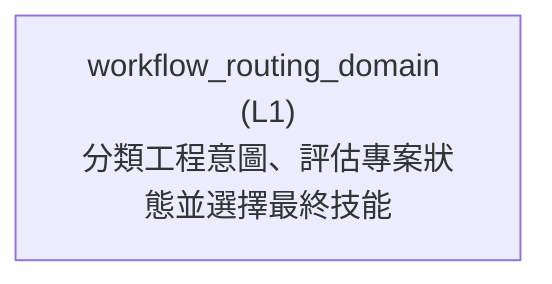

<!-- GENERATED BY govern-modular-event-architecture; DO NOT EDIT -->

# `workflow_routing_domain`

## Structure

## Modules

| ID | Level | Role | Parent | Implementation Status | Purpose |
|---|---|---|---|---|---|
| `workflow_routing_domain` | L1 | domain | `guided_workflow_router` | implemented | Own deterministic engineering-intent classification, three-state project assessment, capability fallback, and final skill handoff selection. |

### `workflow_routing_domain`

- **Purpose:** Own deterministic engineering-intent classification, three-state project assessment, capability fallback, and final skill handoff selection.
- **Parent:** `guided_workflow_router`
- **Implementation Status:** `implemented`
- **Input Ports:** `workflow-routing.assess-project`, `workflow-routing.select`
- **Output Ports:** `repository-evidence.collect`
- **Emitted Events:** None
- **Owned State:** None
- **Side Effects:** None
- **Errors:** None
- **Invariants:** Explicit skills outrank inferred intent.; Intent selects the primary flow before project state and risk gates are applied.; A uniquely resolved confirmed specification does not bypass ProjectState interview precedence without explicit resume evidence.; Pending unresolved-decision evidence means a non-discoverable user choice affects implementation behavior, an interface, a persistent parameter, failure policy, specification scope, or an acceptance threshold.; Pending unresolved-decision evidence overrides lexical ambiguity in a short follow-up, selects grilling before the question is presented, and resumes at spec-governance for reconciliation.; Resume evidence fails closed unless it identifies one valid confirmed specification.; A reopened working canonical specification blocks execution even when completed stages contain evidence from its prior confirmed revision.; Indeterminate intent or project state is never silently guessed.; Risk classification adds gates but never replaces the primary user intent.
- **Entrypoints:** [`assess_project_state`](../../skills/engineering-risk-routing/scripts/project_state.py) (function) [`select_workflow`](../../skills/engineering-risk-routing/scripts/workflow_selection.py) (function)
- **Public Symbols:** [`RepositoryEvidencePort`](../../skills/engineering-risk-routing/scripts/project_state.py) (class) [`assess_project_state`](../../skills/engineering-risk-routing/scripts/project_state.py) (function) [`classify_intent`](../../skills/engineering-risk-routing/scripts/workflow_selection.py) (function) [`select_workflow`](../../skills/engineering-risk-routing/scripts/workflow_selection.py) (function)

## Port Contracts

| ID | Owner | Direction | Kind | Timing | Description | Symbols |
|---|---|---|---|---|---|---|
| `workflow-routing.assess-project` | `workflow_routing_domain` | input | query | sync | Convert repository evidence into a three-state implementation and documentation assessment.: Read-only tracked and non-ignored untracked path evidence. | `assess_project_state` |
| `workflow-routing.select` | `workflow_routing_domain` | input | query | sync | Select the authoritative skill handoff after intent, project state, risk, capability, and complexity checks.: IntentAssessment, ProjectStateAssessment, RoutingDecision, capabilities, wayfinder threshold evidence, and caller-supplied unresolved-decision lifecycle evidence for a non-discoverable choice that shapes the change set. | `select_workflow` |
| `repository-evidence.collect` | `workflow_routing_domain` | output | query | sync | Read repository paths and Git tracking status for project-state assessment.: One project root produces normalized RepositoryEvidence rows. | `RepositoryEvidencePort` |

## Event Contracts

| ID | Owner | Delivery | Emitted when | Purpose | Consumers |
|---|---|---|---|---|---|

## Type Catalog

| ID | Owner | Declaration | Visibility | Semantic kind | Consumers | References |
|---|---|---|---|---|---|---|
| `repository-artifact` | `workflow_routing_domain` | `RepositoryArtifact` (interface, `skills/engineering-risk-routing/references/guided-routing-contract.schema.json`) | cross-module | domain-value | `workflow_routing_domain`, `repository_evidence_adapter` | None |
| `repository-evidence` | `workflow_routing_domain` | `RepositoryEvidence` (interface, `skills/engineering-risk-routing/references/guided-routing-contract.schema.json`) | cross-module | domain-value | `guided_workflow_router`, `workflow_routing_domain` | None |
| `project-state-assessment` | `workflow_routing_domain` | `ProjectStateAssessment` (interface, `skills/engineering-risk-routing/references/guided-routing-contract.schema.json`) | cross-module | query | `guided_workflow_router` | `repository-artifact`, `repository-evidence` |
| `intent-assessment` | `workflow_routing_domain` | `IntentAssessment` (interface, `skills/engineering-risk-routing/references/guided-routing-contract.schema.json`) | cross-module | query | `guided_workflow_router` | None |
| `workflow-selection-options` | `workflow_routing_domain` | `WorkflowSelectionOptions` (interface, `skills/engineering-risk-routing/references/guided-routing-contract.schema.json`) | cross-module | domain-value | `guided_workflow_router`, `workflow_routing_domain` | None |
| `guided-route-decision` | `workflow_routing_domain` | `GuidedRouteDecision` (interface, `skills/engineering-risk-routing/references/guided-routing-contract.schema.json`) | cross-module | query | `guided_workflow_router` | `project-state-assessment`, `intent-assessment`, `spec-context-assessment` |
| `spec-context-assessment` | `workflow_routing_domain` | `SpecContextAssessment` (interface, `skills/engineering-risk-routing/references/guided-routing-contract.schema.json`) | cross-module | query | `guided_workflow_router`, `workflow_routing_domain` | None |
| `repository-evidence-port` | `workflow_routing_domain` | `RepositoryEvidencePort` (class, `skills/engineering-risk-routing/scripts/project_state.py`) | module-public | port | `workflow_routing_domain`, `repository_evidence_adapter` | `repository-artifact` |

## State Ownership

| ID | Owner | Declaration | Type | Visibility | Mutability | Read authority | Write authority |
|---|---|---|---|---|---|---|---|

## Cross-module Mapping

| Interaction | Producer | Consumer | Parent | Producer contract | Consumer contract | Mapping owner | State accessed | Allowed edges | Forbidden edges |
|---|---|---|---|---|---|---|---|---|---|

## End-to-End Flows
