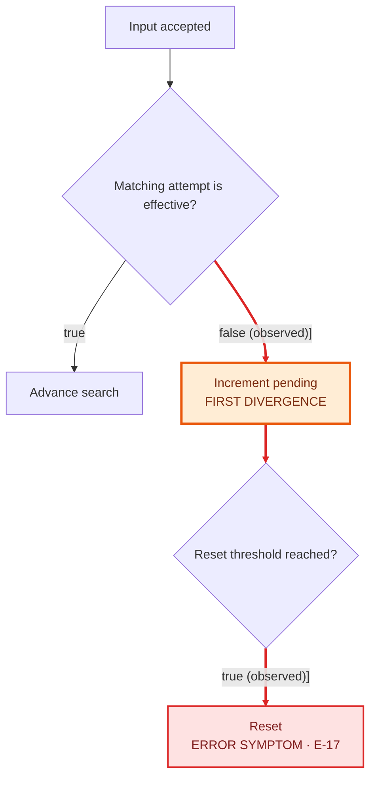

# Debug Model Packet

Use this contract when Phase 2.5 identifies model-alignment risk. Return the packet in the conversation unless the user explicitly requests a durable file.

The goal is a shared, auditable computation model. Keep historical evidence, current source, assumptions, and arithmetic distinct. Do not use phrases such as “data arrived” or “the head advanced” when the relevant increment, transition, or acceptance condition can be named precisely.

## 1. Problem and evidence boundary

State:

- the observed symptom and expected behavior;
- the actual evidence and its version, build, configuration, epoch, and time boundary;
- the first observable divergence;
- whether each code excerpt matches the captured runtime artifact.

Label material claims as:

- **Confirmed（已確認）** — directly supported by source, a controlled experiment, or captured evidence;
- **Inference（推論）** — derived from confirmed facts but not directly observed;
- **To verify（待確認）** — missing evidence or an unresolved interpretation.

Never infer per-event order from periodic or aggregated snapshots unless the capture guarantees that granularity.

## 2. Decision flow

Use a Mermaid flowchart to show the exact judgment order and branches. Name the condition on each decision edge and the state or output mutation on each action node.

Visibly distinguish:

- the normal or expected path;
- the **observed error path**, including the evaluated value on each decision edge;
- the first divergence node, labelled `FIRST DIVERGENCE`;
- the final observable symptom, labelled with its evidence ID.

Use a red stroke or error class for confirmed error nodes and edges, and a distinct warning style for the first divergence. Styling is supplemental: every marked node and edge must also have a textual label so the meaning survives monochrome rendering and copy/paste.

If evidence does not yet prove the path, label it `INFERRED ERROR PATH` and classify it as **Inference（推論）**. Do not render an inferred path as a confirmed observation. If multiple error paths remain possible, mark each candidate separately and tie it to the hypothesis or missing evidence that distinguishes it.

Recommended Mermaid convention:



The flowchart explains control flow only. It does **not** replace exact counter arithmetic, accounting identities, or the worked trace.

## 3. Event sequence

When two or more actors, queues, tasks, devices, or callbacks participate, add a Mermaid sequence diagram. Show:

- the event source and receiver;
- ordering boundaries and asynchronous handoffs;
- the state observed before a decision;
- accepted, rejected, dropped, retried, reset, or emitted outcomes.

Omit this diagram only when actor ordering cannot affect the failure.

## 4. Counter and state contracts

Create one row per counter or state value:

| Name | Unit and scope | Increment/update condition | Does not change when | Clear/reset condition | Threshold and epoch | What it proves | What it cannot prove |
|---|---|---|---|---|---|---|---|
| `<name>` | `<events/items/time; actor/session/epoch>` | `<exact predicate and delta>` | `<rejected paths or unrelated events>` | `<exact transition>` | `<limit and ownership>` | `<supported conclusion>` | `<common invalid inference>` |

For derived values, include the formula and source fields. Distinguish lifetime totals, per-epoch totals, rolling windows, pending values, and high-water marks.

## 5. Conservation or reconciliation

When the system accounts for items or state transitions, write the conservation equation before substituting numbers. For example:

```text
accepted = matched + planned_drop + refresh_drop + stall_drop + pending_delta
```

Then substitute the evidence for each actor, stream, or epoch. If the equation does not balance, mark the result `BLOCKED`; identify the missing term or unreliable measurement instead of forcing a root-cause conclusion.

## 6. Minimal worked trace

Walk the smallest event sequence that still exhibits the failure:

| Step | Input/event | Predicate and branch | Counter delta | Pending/state after | Offset/lock/epoch after | Output |
|---:|---|---|---|---|---|---|
| 1 | `<event>` | `<evaluated condition → branch>` | `<name: old → new>` | `<state>` | `<state>` | `<result>` |

Include no hidden arithmetic. When two counters move on the same event, show both deltas. When a value is preserved, write “unchanged” and state why.

## 7. First semantic divergence

Name the first point where the implementation's measured condition differs from the intended domain meaning. Use this form:

```text
Implementation treats <observable predicate> as <domain claim>,
but <counterexample/evidence> shows the predicate does not prove that claim.
```

This is a candidate model divergence, not yet the declared root cause.

## 8. Understanding gate

End the packet with:

1. the exact event or table row the user should trace;
2. one question asking whether the counter/state transition is clear or which first step is unclear;
3. an explicit statement that root-cause ranking and repair comparison wait for confirmation.

After confirmation, Phase 3 may rank falsifiable hypotheses. Every later root-cause claim must link back to a flow node, counter/state contract, trace row, and evidence item. Every repair candidate must predict which counters, states, and outputs will change; evaluate experiments as `PASS`, `FAIL`, or `BLOCKED` against those predictions.
