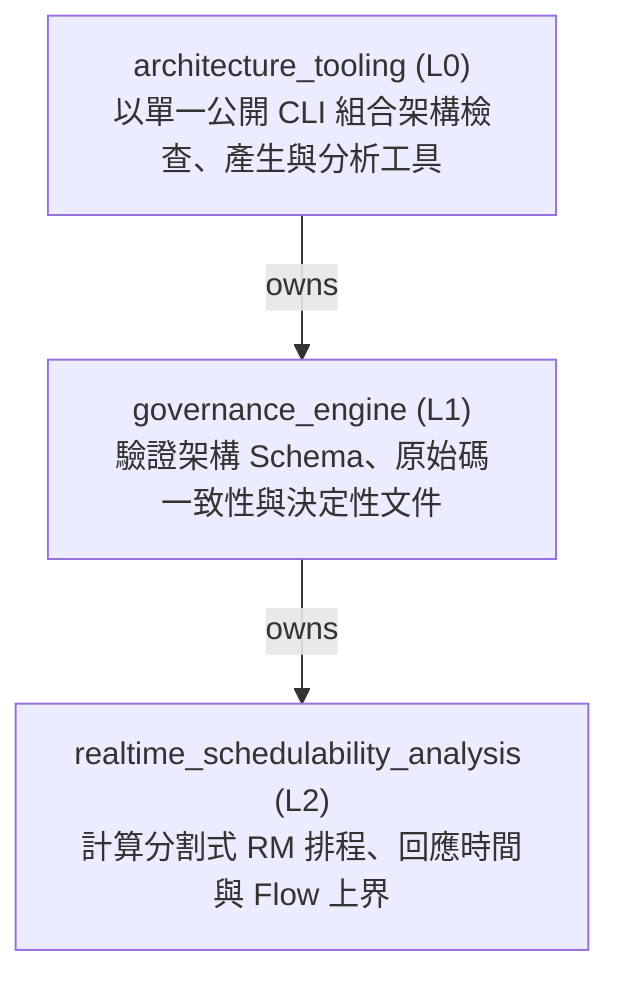
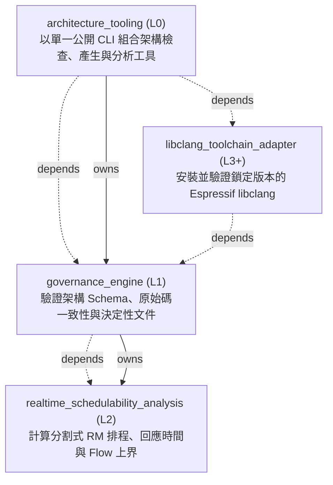

<!-- GENERATED BY govern-modular-event-architecture; DO NOT EDIT -->

# govern-modular-event-architecture Architecture Guide

- Standard: `2.2.0`
- Schema: `2.2.0`

## System Purpose and Entrypoints

- `architecture_tooling` — Provide the single public schema 2.1.0/2.2.0 governance CLI and compose its checker, renderer, bootstrap, adoption, source-analysis, and pinned libclang provider modules.
  - Entrypoints: [`main`](../scripts/architecture_cli.py) (function)

## Main Function Tree

## Function Guide

### `architecture_tooling`

- **Purpose:** Provide the single public schema 2.1.0/2.2.0 governance CLI and compose its checker, renderer, bootstrap, adoption, source-analysis, and pinned libclang provider modules.
- **Children:** `governance_engine`
- **Related Flows:** [`validate-architecture`](generated/architecture_tooling.md#validate-architecture), [`verify-libclang-toolchain`](generated/architecture_tooling.md#verify-libclang-toolchain)
- **Protection Rationale:** architecture_cli.py is the only supported command-line entry.; Internal scripts cannot be invoked as legacy public commands.; Gate commands never download or replace a toolchain cache.

### `governance_engine`

- **Purpose:** Validate schema 2.1.0/2.2.0, source conformance, temporary debt, deterministic views, and workload-driven scheduling through one deep governance module.
- **Children:** `realtime_schedulability_analysis`
- **Related Flows:** [`validate-architecture`](generated/architecture_tooling.md#validate-architecture)
- **Protection Rationale:** Empty baseline never implies verified source conformance.; Python and C/C++ source evidence fail closed.; Release requires zero temporary baseline entries.; C/C++ AST analysis requests a verified provider through the demand-owned libclang toolchain port.

### `realtime_schedulability_analysis`

- **Purpose:** Compute partitioned Rate Monotonic priority order, per-core response times, candidate fingerprints, and conservative end-to-end Flow bounds.
- **Children:** None
- **Related Flows:** None
- **Protection Rationale:** Every calculation uses integer nanoseconds and deterministic tie-breaking.; Missing bounds or non-convergent fixed points are BLOCKED rather than guessed.; Utilization is an early screen and never replaces RTA.

## Parent Views

- [`architecture_tooling`](generated/architecture_tooling.md) — Provide the single public schema 2.1.0/2.2.0 governance CLI and compose its checker, renderer, bootstrap, adoption, source-analysis, and pinned libclang provider modules.
- [`governance_engine`](generated/governance_engine.md) — Validate schema 2.1.0/2.2.0, source conformance, temporary debt, deterministic views, and workload-driven scheduling through one deep governance module.

## End-to-End Flows

- [`validate-architecture`](generated/architecture_tooling.md#validate-architecture) — Validate one manifest and return deterministic diagnostics.
- [`verify-libclang-toolchain`](generated/architecture_tooling.md#verify-libclang-toolchain) — Resolve a lock-pinned provider, validate its immutable cache, bind libclang explicitly, and prove Xtensa parsing capability.

## Complete Technical Reference

## System Overview

## Type Catalog

- `diagnostic` — `governance_engine` / `domain-value` / `cross-module`
- `manifest-error` — `governance_engine` / `domain-value` / `cross-module`
- `ast-evidence` — `governance_engine` / `private-helper` / `private`
- `libclang-toolchain-port` — `governance_engine` / `port` / `cross-module`
- `libclang-toolchain-evidence` — `governance_engine` / `domain-value` / `cross-module`
- `toolchain-provider-error` — `governance_engine` / `domain-value` / `cross-module`
- `espressif-libclang-toolchain-adapter` — `libclang_toolchain_adapter` / `adapter-binding` / `module-public`

## State Ownership

## Cross-module Mapping

## Adoption Readiness

- [Human-readable readiness](generated/adoption-readiness.md)
- [Machine-readable readiness](generated/adoption-readiness.json)

## Execution Profiles

- [`cross-platform-cli`](generated/execution-cross-platform-cli.md) — `proposed` / `runtime-selected`

## Real-time Scheduling Studies
