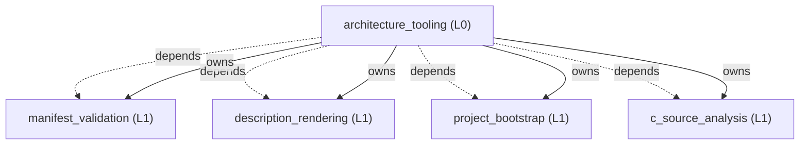

<!-- GENERATED BY govern-modular-event-architecture; DO NOT EDIT -->

# govern-modular-event-architecture Architecture Guide

- Standard: `2.0.2`
- Schema: `2.0.2`

## System Overview

## Parent Views

- [`architecture_tooling`](generated/architecture_tooling.md) — Compose the schema 2.0.2 architecture checker, renderer, bootstrap, and source-analysis commands.
- [`manifest_validation`](generated/manifest_validation.md) — Validate schema 2.0.2 logical, description, source-set, type, state, boundary, execution, data-access, and microarchitecture contracts.
- [`description_rendering`](generated/description_rendering.md) — Render deterministic System, Parent, Flow, and Execution Profile views.
- [`project_bootstrap`](generated/project_bootstrap.md) — Install versioned governance tools and generated views into a confirmed target project.
- [`c_source_analysis`](generated/c_source_analysis.md) — Analyze C and C++ dependencies, named types, runtime-state authority, and functional-to-technology boundaries using fail-closed AST evidence.

## End-to-End Flows

- [`validate-architecture`](generated/architecture_tooling.md#validate-architecture) — Validate one manifest and return deterministic diagnostics.

## Type Catalog

- `diagnostic` ??`manifest_validation` / `domain-value` / `cross-module`
- `manifest-error` ??`manifest_validation` / `domain-value` / `cross-module`
- `subscriber-failure` ??`architecture_tooling` / `private-helper` / `private`

## State Ownership

## Cross-module Mapping

## Execution Profiles

- [`cross-platform-cli`](generated/execution-cross-platform-cli.md) ??`legacy-review` / `runtime-selected`
