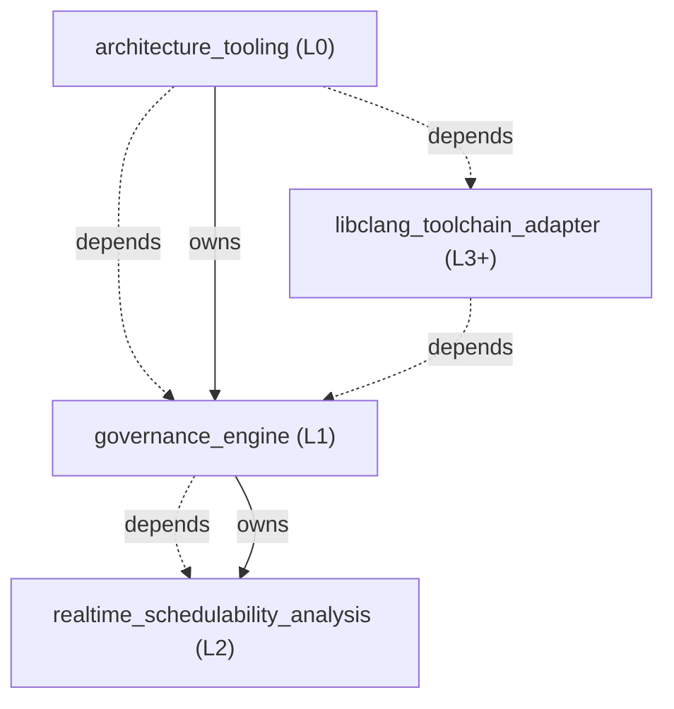

<!-- GENERATED BY govern-modular-event-architecture; DO NOT EDIT -->

# govern-modular-event-architecture Architecture Guide

- Standard: `2.1.0`
- Schema: `2.1.0`

## System Overview

## Parent Views

- [`architecture_tooling`](generated/architecture_tooling.md) — Provide the single public schema 2.1.0 governance CLI and compose its checker, renderer, bootstrap, adoption, source-analysis, and pinned libclang provider modules.
- [`governance_engine`](generated/governance_engine.md) — Validate schema 2.1.0, source conformance, temporary debt, deterministic views, and workload-driven scheduling through one deep governance module.

## End-to-End Flows

- [`validate-architecture`](generated/architecture_tooling.md#validate-architecture) — Validate one manifest and return deterministic diagnostics.
- [`verify-libclang-toolchain`](generated/architecture_tooling.md#verify-libclang-toolchain) — Resolve a lock-pinned provider, validate its immutable cache, bind libclang explicitly, and prove Xtensa parsing capability.

## Type Catalog

- `diagnostic` — `governance_engine` / `domain-value` / `cross-module`
- `manifest-error` — `governance_engine` / `domain-value` / `cross-module`
- `ast-evidence` — `governance_engine` / `private-helper` / `private`
- `libclang-toolchain-port` — `governance_engine` / `port` / `cross-module`
- `libclang-toolchain-evidence` — `governance_engine` / `domain-value` / `cross-module`
- `toolchain-provider-error` — `governance_engine` / `domain-value` / `cross-module`
- `espressif-libclang-toolchain-adapter` — `libclang_toolchain_adapter` / `adapter-binding` / `module-public`

## State Ownership

## Cross-module Mapping

## Adoption Readiness

- [Human-readable readiness](generated/adoption-readiness.md)
- [Machine-readable readiness](generated/adoption-readiness.json)

## Execution Profiles

- [`cross-platform-cli`](generated/execution-cross-platform-cli.md) — `proposed` / `runtime-selected`

## Real-time Scheduling Studies
