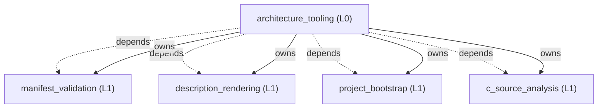
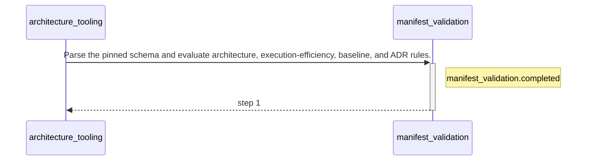

<!-- GENERATED BY govern-modular-event-architecture; DO NOT EDIT -->

# `architecture_tooling`

## Structure

## Modules

| ID | Level | Role | Parent | Implementation Status | Purpose |
|---|---|---|---|---|---|
| `architecture_tooling` | L0 | composition | `-` | implemented | Compose the schema 2.0.2 architecture checker, renderer, bootstrap, and source-analysis commands. |
| `manifest_validation` | L1 | domain | `architecture_tooling` | implemented | Validate schema 2.0.2 logical, description, source-set, type, state, boundary, execution, data-access, and microarchitecture contracts. |
| `description_rendering` | L1 | domain | `architecture_tooling` | implemented | Render deterministic System, Parent, Flow, and Execution Profile views. |
| `project_bootstrap` | L1 | domain | `architecture_tooling` | implemented | Install versioned governance tools and generated views into a confirmed target project. |
| `c_source_analysis` | L1 | domain | `architecture_tooling` | implemented | Analyze C and C++ dependencies, named types, runtime-state authority, and functional-to-technology boundaries using fail-closed AST evidence. |

### `architecture_tooling`

- **Purpose:** Compose the schema 2.0.2 architecture checker, renderer, bootstrap, and source-analysis commands.
- **Parent:** `-`
- **Implementation Status:** `implemented`
- **Input Ports:** None
- **Output Ports:** None
- **Emitted Events:** None
- **Owned State:** None
- **Side Effects:** Select and invoke one bounded architecture tooling command. (`-`)
- **Errors:** None
- **Invariants:** Tool commands accept only schema 2.0.2 and preserve every inherited governance rule.
- **Entrypoints:** [`main`](../../scripts/check_architecture.py) (function)
- **Public Symbols:** [`main`](../../scripts/check_architecture.py) (function)

### `manifest_validation`

- **Purpose:** Validate schema 2.0.2 logical, description, source-set, type, state, boundary, execution, data-access, and microarchitecture contracts.
- **Parent:** `architecture_tooling`
- **Implementation Status:** `implemented`
- **Input Ports:** `manifest_validation.check`
- **Output Ports:** `manifest_validation.output`
- **Emitted Events:** `manifest_validation.completed`
- **Owned State:** None
- **Side Effects:** None
- **Errors:** None
- **Invariants:** Schema 2.0.2 retains every 1.0 through 2.0.1 governance requirement.; Every governed named type has one catalog owner and source declaration.; AI identities cannot approve accepted governance records.
- **Entrypoints:** [`main`](../../scripts/check_architecture.py) (function)
- **Public Symbols:** [`validate_manifest`](../../scripts/check_architecture.py) (function) [`main`](../../scripts/check_architecture.py) (function)

### `description_rendering`

- **Purpose:** Render deterministic System, Parent, Flow, and Execution Profile views.
- **Parent:** `architecture_tooling`
- **Implementation Status:** `implemented`
- **Input Ports:** None
- **Output Ports:** None
- **Emitted Events:** None
- **Owned State:** None
- **Side Effects:** Write only marker-owned generated Markdown when explicitly requested. (`-`)
- **Errors:** None
- **Invariants:** Manual documents are never overwritten.
- **Entrypoints:** [`main`](../../scripts/render_architecture.py) (function)
- **Public Symbols:** [`render_documents`](../../scripts/render_architecture.py) (function) [`main`](../../scripts/render_architecture.py) (function)

### `project_bootstrap`

- **Purpose:** Install versioned governance tools and generated views into a confirmed target project.
- **Parent:** `architecture_tooling`
- **Implementation Status:** `implemented`
- **Input Ports:** None
- **Output Ports:** None
- **Emitted Events:** None
- **Owned State:** None
- **Side Effects:** Create governance files only when none of the target paths already exists. (`-`)
- **Errors:** None
- **Invariants:** Existing governance files are never overwritten.
- **Entrypoints:** [`main`](../../scripts/bootstrap_project.py) (function)
- **Public Symbols:** [`bootstrap`](../../scripts/bootstrap_project.py) (function) [`main`](../../scripts/bootstrap_project.py) (function)

### `c_source_analysis`

- **Purpose:** Analyze C and C++ dependencies, named types, runtime-state authority, and functional-to-technology boundaries using fail-closed AST evidence.
- **Parent:** `architecture_tooling`
- **Implementation Status:** `implemented`
- **Input Ports:** None
- **Output Ports:** None
- **Emitted Events:** None
- **Owned State:** None
- **Side Effects:** None
- **Errors:** None
- **Invariants:** Analysis remains read-only.
- **Entrypoints:** [`main`](../../scripts/c_analyzer.py) (function)
- **Public Symbols:** [`analyze`](../../scripts/c_analyzer.py) (function) [`main`](../../scripts/c_analyzer.py) (function)

## Port Contracts

| ID | Owner | Direction | Kind | Timing | Description | Symbols |
|---|---|---|---|---|---|---|
| `manifest_validation.check` | `manifest_validation` | input | command | sync | Submit one version-pinned manifest validation request.: Manifest path, optional baselines, output format, and generated-view check flag. | `validate_manifest` |
| `manifest_validation.output` | `manifest_validation` | output | event | sync | Publish the deterministic diagnostic result.: Rule ID, severity, location, message, disposition, and final exit classification. | `validate_manifest` |

## Event Contracts

| ID | Owner | Delivery | Emitted when | Purpose | Consumers |
|---|---|---|---|---|---|
| `manifest_validation.completed` | `manifest_validation` | at-most-once | Validation and optional generated-view comparison have completed. | Report that one manifest validation request has a complete diagnostic set. | `architecture_tooling` |

## Type Catalog

| ID | Owner | Declaration | Visibility | Semantic kind | Consumers | References |
|---|---|---|---|---|---|---|
| `diagnostic` | `manifest_validation` | `Diagnostic` (class, `scripts/check_architecture.py`) | cross-module | domain-value | `manifest_validation`, `c_source_analysis` | None |
| `manifest-error` | `manifest_validation` | `ManifestError` (class, `scripts/check_architecture.py`) | cross-module | domain-value | `manifest_validation`, `c_source_analysis` | None |
| `subscriber-failure` | `architecture_tooling` | `SubscriberFailure` (class, `scripts/fanout_reference.py`) | private | private-helper | `architecture_tooling` | None |

## State Ownership

| ID | Owner | Declaration | Type | Visibility | Mutability | Read authority | Write authority |
|---|---|---|---|---|---|---|---|

## Cross-module Mapping

| Interaction | Producer | Consumer | Parent | Producer contract | Consumer contract | Mapping owner | State accessed | Allowed edges | Forbidden edges |
|---|---|---|---|---|---|---|---|---|---|

## End-to-End Flows

### `validate-architecture`

Validate one manifest and return deterministic diagnostics.

#### Flow Diagram

#### Ordered Steps

| # | Module | Action | Receives | Emits | State changes | Side effects |
|---|---|---|---|---|---|---|
| 1 | `manifest_validation` | Parse the pinned schema and evaluate architecture, execution-efficiency, baseline, and ADR rules. | `manifest_validation.check` | `manifest_validation.completed` | None | None |

- **Success:** Diagnostics and an exit classification are returned.

#### Execution efficiency

- Workload `validation-request`: `best-effort`; steps `validate-architecture.step-1`; profiles [`cross-platform-cli`](execution-cross-platform-cli.md).
