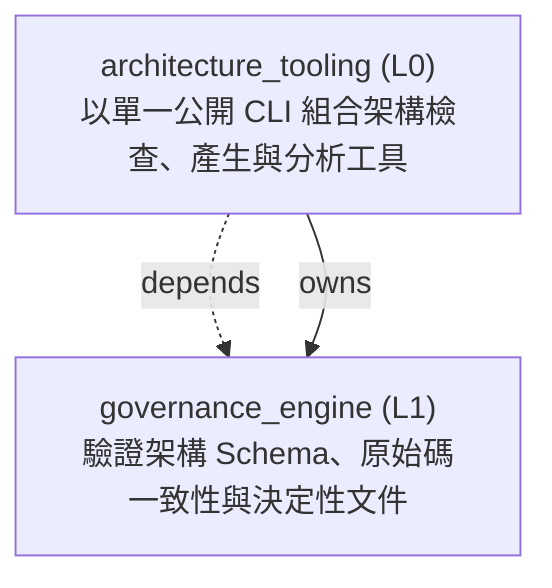
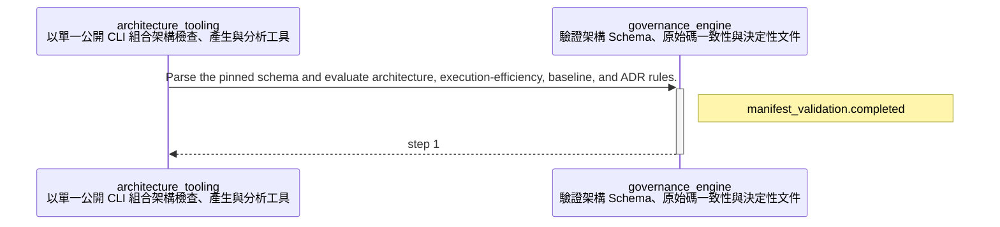
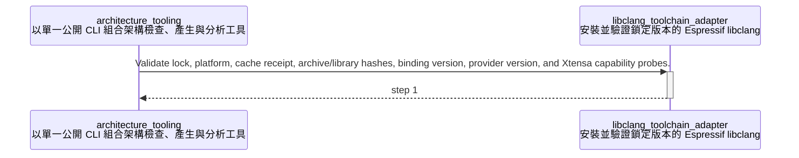

<!-- GENERATED BY govern-modular-event-architecture; DO NOT EDIT -->

# `architecture_tooling`

## Structure

## Modules

| ID | Level | Role | Parent | Implementation Status | Purpose |
|---|---|---|---|---|---|
| `architecture_tooling` | L0 | composition | `-` | implemented | Provide the single public schema 2.1.0/2.2.0 governance CLI and compose its checker, renderer, bootstrap, adoption, source-analysis, and pinned libclang provider modules. |
| `governance_engine` | L1 | domain | `architecture_tooling` | implemented | Validate schema 2.1.0/2.2.0, source conformance, temporary debt, deterministic views, and workload-driven scheduling through one deep governance module. |

### `architecture_tooling`

- **Purpose:** Provide the single public schema 2.1.0/2.2.0 governance CLI and compose its checker, renderer, bootstrap, adoption, source-analysis, and pinned libclang provider modules.
- **Parent:** `-`
- **Implementation Status:** `implemented`
- **Input Ports:** None
- **Output Ports:** None
- **Emitted Events:** None
- **Owned State:** None
- **Side Effects:** Select and invoke one bounded architecture tooling command. (`-`)
- **Errors:** None
- **Invariants:** architecture_cli.py is the only supported command-line entry.; Internal scripts cannot be invoked as legacy public commands.; Gate commands never download or replace a toolchain cache.
- **Entrypoints:** [`main`](../../scripts/architecture_cli.py) (function)
- **Public Symbols:** [`main`](../../scripts/architecture_cli.py) (function)

### `governance_engine`

- **Purpose:** Validate schema 2.1.0/2.2.0, source conformance, temporary debt, deterministic views, and workload-driven scheduling through one deep governance module.
- **Parent:** `architecture_tooling`
- **Implementation Status:** `implemented`
- **Input Ports:** `manifest_validation.check`
- **Output Ports:** `manifest_validation.output`, `libclang_toolchain.resolve`
- **Emitted Events:** `manifest_validation.completed`
- **Owned State:** None
- **Side Effects:** Write marker-owned generated documents only when requested by the single CLI. (`-`)
- **Errors:** None
- **Invariants:** Empty baseline never implies verified source conformance.; Python and C/C++ source evidence fail closed.; Release requires zero temporary baseline entries.; C/C++ AST analysis requests a verified provider through the demand-owned libclang toolchain port.
- **Entrypoints:** [`validate_manifest`](../../scripts/check_architecture.py) (function)
- **Public Symbols:** [`validate_manifest`](../../scripts/check_architecture.py) (function) [`LibclangToolchainPort`](../../scripts/libclang_toolchain_contract.py) (class)

## Port Contracts

| ID | Owner | Direction | Kind | Timing | Description | Symbols |
|---|---|---|---|---|---|---|
| `manifest_validation.check` | `governance_engine` | input | command | sync | Submit one version-pinned manifest validation request.: Manifest path, optional baselines, output format, and generated-view check flag. | `validate_manifest` |
| `manifest_validation.output` | `governance_engine` | output | event | sync | Publish the deterministic diagnostic result.: Rule ID, severity, location, message, disposition, and final exit classification. | `validate_manifest` |
| `libclang_toolchain.resolve` | `governance_engine` | output | query | sync | Resolve and explicitly bind the exact libclang provider required by C/C++ AST governance.: A lock path and operation mode produce verified immutable provider evidence or a fail-closed diagnostic. | `LibclangToolchainPort` |

## Event Contracts

| ID | Owner | Delivery | Emitted when | Purpose | Consumers |
|---|---|---|---|---|---|
| `manifest_validation.completed` | `governance_engine` | at-most-once | Validation and optional generated-view comparison have completed. | Report that one manifest validation request has a complete diagnostic set. | `architecture_tooling` |

## Type Catalog

| ID | Owner | Declaration | Visibility | Semantic kind | Consumers | References |
|---|---|---|---|---|---|---|
| `diagnostic` | `governance_engine` | `Diagnostic` (class, `scripts/check_architecture.py`) | cross-module | domain-value | `architecture_tooling`, `governance_engine` | None |
| `manifest-error` | `governance_engine` | `ManifestError` (class, `scripts/check_architecture.py`) | cross-module | domain-value | `architecture_tooling`, `governance_engine` | None |
| `ast-evidence` | `governance_engine` | `AstEvidence` (class, `scripts/ast_analyzer.py`) | private | private-helper | `governance_engine` | None |
| `libclang-toolchain-port` | `governance_engine` | `LibclangToolchainPort` (class, `scripts/libclang_toolchain_contract.py`) | cross-module | port | `architecture_tooling`, `libclang_toolchain_adapter` | `libclang-toolchain-evidence` |
| `libclang-toolchain-evidence` | `governance_engine` | `LibclangToolchainEvidence` (class, `scripts/libclang_toolchain_contract.py`) | cross-module | domain-value | `architecture_tooling`, `governance_engine`, `libclang_toolchain_adapter` | None |
| `toolchain-provider-error` | `governance_engine` | `ToolchainProviderError` (class, `scripts/libclang_toolchain_contract.py`) | cross-module | domain-value | `architecture_tooling`, `governance_engine`, `libclang_toolchain_adapter` | None |

## State Ownership

| ID | Owner | Declaration | Type | Visibility | Mutability | Read authority | Write authority |
|---|---|---|---|---|---|---|---|

## Cross-module Mapping

| Interaction | Producer | Consumer | Parent | Producer contract | Consumer contract | Mapping owner | State accessed | Allowed edges | Forbidden edges |
|---|---|---|---|---|---|---|---|---|---|

## End-to-End Flows

### `validate-architecture`

Validate one manifest and return deterministic diagnostics.

#### Flow Diagram

#### Ordered Steps

| # | Module | Action | Receives | Emits | State changes | Side effects |
|---|---|---|---|---|---|---|
| 1 | `governance_engine` | Parse the pinned schema and evaluate architecture, execution-efficiency, baseline, and ADR rules. | `manifest_validation.check` | `manifest_validation.completed` | None | None |

- **Success:** Diagnostics and an exit classification are returned.

#### Execution efficiency

- Workload `validation-request`: `best-effort`; steps `validate-architecture.step-1`; profiles [`cross-platform-cli`](execution-cross-platform-cli.md).

### `verify-libclang-toolchain`

Resolve a lock-pinned provider, validate its immutable cache, bind libclang explicitly, and prove Xtensa parsing capability.

#### Flow Diagram

#### Ordered Steps

| # | Module | Action | Receives | Emits | State changes | Side effects |
|---|---|---|---|---|---|---|
| 1 | `libclang_toolchain_adapter` | Validate lock, platform, cache receipt, archive/library hashes, binding version, provider version, and Xtensa capability probes. | `libclang_toolchain.resolve` | None | None | Read the immutable per-user provider cache.; Configure clang.cindex with the verified shared-library path. |

- **Success:** Immutable provider evidence is available to the AST analyzer.

#### Execution efficiency

- Workload `libclang-toolchain-verification`: `best-effort`; steps `verify-libclang-toolchain.step-1`; profiles None.
