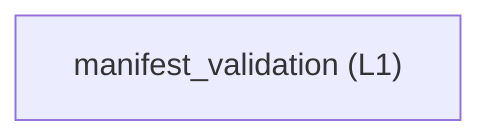

<!-- GENERATED BY govern-modular-event-architecture; DO NOT EDIT -->

# `manifest_validation`

## Structure

## Modules

| ID | Level | Role | Parent | Implementation Status | Purpose |
|---|---|---|---|---|---|
| `manifest_validation` | L1 | domain | `architecture_tooling` | implemented | Validate schema 2.0.2 logical, description, source-set, type, state, boundary, execution, data-access, and microarchitecture contracts. |

### `manifest_validation`

- **Purpose:** Validate schema 2.0.2 logical, description, source-set, type, state, boundary, execution, data-access, and microarchitecture contracts.
- **Parent:** `architecture_tooling`
- **Implementation Status:** `implemented`
- **Input Ports:** `manifest_validation.check`
- **Output Ports:** `manifest_validation.output`
- **Emitted Events:** `manifest_validation.completed`
- **Owned State:** None
- **Side Effects:** None
- **Errors:** None
- **Invariants:** Schema 2.0.2 retains every 1.0 through 2.0.1 governance requirement.; Every governed named type has one catalog owner and source declaration.; AI identities cannot approve accepted governance records.
- **Entrypoints:** [`main`](../../scripts/check_architecture.py) (function)
- **Public Symbols:** [`validate_manifest`](../../scripts/check_architecture.py) (function) [`main`](../../scripts/check_architecture.py) (function)

## Port Contracts

| ID | Owner | Direction | Kind | Timing | Description | Symbols |
|---|---|---|---|---|---|---|
| `manifest_validation.check` | `manifest_validation` | input | command | sync | Submit one version-pinned manifest validation request.: Manifest path, optional baselines, output format, and generated-view check flag. | `validate_manifest` |
| `manifest_validation.output` | `manifest_validation` | output | event | sync | Publish the deterministic diagnostic result.: Rule ID, severity, location, message, disposition, and final exit classification. | `validate_manifest` |

## Event Contracts

| ID | Owner | Delivery | Emitted when | Purpose | Consumers |
|---|---|---|---|---|---|
| `manifest_validation.completed` | `manifest_validation` | at-most-once | Validation and optional generated-view comparison have completed. | Report that one manifest validation request has a complete diagnostic set. | `architecture_tooling` |

## Type Catalog

| ID | Owner | Declaration | Visibility | Semantic kind | Consumers | References |
|---|---|---|---|---|---|---|
| `diagnostic` | `manifest_validation` | `Diagnostic` (class, `scripts/check_architecture.py`) | cross-module | domain-value | `manifest_validation`, `c_source_analysis` | None |
| `manifest-error` | `manifest_validation` | `ManifestError` (class, `scripts/check_architecture.py`) | cross-module | domain-value | `manifest_validation`, `c_source_analysis` | None |

## State Ownership

| ID | Owner | Declaration | Type | Visibility | Mutability | Read authority | Write authority |
|---|---|---|---|---|---|---|---|

## Cross-module Mapping

| Interaction | Producer | Consumer | Parent | Producer contract | Consumer contract | Mapping owner | State accessed | Allowed edges | Forbidden edges |
|---|---|---|---|---|---|---|---|---|---|

## End-to-End Flows
