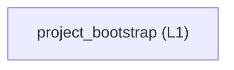

<!-- GENERATED BY govern-modular-event-architecture; DO NOT EDIT -->

# `project_bootstrap`

## Structure

## Modules

| ID | Level | Role | Parent | Implementation Status | Purpose |
|---|---|---|---|---|---|
| `project_bootstrap` | L1 | domain | `architecture_tooling` | implemented | Install versioned governance tools and generated views into a confirmed target project. |

### `project_bootstrap`

- **Purpose:** Install versioned governance tools and generated views into a confirmed target project.
- **Parent:** `architecture_tooling`
- **Implementation Status:** `implemented`
- **Input Ports:** None
- **Output Ports:** None
- **Emitted Events:** None
- **Owned State:** None
- **Side Effects:** Create governance files only when none of the target paths already exists. (`-`)
- **Errors:** None
- **Invariants:** Existing governance files are never overwritten.
- **Entrypoints:** [`main`](../../scripts/bootstrap_project.py) (function)
- **Public Symbols:** [`bootstrap`](../../scripts/bootstrap_project.py) (function) [`main`](../../scripts/bootstrap_project.py) (function)

## Port Contracts

| ID | Owner | Direction | Kind | Timing | Description | Symbols |
|---|---|---|---|---|---|---|

## Event Contracts

| ID | Owner | Delivery | Emitted when | Purpose | Consumers |
|---|---|---|---|---|---|

## Type Catalog

| ID | Owner | Declaration | Visibility | Semantic kind | Consumers | References |
|---|---|---|---|---|---|---|

## State Ownership

| ID | Owner | Declaration | Type | Visibility | Mutability | Read authority | Write authority |
|---|---|---|---|---|---|---|---|

## Cross-module Mapping

| Interaction | Producer | Consumer | Parent | Producer contract | Consumer contract | Mapping owner | State accessed | Allowed edges | Forbidden edges |
|---|---|---|---|---|---|---|---|---|---|

## End-to-End Flows
