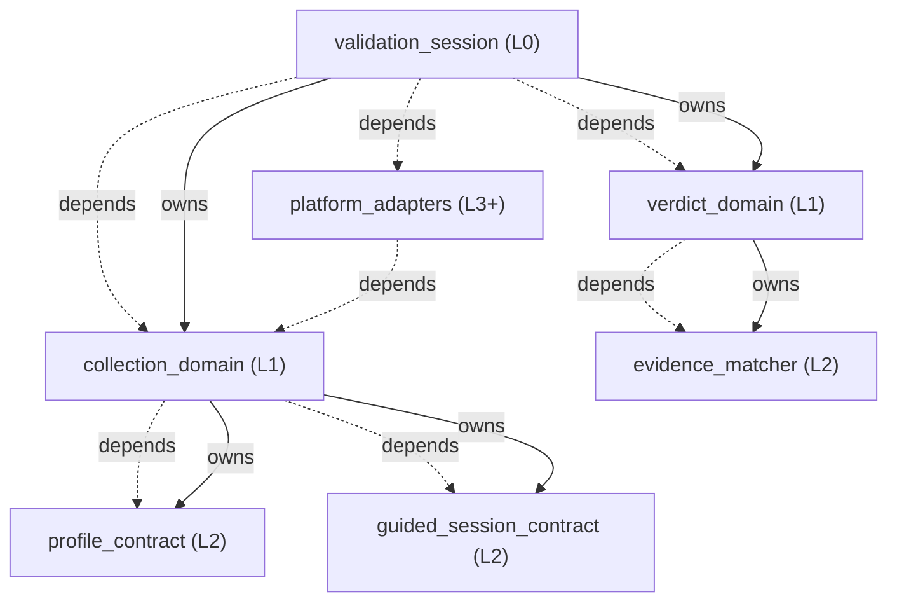

<!-- GENERATED BY govern-modular-event-architecture; DO NOT EDIT -->

# validate-on-device 架構導覽

- Standard: `1.1.0`
- Schema: `1.1.0`

## 系統總覽

## Parent Views

- [`validation_session`](generated/validation_session.md) — 協調enablement、smoke與acceptance runtime scenario，並彙總結構化Gate 1與四階段驗證證據。
- [`collection_domain`](generated/collection_domain.md) — 驗證profile、執行能力探測與bounded action/capture，並保存guided事實。
- [`verdict_domain`](generated/verdict_domain.md) — 重算runtime criterion、逐修改Gate 1文件與overall gate證據，合成PASS、FAIL或BLOCKED。

## 端到端 Flows

- [`guided-validation`](generated/validation_session.md#guided-validation) — 從enablement能力建立、guided capture到acceptance prerequisite與verdict的runtime證據流程。
