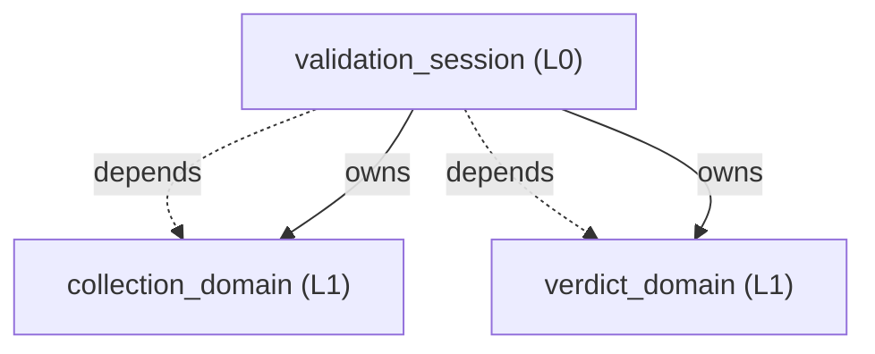
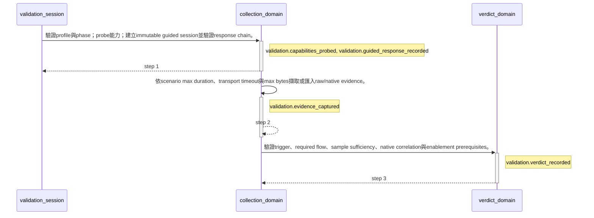

<!-- GENERATED BY govern-modular-event-architecture; DO NOT EDIT -->

# `validation_session`

## 結構圖

## 模組

| ID | Level | Role | 父模組 | 實作狀態 | 目的 |
|---|---|---|---|---|---|
| `validation_session` | L0 | composition | `-` | implemented | 協調enablement、smoke與acceptance runtime scenario，並彙總結構化Gate 1與四階段驗證證據。 |
| `collection_domain` | L1 | domain | `validation_session` | implemented | 驗證profile、執行能力探測與bounded action/capture，並保存guided事實。 |
| `verdict_domain` | L1 | domain | `validation_session` | implemented | 重算runtime criterion、逐修改Gate 1文件與overall gate證據，合成PASS、FAIL或BLOCKED。 |

### `validation_session`

- **目的:** 協調enablement、smoke與acceptance runtime scenario，並彙總結構化Gate 1與四階段驗證證據。
- **父模組:** `-`
- **實作狀態:** `implemented`
- **輸入 Ports:** 無
- **輸出 Ports:** 無
- **輸出 Events:** 無
- **擁有狀態:** 無
- **副作用:** 無
- **異常:** 無
- **不變條件:** Acceptance scenario必須引用同一profile的enablement PASS bundle。; Validation image的證據不得替代獨立的release acceptance。; Host-side Fake Port與unit測試不由runtime runner執行；必要smoke只支援Gate 1且不得滿足Gate 2。
- **程式入口:** [`main`](../../scripts/validate_on_device.py) (cli_entrypoint)
- **公開 Symbols:** [`main`](../../scripts/validate_on_device.py) (entrypoint)

### `collection_domain`

- **目的:** 驗證profile、執行能力探測與bounded action/capture，並保存guided事實。
- **父模組:** `validation_session`
- **實作狀態:** `implemented`
- **輸入 Ports:** `collection.input`
- **輸出 Ports:** `collection.output`, `collection.transport`
- **輸出 Events:** `validation.capabilities_probed`, `validation.guided_response_recorded`, `validation.evidence_captured`
- **擁有狀態:** 無
- **副作用:** 透過transport adapter擷取或匯入bounded evidence。 (`collection.transport`)
- **異常:** 無
- **不變條件:** Capture同時受scenario max_duration_ms、transport timeout與max_bytes限制。; Serial/TCP只在匹配run、scenario與completion reason後提早結束。
- **程式入口:** [`run_action`](../../scripts/vod/execution.py) (command_handler)
- **公開 Symbols:** [`CollectionInputPort`](../../scripts/vod/execution.py) (port) [`CollectionOutputPort`](../../scripts/vod/execution.py) (port) [`TransportPort`](../../scripts/vod/execution.py) (port)

### `verdict_domain`

- **目的:** 重算runtime criterion、逐修改Gate 1文件與overall gate證據，合成PASS、FAIL或BLOCKED。
- **父模組:** `validation_session`
- **實作狀態:** `implemented`
- **輸入 Ports:** `verdict.input`
- **輸出 Ports:** `verdict.output`
- **輸出 Events:** `validation.verdict_recorded`
- **擁有狀態:** 無
- **副作用:** 無
- **異常:** 無
- **不變條件:** Overall precedence固定為FAIL高於BLOCKED高於PASS。; 未證明trigger時不得把缺少流程事件判為產品FAIL。; Gate 1必須逐change group驗證風險、命令、exit code、hashed evidence與smoke決策。; Governed external Port或L3+ Adapter變更必須包含port-contract check。; 作者宣告的Gate 1 verdict不得覆寫runner重算結果。
- **程式入口:** [`overall`](../../scripts/vod/model.py) (query_handler)
- **公開 Symbols:** [`VerdictInputPort`](../../scripts/vod/model.py) (port) [`VerdictOutputPort`](../../scripts/vod/model.py) (port) [`overall_gates`](../../scripts/vod/model.py) (query)

## Port 契約

| ID | Owner | Direction | Kind | Timing | Description | Symbols |
|---|---|---|---|---|---|---|
| `collection.input` | `collection_domain` | input | command | async | 接受validated scenario、bounded collection或action command。: Profile、phase、scenario、risk approvals與evidence output path。 | `CollectionInputPort` |
| `collection.output` | `collection_domain` | output | event | async | 發布能力、guided response與capture完成狀態。: Run ID、phase、provider state、completion cause與bounded evidence location。 | `CollectionOutputPort` |
| `collection.transport` | `collection_domain` | output | dependency | async | 執行平台、Serial、TCP、process與file transport。: Bounded bytes、native trace exports與external process results。 | `TransportPort` |
| `verdict.input` | `verdict_domain` | input | command | sync | 接受runtime criterion、逐修改development gate與release gate evidence。: Criterion results、change groups、architecture refs、commands、exit codes、hashed artifacts、smoke references、phase、profile hash與prerequisite bundles。 | `VerdictInputPort` |
| `verdict.output` | `verdict_domain` | output | event | async | 發布scenario或overall gate判定。: PASS、FAIL或BLOCKED及其evidence anchors。 | `VerdictOutputPort` |

## Event 契約

| ID | Owner | Delivery | Emitted when | Purpose | Consumers |
|---|---|---|---|---|---|
| `validation.capabilities_probed` | `collection_domain` | at-most-once | Passive probe與profile validation完成。 | 指出enablement所需provider、transport與action能力是否存在。 | `validation_session` |
| `validation.guided_response_recorded` | `collection_domain` | at-most-once | Identity、revision chain、confirmation與evidence references完成驗證。 | 指出fact-only guided revision與read-only review已驗證。 | `validation_session`, `verdict_domain` |
| `validation.evidence_captured` | `collection_domain` | at-most-once | Capture達到matching completion、duration/bytes boundary或adapter failure。 | 指出bounded raw或native evidence已捕捉、匯入或被阻擋。 | `validation_session`, `verdict_domain` |
| `validation.verdict_recorded` | `verdict_domain` | at-most-once | Evidence completeness、development change groups、completion、sample plan與prerequisites完成評估。 | 保存criterion、scenario與四階段gate的PASS、FAIL或BLOCKED判定。 | `validation_session` |

## 端到端 Flows

### `guided-validation`

從enablement能力建立、guided capture到acceptance prerequisite與verdict的runtime證據流程。

#### Flow 圖

#### 執行步驟

| # | Module | Action | Receives | Emits | State changes | Side effects |
|---|---|---|---|---|---|---|
| 1 | `collection_domain` | 驗證profile與phase；probe能力；建立immutable guided session並驗證response chain。 | `collection.input` | `validation.capabilities_probed`, `validation.guided_response_recorded` | 無 | 寫入session、response template與deterministic review artifacts。 |
| 2 | `collection_domain` | 依scenario max duration、transport timeout與max bytes擷取或匯入raw/native evidence。 | `collection.input` | `validation.evidence_captured` | 無 | 保存raw、native、guided與hash artifacts。 |
| 3 | `verdict_domain` | 驗證trigger、required flow、sample sufficiency、native correlation與enablement prerequisites。 | `verdict.input` | `validation.verdict_recorded` | 無 | 寫入criterion與scenario result bundle。 |

- **成功結果:** Scenario及所有required criteria具有PASS evidence。
- **異常:** Capability、trigger、window、samples、trace、guided review或prerequisite不完整。 → `validation.evidence_captured` → 保存可用證據並回報BLOCKED與remediation。
