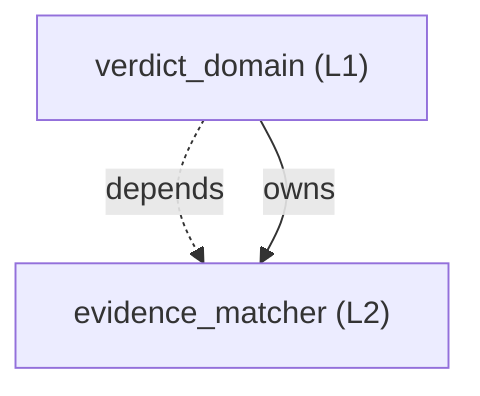

<!-- GENERATED BY govern-modular-event-architecture; DO NOT EDIT -->

# `verdict_domain`

## 結構圖

## 模組

| ID | Level | Role | 父模組 | 實作狀態 | 目的 |
|---|---|---|---|---|---|
| `verdict_domain` | L1 | domain | `validation_session` | implemented | 重算runtime criterion、逐修改Gate 1文件與overall gate證據，合成PASS、FAIL或BLOCKED。 |
| `evidence_matcher` | L2 | component | `verdict_domain` | implemented | 解析VAL evidence，驗證完整性、flow completion、sample sufficiency與native correlation。 |

### `verdict_domain`

- **目的:** 重算runtime criterion、逐修改Gate 1文件與overall gate證據，合成PASS、FAIL或BLOCKED。
- **父模組:** `validation_session`
- **實作狀態:** `implemented`
- **輸入 Ports:** `verdict.input`
- **輸出 Ports:** `verdict.output`
- **輸出 Events:** `validation.verdict_recorded`
- **擁有狀態:** 無
- **副作用:** 無
- **異常:** 無
- **不變條件:** Overall precedence固定為FAIL高於BLOCKED高於PASS。; 未證明trigger時不得把缺少流程事件判為產品FAIL。; Gate 1必須逐change group驗證風險、命令、exit code、hashed evidence與smoke決策。; Governed external Port或L3+ Adapter變更必須包含port-contract check。; 作者宣告的Gate 1 verdict不得覆寫runner重算結果。
- **程式入口:** [`overall`](../../scripts/vod/model.py) (query_handler)
- **公開 Symbols:** [`VerdictInputPort`](../../scripts/vod/model.py) (port) [`VerdictOutputPort`](../../scripts/vod/model.py) (port) [`overall_gates`](../../scripts/vod/model.py) (query)

### `evidence_matcher`

- **目的:** 解析VAL evidence，驗證完整性、flow completion、sample sufficiency與native correlation。
- **父模組:** `verdict_domain`
- **實作狀態:** `implemented`
- **輸入 Ports:** 無
- **輸出 Ports:** 無
- **輸出 Events:** 無
- **擁有狀態:** 無
- **副作用:** 無
- **異常:** 無
- **不變條件:** Flow缺項只有在trigger與完整bounded window已證明時才判FAIL。; Sample不足、trace loss、sequence gap或量測超預算皆判BLOCKED。; Supported OS resource criteria不可由structured-log fallback取得PASS。
- **程式入口:** [`evaluate`](../../scripts/vod/evidence.py) (query_handler)
- **公開 Symbols:** [`write_bundle`](../../scripts/vod/evidence.py) (evidence_writer)

## Port 契約

| ID | Owner | Direction | Kind | Timing | Description | Symbols |
|---|---|---|---|---|---|---|
| `verdict.input` | `verdict_domain` | input | command | sync | 接受runtime criterion、逐修改development gate與release gate evidence。: Criterion results、change groups、architecture refs、commands、exit codes、hashed artifacts、smoke references、phase、profile hash與prerequisite bundles。 | `VerdictInputPort` |
| `verdict.output` | `verdict_domain` | output | event | async | 發布scenario或overall gate判定。: PASS、FAIL或BLOCKED及其evidence anchors。 | `VerdictOutputPort` |

## Event 契約

| ID | Owner | Delivery | Emitted when | Purpose | Consumers |
|---|---|---|---|---|---|
| `validation.verdict_recorded` | `verdict_domain` | at-most-once | Evidence completeness、development change groups、completion、sample plan與prerequisites完成評估。 | 保存criterion、scenario與四階段gate的PASS、FAIL或BLOCKED判定。 | `validation_session` |

## 端到端 Flows
