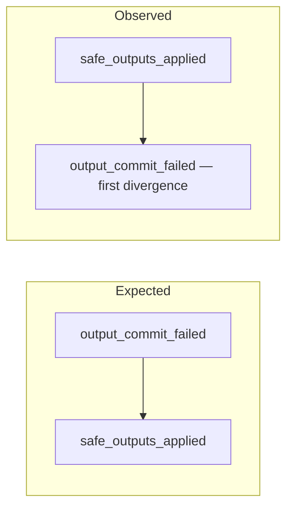
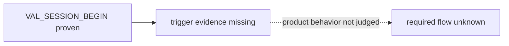

# User-facing test reporting

Use this contract for every guided or Codex-operated runtime scenario. Keep machine evidence and the runner verdict authoritative; presentation must never recalculate or override them.

## Resolve human-readable text

Prefer profile-authored text:

- scenario `title` and `purpose`;
- criterion `label` and `description`.

These fields are optional and must be non-empty strings when present. When they are absent, use these deterministic fallbacks and append `（由測試契約推導）` to every rendered fallback title, purpose, label, or description:

- title: the scenario ID;
- purpose: `驗證 scenario <id> 在 <phase> 階段是否符合 trigger criteria <ids> 與 required criteria <ids>。`;
- criterion label: the criterion ID;
- event sequence description: `依序觀察 <event → event...>。`;
- hard limit, statistic, or native metric description: show the metric, field or method, operator, threshold, and unit when declared;
- observation description: show its guided step and observation code.

Do not infer product intent beyond the profile. Preserve scenario, criterion, event, metric, and symbol identifiers verbatim.

## Before the test

Present these items once before asking the user to operate the target:

1. `測試名稱`
2. `測試目的`
3. `測試項目`
4. `前置條件與風險`
5. `操作步驟`
6. `預期流程`

Map every trigger and required criterion into the test-item table. State initial device or application state, bounded duration, relevant permissions, expected state changes, and cleanup or reset requirements. Explain what allowing or denying a permission will do before requesting it.

During the test, show only the current action, completion signal, and timeout. Do not repeat the full brief on every confirmation turn.

## After the runner evaluates evidence

Lead with one sentence containing the runner-owned `PASS`, `FAIL`, or `BLOCKED` verdict. Then emit every heading below exactly once, in this order. Treat these literal headings as an output API: do not omit, merge, rename, or replace them with unheaded prose.

1. `結論`
2. `測試目的`
3. `測試項目結果`
4. `預期與實際流程`
5. `第一個差異`
6. `問題分類`
7. `下一步`
8. `證據`

The result table must map each runner criterion to its expected value or sequence, observed value or sequence, and runner verdict. Link the result bundle and raw or native evidence when available.

- For `PASS`, state which required criteria passed; do not imply broader coverage.
- For `FAIL`, require proven trigger and a complete bounded window. Identify the first mismatching event or threshold from criterion evidence and distinguish product behavior from observation, validation wiring, or logging behavior.
- For `BLOCKED`, identify the missing capability, trigger, window, sample, trace, confirmation, or permission. Never describe absent evidence as product failure.
- User confirmation confirms recorded facts only. Never ask the user to assign or change a verdict.

## Choose the smallest useful flow view

Always show the expected flow. A `PASS` whose relevant ordered flow contains only one or two events must use an inline chain and must not use Mermaid. Use Mermaid when any of these is true:

- an ordered flow has three or more meaningful steps;
- ordering is the subject of the criterion;
- the result is `FAIL` or `BLOCKED` and a flow view clarifies the evidence boundary.

For a sequence `FAIL`, show expected and observed paths separately and visually mark the first divergence. For `BLOCKED`, stop the observed path at the last proven event and label the missing evidence; do not invent later behavior. Exclude unrelated session-envelope and diagnostic events unless they explain the verdict.

Before sending the response, verify all of these conditions:

- all required headings are present exactly once and in order;
- every trigger and required criterion appears in the result table;
- every contract-derived fallback carries `（由測試契約推導）`;
- a simple one- or two-event `PASS` uses an inline chain rather than Mermaid;
- `FAIL` and `BLOCKED` are not conflated;
- the user is not asked to assign, confirm, or change the verdict.

## Minimal examples

Simple `PASS`:

```text
validation_started → system_initialized
```

Ordering `FAIL`:



Incomplete `BLOCKED`:


